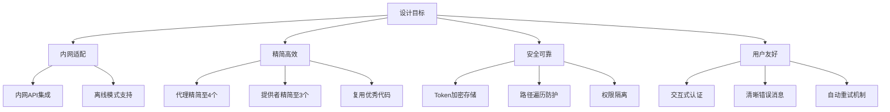
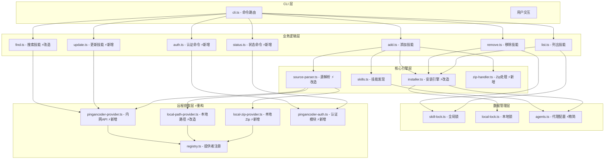
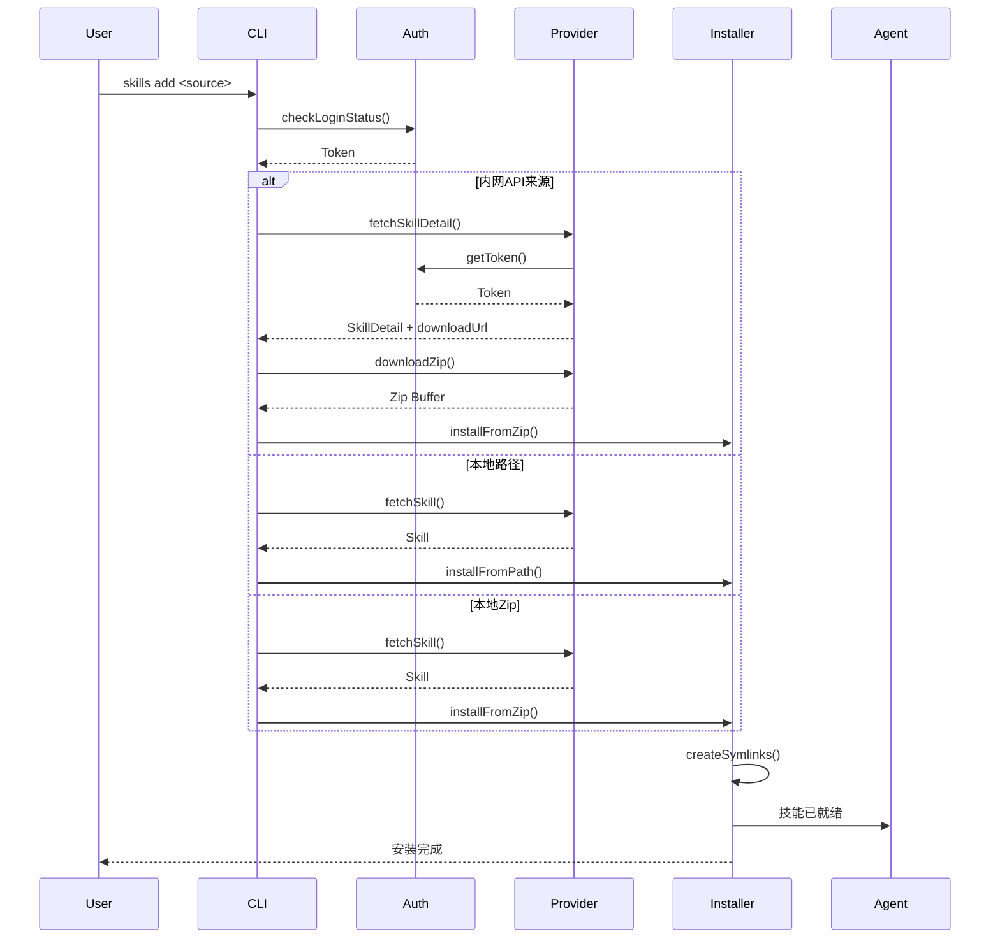
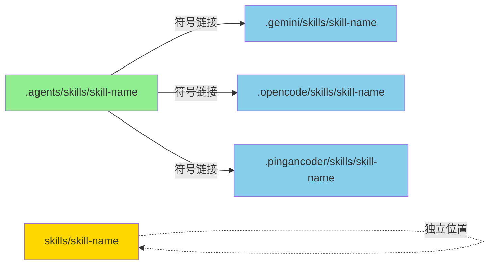
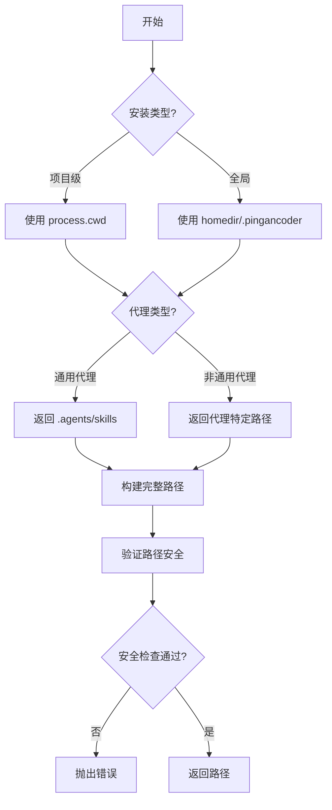
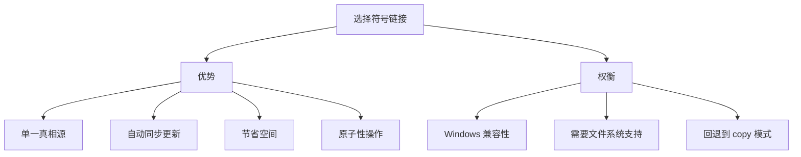
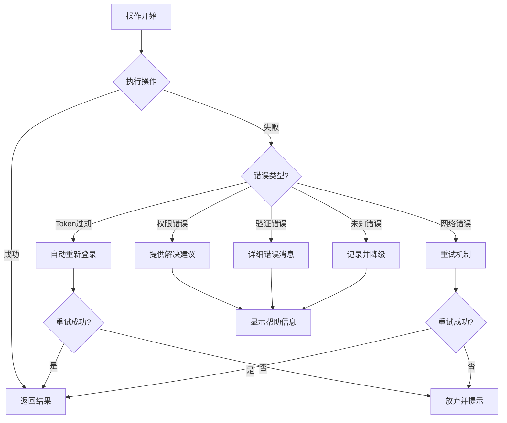

# 项目概述与架构设计

## 1. 项目简介

Pingancoder Skills 是基于 skills-main 改造的**企业内网版本**，为公司内部开发者提供统一的 AI 技能管理工具，适配公司内网环境。

### 1.1 核心功能

- **技能安装**: 从内网静态资源服务、本地路径或本地 Zip 文件安装技能
- **技能管理**: 列出、搜索、移除已安装的技能
- **更新检测**: 通过内网 API 检查并更新技能到最新版本
- **多代理支持**: 支持 gemini、opencode、openclaw、pingancoder 四种代理
- **版本锁定**: 通过锁文件追踪技能版本
- **认证管理**: 内网服务认证和 Token 自动管理

### 1.2 设计目标



## 2. 整体架构

### 2.1 系统分层架构



### 2.2 数据流架构



## 3. 核心概念

### 3.1 技能 (Skill)

技能是可重用的指令集，扩展 AI 代理的能力。每个技能包含：

- **SKILL.md**: 技能定义文件（Markdown + YAML 前言）
- **name**: 唯一标识符
- **description**: 功能描述
- **metadata**: 可选元数据（版本、分类等）

### 3.2 代理 (Agent)

代理是指支持技能的 AI 编码工具。内网版本支持 4 种代理：

| 代理 | 类型 | 技能目录 | 说明 |
|------|------|----------|------|
| **gemini** | 通用 | `.agents/skills` | Gemini CLI |
| **opencode** | 通用 | `.agents/skills` | OpenCode |
| **openclaw** | 独立 | `skills/` | OpenClaw |
| **pingancoder** | 通用 | `.agents/skills` | 公司内代理 |

### 3.3 单一真相源架构



**优势**：
- 避免文件重复
- 简化更新流程
- 节省磁盘空间
- 保持一致性

### 3.4 安装模式

| 模式 | 描述 | 适用场景 |
|------|------|----------|
| **Symlink** | 创建符号链接到规范位置 | 推荐，支持更新 |
| **Copy** | 复制文件到代理目录 | 不支持符号链接的系统 |

## 4. 路径管理

### 4.1 目录结构

```
┌─────────────────────────────────────────────────────────┐
│ 项目级安装                                              │
├─────────────────────────────────────────────────────────┤
│ .agents/skills/           ← 规范位置（通用代理）         │
│ .gemini/skills/           → symlink → .agents/skills/   │
│ .opencode/skills/         → symlink → .agents/skills/   │
│ .pingancoder/skills/      → symlink → .agents/skills/   │
│                                                          │
│ （非通用代理有独立的规范位置）                          │
│ skills/                   ← OpenClaw 独立位置            │
│ skills-lock.json          ← 项目级锁文件                 │
└─────────────────────────────────────────────────────────┘

┌─────────────────────────────────────────────────────────┐
│ 全局级安装 (~/.agents/)                                 │
├─────────────────────────────────────────────────────────┤
│ .skill-lock.json           ← 全局锁文件                  │
│ skills/                    ← 全局技能目录                │
│ └── skill-name/            ← 技能文件                    │
└─────────────────────────────────────────────────────────┘
```

### 4.2 路径解析流程



## 5. 技术选型

### 5.1 为什么选择 TypeScript？

- **类型安全**: 编译时错误检测
- **更好的 IDE 支持**: 自动完成和重构
- **易于维护**: 大型项目必备
- **生态系统**: 丰富的类型定义
- **与原版一致**: 降低迁移成本

### 5.2 为什么使用符号链接？



### 5.3 为什么选择 Zip 下载而不是 Git clone？

- **内网限制**: 内网环境可能无法访问 Git 服务
- **简化流程**: 静态资源服务直接提供 Zip 包
- **版本控制**: Zip 包名可包含版本信息
- **离线支持**: Zip 包可离线传输和安装

## 6. 扩展性设计

### 6.1 代理扩展机制

添加新代理只需：

1. 在 `agents.ts` 中定义配置
2. 指定项目级和全局级路径
3. 提供检测函数

```typescript
// 示例：添加新代理
newAgent: {
  name: 'new-agent',
  displayName: 'New Agent',
  skillsDir: '.agents/skills',  // 通用目录
  globalSkillsDir: join(home, '.newagent/skills'),
  detectInstalled: async () => existsSync(join(home, '.newagent')),
}
```

### 6.2 提供者扩展机制

通过注册模式支持多种技能源：

```typescript
// 注册新的提供者
registerProvider({
  id: 'custom-provider',
  displayName: 'Custom Provider',
  match: (url) => { /* ... */ },
  fetchSkill: async (url) => { /* ... */ },
});
```

## 7. 性能考虑

### 7.1 并发处理

- **并行发现**: 同时搜索多个目录
- **并行安装**: 同时安装到多个代理
- **并行文件操作**: 使用 `Promise.all`

### 7.2 缓存策略

- **Token 缓存**: 避免重复登录
- **锁文件缓存**: 避免重复计算哈希
- **检测结果缓存**: 避免重复文件系统检查
- **API 响应缓存**: 减少 API 调用（未来）

### 7.3 Zip 下载优化

- **流式下载**: 支持大文件下载
- **断点续传**: 网络中断后可恢复
- **进度显示**: 显示下载进度

## 8. 错误处理策略



## 9. 与原版的兼容性

### 9.1 保持兼容的部分

- 核心安装引擎逻辑
- 符号链接机制
- 锁文件格式
- 本地路径安装
- SKILL.md 格式

### 9.2 不兼容的变更

- 技能来源从外部 API 改为内网 API
- 代理数量从 42+ 精简到 4
- 提供者从 7+ 精简到 3
- 新增认证机制

### 9.3 迁移路径

对于已使用 skills-main 的用户：

1. 导出现有技能列表
2. 卸载 skills-main
3. 安装 pingancoder-skills
4. 重新安装技能（从内网或本地）

## 10. 未来展望

### 10.1 短期计划

- [ ] 完成核心功能开发
- [ ] 编写完整测试用例
- [ ] 编写用户文档
- [ ] 内网试点部署

### 10.2 中期计划

- [ ] 支持技能依赖管理
- [ ] 支持技能版本化
- [ ] 集成企业 SSO
- [ ] 技能审核工作流

### 10.3 长期计划

- [ ] Web UI 界面
- [ ] 技能市场
- [ ] 技能评分和评论
- [ ] 企业级权限管理

---

**下一篇**: [02-核心模块分析](./02-核心模块分析.md)
