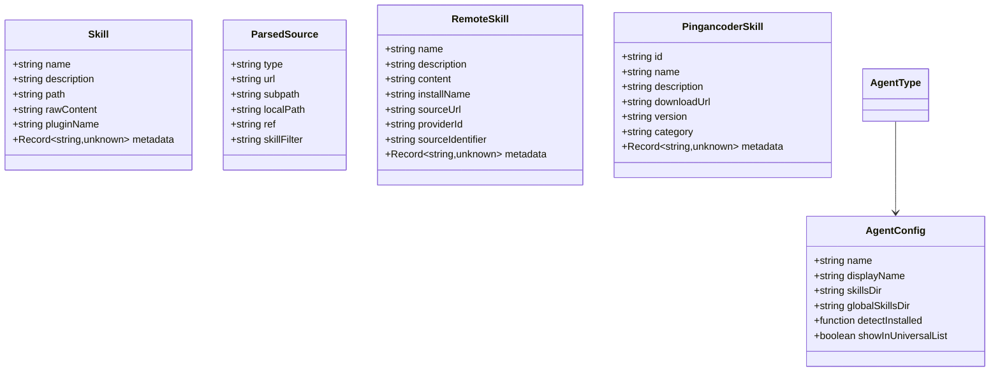
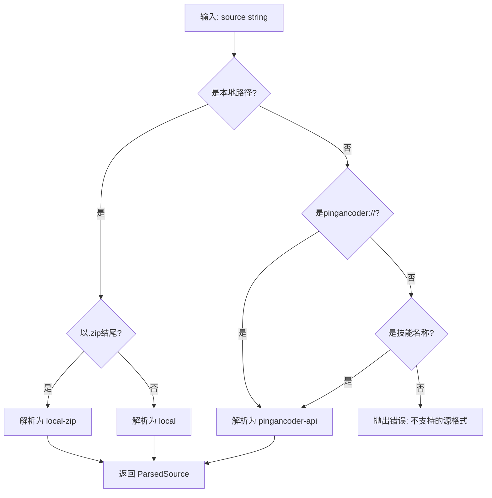
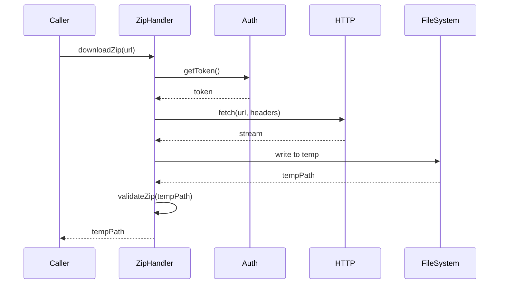
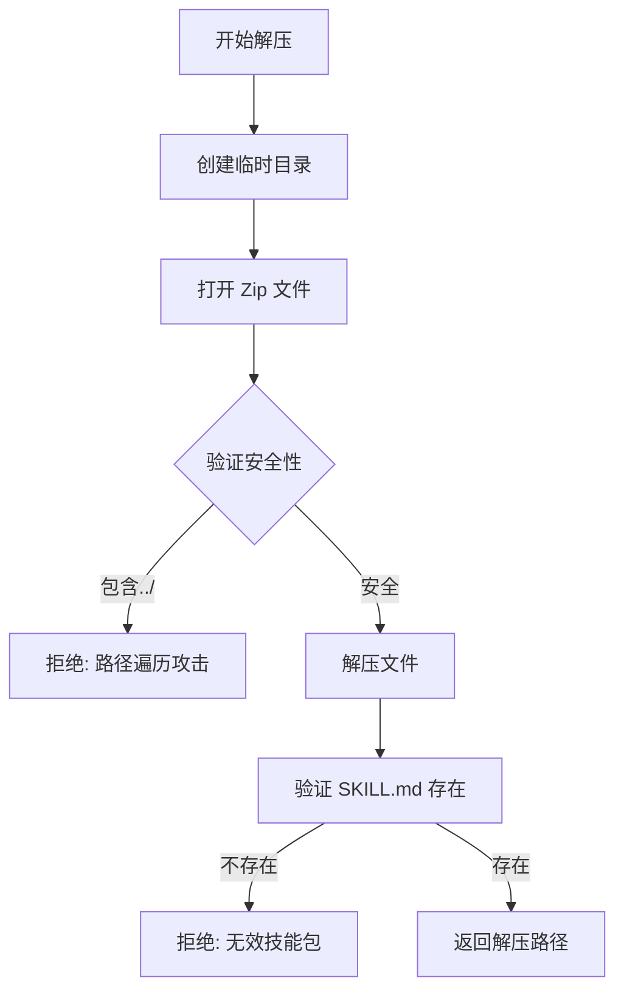
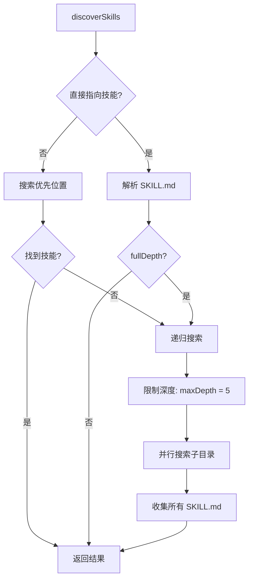
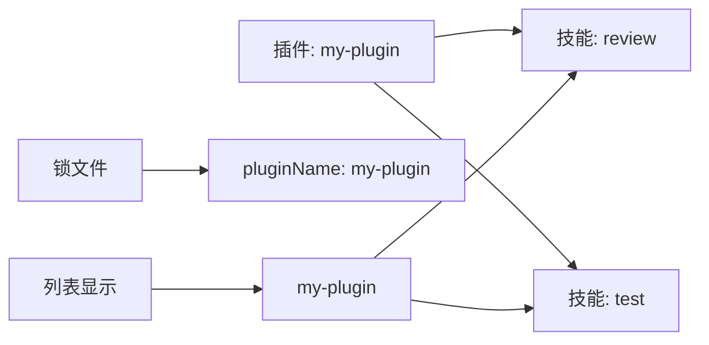

# 核心模块分析

## 1. 类型系统 (types.ts)

类型系统是整个项目的基础，定义了所有核心数据结构。内网版本对代理类型进行了精简。

### 1.1 核心类型定义



### 1.2 代理类型枚举（精简后）

```typescript
export type AgentType =
  | 'gemini'          // Gemini CLI
  | 'opencode'        // OpenCode
  | 'openclaw'        // OpenClaw
  | 'pingancoder';    // 公司内代理
```

**变更说明**：
- 原版支持 42+ 种代理类型
- 内网版本只保留 4 种代理
- 保留原则：内网常用代理 + 公司内部代理

### 1.3 来源类型枚举（新增）

```typescript
export type SourceType =
  | 'local'              // 本地文件路径
  | 'local-zip'          // 本地 Zip 文件
  | 'pingancoder-api';   // 内网 API
```

### 1.4 技能结构

```typescript
export interface Skill {
  name: string;              // 技能名称（唯一标识符）
  description: string;       // 技能描述
  path: string;              // 技能目录路径
  rawContent?: string;       // SKILL.md 原始内容（用于哈希计算）
  pluginName?: string;       // 所属插件名称
  metadata?: Record<string, unknown>; // 额外元数据
}
```

### 1.5 认证会话（新增）

```typescript
export interface AuthSession {
  token: string;             // JWT Token
  expiresAt: number;         // 过期时间戳
  username: string;          // 用户名
}

export interface PingancoderConfig {
  baseUrl: string;           // 内网 API 基础地址
  username?: string;         // 用户名（缓存）
  password?: string;         // 密码（加密缓存）
  tokenPath: string;         // Token 存储路径
}
```

## 2. 常量定义 (constants.ts)

```typescript
export const AGENTS_DIR = '.agents';
export const SKILLS_SUBDIR = 'skills';
export const PINGANCODER_DIR = '.pingancoder';
export const AUTH_FILE = 'auth.json';
export const CONFIG_FILE = 'config.json';

// 路径构建
// 规范位置: `{cwd}/{AGENTS_DIR}/{SKILLS_SUBDIR}`
// 示例: `.agents/skills/`

// 认证相关
export const AUTH_DEFAULT_PATH = join(homedir(), PINGANCODER_DIR, AUTH_FILE);
export const TOKEN_EXPIRY_BUFFER = 5 * 60 * 1000; // 5分钟缓冲
```

## 3. 源解析器 (source-parser.ts)

### 3.1 支持的源格式（改造后）

```mermaid
graph TD
    A[源输入] --> B{格式类型?}

    B -->|本地路径| C[local]
    B -->|本地Zip| D[local-zip]
    B -->|内网API| E[pingancoder-api]
    B -->|pingancoder://| E

    C --> C1[./path]
    C --> C2[../path]
    C --> C3[/absolute/path]

    D --> D1[./skill.zip]
    D --> D2[/absolute/skill.zip]

    E --> E1[pingancoder://skill-id]
    E --> E2[skill-name]
```

### 3.2 解析流程



### 3.3 关键函数

#### `parseSource(input: string): ParsedSource`

```typescript
// 示例解析结果
parseSource('pingancoder://code-review')
// => { type: 'pingancoder-api', identifier: 'code-review' }

parseSource('./local-skills')
// => { type: 'local', url: '/absolute/path', localPath: '/absolute/path' }

parseSource('./skill.zip')
// => { type: 'local-zip', url: '/absolute/skill.zip' }

parseSource('code-review')
// => { type: 'pingancoder-api', identifier: 'code-review' }
```

#### `getInstallName(parsed: ParsedSource): string`

```typescript
// 用于生成安装目录名
getInstallName({ type: 'pingancoder-api', identifier: 'code-review' })
// => 'code-review'

getInstallName({ type: 'local-zip', url: '/path/to/my-skill.zip' })
// => 'my-skill'

getInstallName({ type: 'local', localPath: './skills/my-skill' })
// => 'my-skill'
```

## 4. Zip 处理器 (zip-handler.ts) - 新增

### 4.1 Zip 下载流程



### 4.2 Zip 解压流程



### 4.3 关键函数

```typescript
export class ZipHandler {
  /**
   * 从 URL 下载 Zip 文件
   */
  async downloadZip(
    url: string,
    token: string,
    onProgress?: (progress: number) => void
  ): Promise<string>;

  /**
   * 解压 Zip 文件到临时目录
   */
  async extractZip(zipPath: string): Promise<string>;

  /**
   * 从 Buffer 解压 Zip
   */
  async extractZipFromBuffer(buffer: Buffer): Promise<string>;

  /**
   * 验证 Zip 文件安全性
   */
  private validateZip(zipPath: string): boolean;
}
```

### 4.4 安全措施

```typescript
// 防止路径遍历攻击
function validateEntry(entryPath: string): boolean {
  const normalized = normalize(entryPath);
  return !normalized.includes('..');
}

// 验证 Zip 结构
async function validateSkillZip(extractPath: string): Promise<boolean> {
  const skillMdPath = join(extractPath, 'SKILL.md');
  return existsSync(skillMdPath);
}
```

## 5. 技能发现 (skills.ts)

### 5.1 发现策略（保持不变）



### 5.2 优先搜索位置

```typescript
const prioritySearchDirs = [
  searchPath,                          // 根目录
  join(searchPath, 'skills'),           // skills/
  join(searchPath, 'skills/.curated'),  // skills/.curated/
  join(searchPath, '.agent/skills'),    // .agent/skills/
  join(searchPath, '.agents/skills'),   // .agents/skills/
  // 通用代理目录
  join(searchPath, '.gemini/skills'),   // .gemini/skills/
  join(searchPath, '.opencode/skills'), // .opencode/skills/
  join(searchPath, '.pingancoder/skills'), // .pingancoder/skills/
  // 非通用代理目录
  join(searchPath, 'skills'),           // openclaw 的 skills/
];
```

### 5.3 技能解析

```typescript
export async function parseSkillMd(
  skillMdPath: string,
  options?: { includeInternal?: boolean }
): Promise<Skill | null>
```

**解析步骤**：
1. 读取文件内容
2. 使用 `gray-matter` 解析 YAML 前言
3. 验证必需字段（name, description）
4. 检查是否为内部技能
5. 返回 Skill 对象或 null

## 6. 插件清单 (plugin-manifest.ts)

### 6.1 兼容 Claude Code 插件（保留）

```typescript
// .claude-plugin/marketplace.json
{
  "metadata": { "pluginRoot": "./plugins" },
  "plugins": [
    {
      "name": "my-plugin",
      "source": "my-plugin",
      "skills": ["./skills/review", "./skills/test"]
    }
  ]
}
```

### 6.2 技能分组



## 7. 配置管理 (config.ts) - 新增

### 7.1 配置结构

```typescript
export interface PingancoderConfig {
  // API 配置
  apiBaseUrl: string;
  downloadBaseUrl?: string;

  // 代理配置
  httpProxy?: string;
  httpsProxy?: string;
  timeout?: number;

  // 行为配置
  autoUpdate?: boolean;        // 自动检查更新
  updateInterval?: number;     // 更新检查间隔（天）
  installMode?: 'symlink' | 'copy';

  // 日志配置
  logLevel?: 'debug' | 'info' | 'warn' | 'error';
  logFile?: string;
}
```

### 7.2 配置文件位置

```typescript
const DEFAULT_CONFIG: PingancoderConfig = {
  apiBaseUrl: process.env.PINGANCODER_API_URL || 'http://internal-server/api',
  timeout: 30000,
  autoUpdate: false,
  installMode: 'symlink',
  logLevel: 'info',
};

const CONFIG_PATHS = [
  join(process.cwd(), '.pingancoder', 'config.json'),
  join(homedir(), '.pingancoder', 'config.json'),
];
```

### 7.3 配置加载

```typescript
export class ConfigManager {
  async load(): Promise<PingancoderConfig> {
    // 按优先级加载配置
    // 1. 环境变量
    // 2. 项目级配置
    // 3. 全局配置
    // 4. 默认配置
  }

  async save(config: PingancoderConfig): Promise<void> {
    // 保存到全局配置
  }

  get(key: keyof PingancoderConfig): any {
    // 获取配置项
  }

  set(key: keyof PingancoderConfig, value: any): void {
    // 设置配置项
  }
}
```

## 8. 日志系统 (logger.ts) - 新增

### 8.1 日志级别

```typescript
export enum LogLevel {
  DEBUG = 0,
  INFO = 1,
  WARN = 2,
  ERROR = 3,
}

export interface Logger {
  debug(message: string, ...args: any[]): void;
  info(message: string, ...args: any[]): void;
  warn(message: string, ...args: any[]): void;
  error(message: string, ...args: any[]): void;
}
```

### 8.2 日志输出

```typescript
export class ConsoleLogger implements Logger {
  constructor(private level: LogLevel = LogLevel.INFO) {}

  debug(message: string, ...args: any[]): void {
    if (this.level <= LogLevel.DEBUG) {
      console.debug(`[DEBUG] ${message}`, ...args);
    }
  }

  info(message: string, ...args: any[]): void {
    if (this.level <= LogLevel.INFO) {
      console.info(`[INFO] ${message}`, ...args);
    }
  }

  warn(message: string, ...args: any[]): void {
    if (this.level <= LogLevel.WARN) {
      console.warn(`[WARN] ${message}`, ...args);
    }
  }

  error(message: string, ...args: any[]): void {
    if (this.level <= LogLevel.ERROR) {
      console.error(`[ERROR] ${message}`, ...args);
    }
  }
}
```

### 8.3 文件日志（可选）

```typescript
export class FileLogger extends ConsoleLogger {
  constructor(
    level: LogLevel,
    private logFilePath: string
  ) {
    super(level);
  }

  async writeToFile(level: string, message: string, ...args: any[]): Promise<void> {
    const timestamp = new Date().toISOString();
    const logLine = `[${timestamp}] [${level}] ${message} ${JSON.stringify(args)}\n`;

    await appendFile(this.logFilePath, logLine);
  }
}
```

---

**下一篇**: [03-命令系统](./03-命令系统.md)
