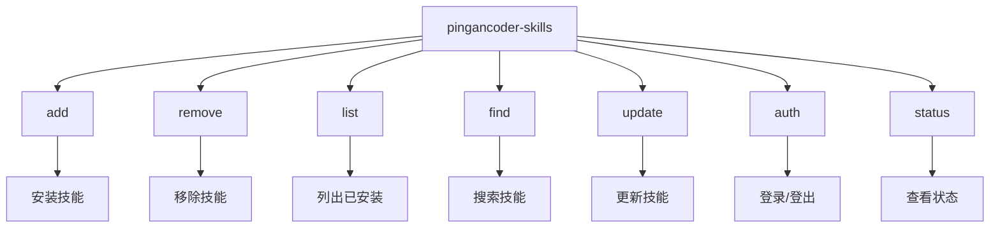
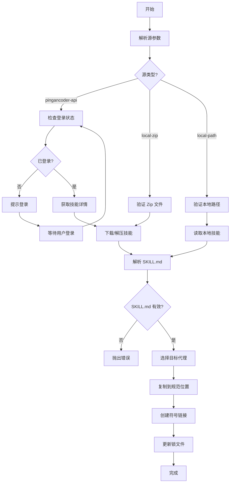
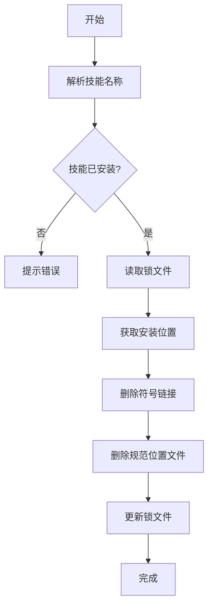
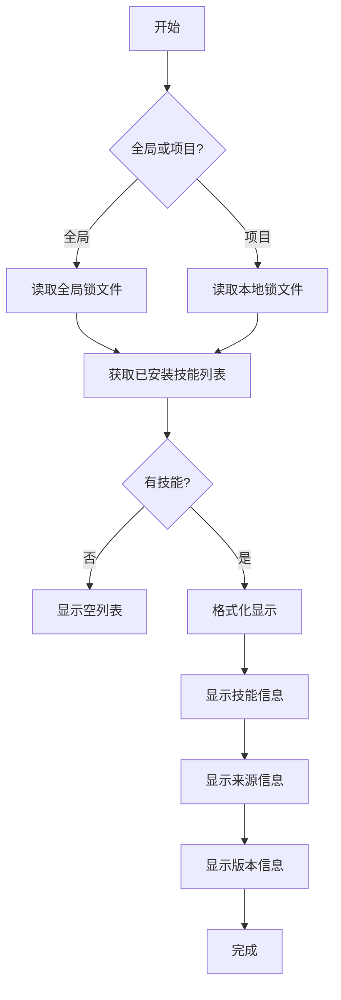
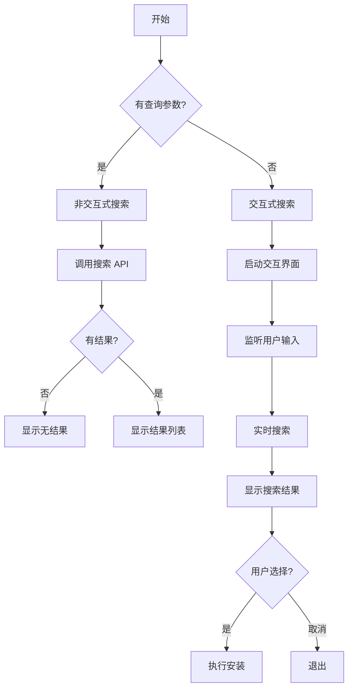
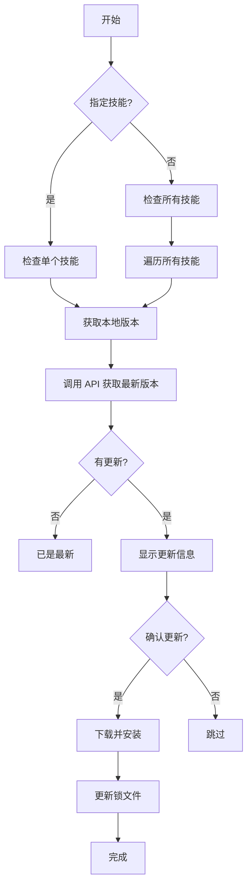
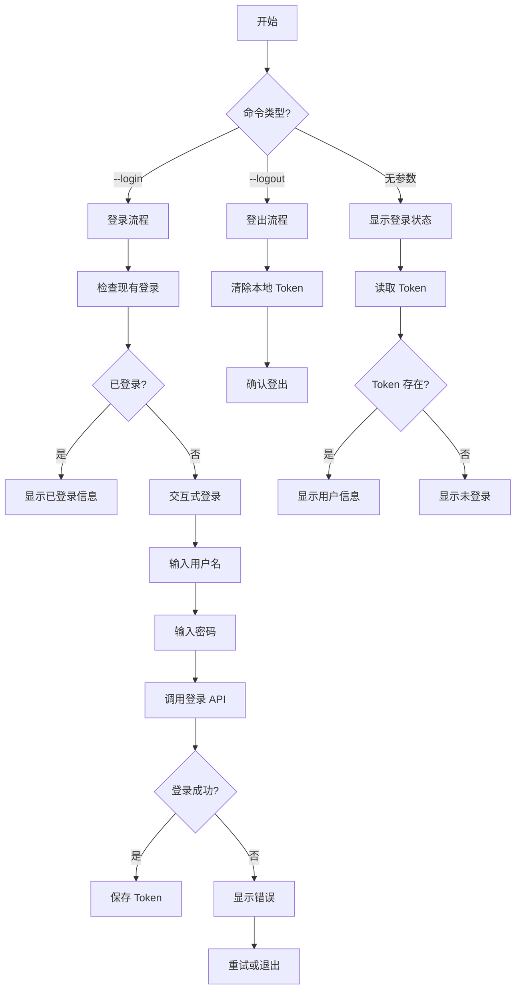
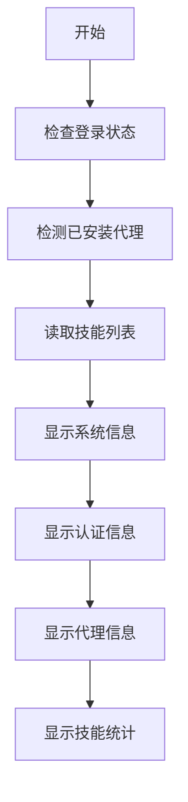

# 命令系统

## 1. CLI 入口 (cli.ts)

### 1.1 命令结构



### 1.2 入口实现

```typescript
#!/usr/bin/env node

import { Command } from 'commander';
import { runAdd } from './add.js';
import { runRemove } from './remove.js';
import { runList } from './list.js';
import { runFind } from './find.js';
import { runUpdate } from './update.js';
import { runAuth } from './auth.js';
import { runStatus } from './status.js';

const program = new Command();

program
  .name('pingancoder-skills')
  .description('Pingancoder 内网技能管理系统')
  .version('1.0.0');

// 添加技能命令
program
  .command('add <source>')
  .description('安装技能')
  .option('-s, --skill <name>', '指定技能名称')
  .option('-g, --global', '全局安装')
  .option('-a, --agents <agents>', '目标代理（逗号分隔）')
  .action(runAdd);

// 移除技能命令
program
  .command('remove <skill>')
  .description('移除技能')
  .option('-g, --global', '全局移除')
  .action(runRemove);

// 列出技能命令
program
  .command('list')
  .description('列出已安装的技能')
  .option('-g, --global', '列出全局安装的技能')
  .action(runList);

// 搜索技能命令
program
  .command('find [query]')
  .description('搜索技能（交互式或直接搜索）')
  .action(runFind);

// 更新技能命令
program
  .command('update [skill]')
  .description('更新技能（不指定则更新所有）')
  .option('-g, --global', '更新全局安装的技能')
  .action(runUpdate);

// 认证命令
program
  .command('auth')
  .description('认证命令（登录/登出）')
  .option('-l, --login', '登录')
  .option('-lo, --logout', '登出')
  .action(runAuth);

// 状态命令
program
  .command('status')
  .description('查看系统状态')
  .action(runStatus);

program.parse();
```

## 2. 添加技能命令 (add.ts)

### 2.1 命令流程



### 2.2 实现代码

```typescript
import { ParsedSource, parseSource } from './source-parser.js';
import { discoverSkills } from './skills.js';
import { installSkill } from './installer.js';
import { detectInstalledAgents } from './agents.js';
import { PingancoderAuth } from './providers/pingancoder-auth.js';

interface AddOptions {
  skill?: string;
  global?: boolean;
  agents?: string;
}

export async function runAdd(sourceStr: string, options: AddOptions = {}): Promise<void> {
  try {
    // 1. 解析源
    const source = parseSource(sourceStr);

    // 2. 特殊处理：如果需要认证
    if (source.type === 'pingancoder-api') {
      const auth = new PingancoderAuth();
      const status = await auth.checkLoginStatus();

      if (!status.loggedIn) {
        console.log('⚠️  需要先登录');
        console.log('请运行: pingancoder-skills auth --login');
        process.exit(1);
      }
    }

    // 3. 确定目标代理
    let targetAgents: AgentType[];
    if (options.agents) {
      targetAgents = options.agents.split(',').map(a => a.trim() as AgentType);
    } else {
      targetAgents = await detectInstalledAgents();
    }

    if (targetAgents.length === 0) {
      console.log('⚠️  未检测到已安装的代理');
      console.log('将安装到通用位置 (.agents/skills/)');
      targetAgents = ['universal'];
    }

    // 4. 安装技能
    const result = await installSkill(source, {
      skillName: options.skill,
      global: options.global,
      agents: targetAgents,
    });

    // 5. 显示结果
    console.log(`✅ 成功安装技能: ${result.installName}`);
    console.log(`   位置: ${result.canonicalPath}`);
    console.log(`   代理: ${result.symlinks.map(s => s.agent).join(', ')}`);

  } catch (error) {
    console.error(`❌ 安装失败: ${error.message}`);
    process.exit(1);
  }
}
```

## 3. 移除技能命令 (remove.ts)

### 3.1 命令流程



### 3.2 实现代码

```typescript
import { removeSkill } from './installer.js';
import { getInstalledSkill } from './skill-lock.js';

interface RemoveOptions {
  global?: boolean;
}

export async function runRemove(skillName: string, options: RemoveOptions = {}): Promise<void> {
  try {
    // 检查技能是否已安装
    const installed = await getInstalledSkill(skillName, options.global);

    if (!installed) {
      console.log(`❌ 技能 "${skillName}" 未安装`);
      process.exit(1);
    }

    // 移除技能
    await removeSkill(skillName, {
      global: options.global,
    });

    console.log(`✅ 成功移除技能: ${skillName}`);

  } catch (error) {
    console.error(`❌ 移除失败: ${error.message}`);
    process.exit(1);
  }
}
```

## 4. 列出技能命令 (list.ts)

### 4.1 命令流程



### 4.2 实现代码

```typescript
import { listInstalledSkills } from './installer.js';
import { readSkillLock } from './local-lock.js';

interface ListOptions {
  global?: boolean;
}

export async function runList(options: ListOptions = {}): Promise<void> {
  try {
    const skills = await listInstalledSkills({
      global: options.global,
    });

    if (skills.length === 0) {
      console.log(options.global
        ? '📭 全局未安装任何技能'
        : '📭 项目未安装任何技能');
      return;
    }

    console.log(options.global ? '📦 全局已安装技能:' : '📦 项目已安装技能:');
    console.log();

    for (const skill of skills) {
      console.log(`• ${skill.name}`);
      console.log(`  描述: ${skill.description}`);
      console.log(`  来源: ${skill.source}`);
      if (skill.version) {
        console.log(`  版本: ${skill.version}`);
      }
      console.log(`  位置: ${skill.path}`);
      console.log();
    }

  } catch (error) {
    console.error(`❌ 列出失败: ${error.message}`);
    process.exit(1);
  }
}
```

## 5. 搜索技能命令 (find.ts)

### 5.1 命令流程



### 5.2 实现代码

```typescript
import { searchPingancoderSkills } from './providers/pingancoder-provider.js';
import { runAdd } from './add.js';
import { runSearchPrompt } from './prompts/search-prompt.js';

export async function runFind(args: string[]): Promise<void> {
  const query = args.join(' ');
  const isNonInteractive = !process.stdin.isTTY;

  // 检查登录状态
  const auth = new PingancoderAuth();
  const status = await auth.checkLoginStatus();

  if (!status.loggedIn) {
    console.log('⚠️  需要先登录');
    console.log('请运行: pingancoder-skills auth --login');
    return;
  }

  // 非交互式模式
  if (query) {
    const results = await searchPingancoderSkills(query);

    if (results.length === 0) {
      console.log(`🔍 未找到匹配 "${query}" 的技能`);
      return;
    }

    console.log(`🎯 找到 ${results.length} 个技能:`);
    console.log();

    for (const skill of results) {
      console.log(`• ${skill.name}`);
      console.log(`  ID: ${skill.slug}`);
      if (skill.version) {
        console.log(`  版本: ${skill.version}`);
      }
      if (skill.installs) {
        console.log(`  下载: ${skill.installs}`);
      }
      console.log(`  安装命令: pingancoder-skills add ${skill.slug}`);
      console.log();
    }
    return;
  }

  // 交互式模式
  if (isNonInteractive) {
    console.log('💡 在非交互式环境中，请使用: pingancoder-skills find <query>');
    return;
  }

  const selected = await runSearchPrompt();

  if (!selected) {
    console.log('🔍 搜索已取消');
    return;
  }

  console.log();
  console.log(`📦 安装 ${selected.name}...`);

  // 执行安装
  await runAdd(selected.slug, {});
}
```

## 6. 更新技能命令 (update.ts) - 新增

### 6.1 命令流程



### 6.2 实现代码

```typescript
import { checkForUpdates, updateSkill } from './update.js';
import { readSkillLock } from './local-lock.js';
import { readGlobalSkillLock } from './skill-lock.js';

interface UpdateOptions {
  global?: boolean;
}

export async function runUpdate(skillName: string | undefined, options: UpdateOptions = {}): Promise<void> {
  try {
    // 检查登录状态
    const auth = new PingancoderAuth();
    const status = await auth.checkLoginStatus();

    if (!status.loggedIn) {
      console.log('⚠️  需要先登录');
      console.log('请运行: pingancoder-skills auth --login');
      return;
    }

    if (skillName) {
      // 更新单个技能
      await updateSingleSkill(skillName, options.global);
    } else {
      // 更新所有技能
      await updateAllSkills(options.global);
    }

  } catch (error) {
    console.error(`❌ 更新失败: ${error.message}`);
    process.exit(1);
  }
}

async function updateSingleSkill(skillName: string, global: boolean): Promise<void> {
  console.log(`🔍 检查 ${skillName} 的更新...`);

  const updates = await checkForUpdates(global);
  const update = updates.find(u => u.skillName === skillName);

  if (!update) {
    console.log(`✅ ${skillName} 已是最新版本`);
    return;
  }

  console.log(`📦 发现新版本:`);
  console.log(`   当前: ${update.currentVersion}`);
  console.log(`   最新: ${update.latestVersion}`);

  await updateSkill(skillName, global);
  console.log(`✅ ${skillName} 更新成功`);
}

async function updateAllSkills(global: boolean): Promise<void> {
  console.log('🔍 检查所有技能的更新...');

  const updates = await checkForUpdates(global);

  if (updates.length === 0) {
    console.log('✅ 所有技能已是最新版本');
    return;
  }

  console.log(`📦 发现 ${updates.length} 个技能有更新:`);
  console.log();

  for (const update of updates) {
    console.log(`• ${update.skillName}`);
    console.log(`  ${update.currentVersion} → ${update.latestVersion}`);
  }

  console.log();
  console.log('开始更新...');

  for (const update of updates) {
    try {
      await updateSkill(update.skillName, global);
      console.log(`✅ ${update.skillName} 更新成功`);
    } catch (error) {
      console.error(`❌ ${update.skillName} 更新失败: ${error.message}`);
    }
  }
}
```

## 7. 认证命令 (auth.ts) - 新增

### 7.1 命令流程



### 7.2 实现代码

```typescript
import { PingancoderAuth } from './providers/pingancoder-auth.js';

interface AuthOptions {
  login?: boolean;
  logout?: boolean;
}

export async function runAuth(options: AuthOptions = {}): Promise<void> {
  const auth = new PingancoderAuth();

  try {
    if (options.logout) {
      // 登出
      await auth.logout();
      console.log('✅ 已登出');
      return;
    }

    if (options.login) {
      // 登录
      const session = await auth.login();
      console.log(`✅ 登录成功: ${session.username}`);
      return;
    }

    // 显示状态
    const status = await auth.checkLoginStatus();

    if (status.loggedIn && status.session) {
      console.log('✅ 已登录');
      console.log(`   用户: ${status.session.username}`);
      console.log(`   过期: ${new Date(status.session.expiresAt).toLocaleString()}`);
    } else {
      console.log('❌ 未登录');
      console.log('   请运行: pingancoder-skills auth --login');
    }

  } catch (error) {
    console.error(`❌ 操作失败: ${error.message}`);
    process.exit(1);
  }
}
```

## 8. 状态命令 (status.ts) - 新增

### 8.1 命令流程



### 8.2 实现代码

```typescript
import { PingancoderAuth } from './providers/pingancoder-auth.js';
import { detectInstalledAgents } from './agents.js';
import { listInstalledSkills } from './installer.js';

export async function runStatus(): Promise<void> {
  try {
    console.log('📊 Pingancoder Skills 系统状态');
    console.log();

    // 认证状态
    console.log('🔐 认证状态:');
    const auth = new PingancoderAuth();
    const authStatus = await auth.checkLoginStatus();

    if (authStatus.loggedIn && authStatus.session) {
      console.log(`   ✅ 已登录: ${authStatus.session.username}`);
      console.log(`   过期时间: ${new Date(authStatus.session.expiresAt).toLocaleString()}`);

      // 检查是否即将过期
      const timeLeft = authStatus.session.expiresAt - Date.now();
      if (timeLeft < 24 * 60 * 60 * 1000) { // 少于24小时
        console.log('   ⚠️  Token 即将过期，建议重新登录');
      }
    } else {
      console.log('   ❌ 未登录');
    }

    console.log();

    // 代理状态
    console.log('🤖 已安装代理:');
    const agents = await detectInstalledAgents();

    if (agents.length === 0) {
      console.log('   未检测到任何代理');
    } else {
      for (const agent of agents) {
        console.log(`   • ${agent}`);
      }
    }

    console.log();

    // 技能统计
    console.log('📦 技能统计:');

    const globalSkills = await listInstalledSkills({ global: true });
    const localSkills = await listInstalledSkills({ global: false });

    console.log(`   全局: ${globalSkills.length} 个`);
    console.log(`   项目: ${localSkills.length} 个`);
    console.log(`   总计: ${globalSkills.length + localSkills.length} 个`);

    console.log();

  } catch (error) {
    console.error(`❌ 获取状态失败: ${error.message}`);
    process.exit(1);
  }
}
```

---

**下一篇**: [04-技能发现与解析](./04-技能发现与解析.md)
