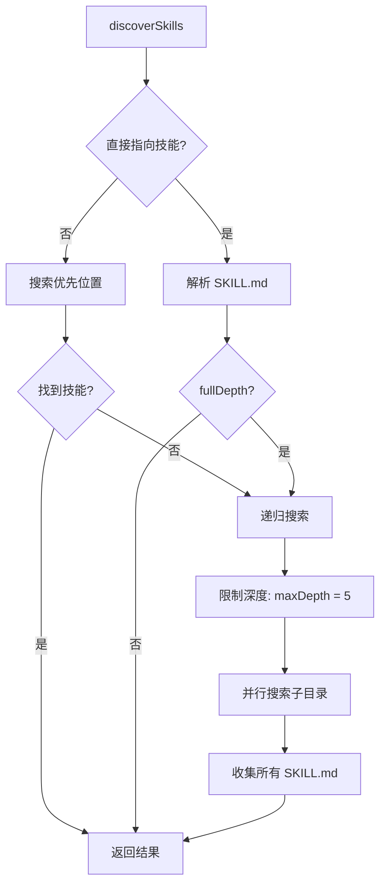
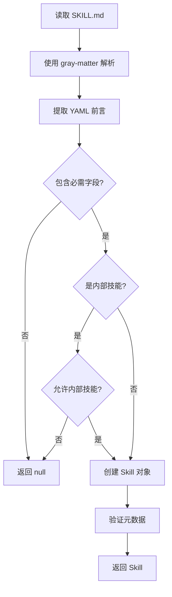

# 技能发现与解析

## 1. 技能发现机制 (skills.ts)

技能发现模块负责在文件系统中查找和解析技能定义文件。

### 1.1 发现策略



### 1.2 优先搜索位置

```typescript
const prioritySearchDirs = [
  searchPath,                              // 根目录
  join(searchPath, 'skills'),               // skills/
  join(searchPath, 'skills/.curated'),      // skills/.curated/
  join(searchPath, 'skills/.experimental'), // skills/.experimental/
  join(searchPath, 'skills/.system'),       // skills/.system/
  join(searchPath, '.agent/skills'),        // .agent/skills/
  join(searchPath, '.agents/skills'),       // .agents/skills/

  // 通用代理目录
  join(searchPath, '.gemini/skills'),       // .gemini/skills/
  join(searchPath, '.opencode/skills'),     // .opencode/skills/
  join(searchPath, '.pingancoder/skills'),  // .pingancoder/skills/

  // 非通用代理目录
  join(searchPath, 'skills'),               // openclaw 的 skills/
];
```

### 1.3 发现实现

```typescript
import { readdir } from 'fs/promises';
import { join } from 'path';
import { existsSync } from 'fs';

export interface DiscoverOptions {
  fullDepth?: boolean;      // 是否深度搜索
  maxDepth?: number;        // 最大搜索深度
  includeInternal?: boolean;// 是否包含内部技能
}

export async function discoverSkills(
  searchPath: string,
  options: DiscoverOptions = {}
): Promise<Skill[]> {
  const {
    fullDepth = false,
    maxDepth = 5,
    includeInternal = false,
  } = options;

  const skills: Skill[] = [];

  // 1. 检查是否直接指向技能
  if (await isSkillDirectory(searchPath)) {
    const skill = await parseSkillMd(join(searchPath, 'SKILL.md'), { includeInternal });
    if (skill) {
      skills.push(skill);
    }
    return skills;
  }

  // 2. 搜索优先位置
  for (const dir of prioritySearchDirs) {
    if (existsSync(dir)) {
      const found = await searchInDirectory(dir, { includeInternal });
      skills.push(...found);
    }
  }

  // 3. 如果需要深度搜索
  if (fullDepth && skills.length === 0) {
    const found = await deepSearch(searchPath, { maxDepth, includeInternal });
    skills.push(...found);
  }

  return skills;
}

async function isSkillDirectory(path: string): Promise<boolean> {
  const skillMdPath = join(path, 'SKILL.md');
  return existsSync(skillMdPath);
}

async function searchInDirectory(
  dir: string,
  options: { includeInternal?: boolean }
): Promise<Skill[]> {
  const skills: Skill[] = [];
  const entries = await readdir(dir, { withFileTypes: true });

  for (const entry of entries) {
    if (entry.isDirectory()) {
      const skillMdPath = join(dir, entry.name, 'SKILL.md');
      if (existsSync(skillMdPath)) {
        const skill = await parseSkillMd(skillMdPath, options);
        if (skill) {
          skills.push(skill);
        }
      }
    }
  }

  return skills;
}

async function deepSearch(
  searchPath: string,
  options: { maxDepth?: number; includeInternal?: boolean },
  currentDepth = 0
): Promise<Skill[]> {
  if (currentDepth >= (options.maxDepth || 5)) {
    return [];
  }

  const skills: Skill[] = [];
  const entries = await readdir(searchPath, { withFileTypes: true });

  for (const entry of entries) {
    const fullPath = join(searchPath, entry.name);

    if (entry.isDirectory()) {
      const skillMdPath = join(fullPath, 'SKILL.md');
      if (existsSync(skillMdPath)) {
        const skill = await parseSkillMd(skillMdPath, options);
        if (skill) {
          skills.push(skill);
        }
      } else {
        // 递归搜索子目录
        const subSkills = await deepSearch(fullPath, options, currentDepth + 1);
        skills.push(...subSkills);
      }
    }
  }

  return skills;
}
```

## 2. 技能解析 (parseSkillMd)

### 2.1 解析流程



### 2.2 解析实现

```typescript
import { readFile } from 'fs/promises';
import matter from 'gray-matter';

export async function parseSkillMd(
  skillMdPath: string,
  options: { includeInternal?: boolean } = {}
): Promise<Skill | null> {
  try {
    // 1. 读取文件内容
    const content = await readFile(skillMdPath, 'utf-8');

    // 2. 解析 YAML 前言
    const { data, content: markdown } = matter(content);

    // 3. 验证必需字段
    if (!data.name || !data.description) {
      console.warn(`⚠️  ${skillMdPath} 缺少必需字段 (name, description)`);
      return null;
    }

    // 4. 检查是否为内部技能
    const isInternal = data.metadata?.internal === true;
    if (isInternal && !options.includeInternal && !shouldInstallInternalSkills()) {
      return null;
    }

    // 5. 创建 Skill 对象
    const skill: Skill = {
      name: data.name,
      description: data.description,
      path: dirname(skillMdPath),
      rawContent: content,
      metadata: data.metadata || {},
    };

    // 6. 可选字段
    if (data.pluginName) {
      skill.pluginName = data.pluginName;
    }

    return skill;

  } catch (error) {
    console.error(`❌ 解析 ${skillMdPath} 失败:`, error.message);
    return null;
  }
}

function shouldInstallInternalSkills(): boolean {
  const envValue = process.env.INSTALL_INTERNAL_SKILLS;
  return envValue === '1' || envValue === 'true';
}
```

## 3. SKILL.md 格式

### 3.1 基本格式

```markdown
---
name: skill-name
description: 技能描述
---

# 技能名称

技能的详细说明...

## 使用方法

...
```

### 3.2 完整格式示例

```markdown
---
name: code-review
description: 代码审查技能，帮助检查代码质量
version: 1.0.0
category: quality
author: Pingancoder Team
tags:
  - review
  - quality
  - best-practices
metadata:
  internal: false
  requires:
    - node: >=18
  permissions:
    - read:code
    - write:comments
---

# Code Review

这是一个代码审查技能，帮助你检查代码质量并提供改进建议。

## 功能特性

- 代码风格检查
- 最佳实践建议
- 性能优化提示
- 安全漏洞检测

## 使用方法

在代码审查时，运行此技能可以获得详细的审查报告。
```

## 4. 技能验证

### 4.1 验证规则

```typescript
export interface ValidationResult {
  valid: boolean;
  errors: string[];
  warnings: string[];
}

export async function validateSkill(skill: Skill): Promise<ValidationResult> {
  const errors: string[] = [];
  const warnings: string[] = [];

  // 必需字段
  if (!skill.name) {
    errors.push('缺少技能名称 (name)');
  }

  if (!skill.description) {
    errors.push('缺少技能描述 (description)');
  }

  // 名称格式
  if (skill.name && !/^[a-z0-9-]+$/.test(skill.name)) {
    errors.push('技能名称只能包含小写字母、数字和连字符');
  }

  // 路径存在性
  if (!existsSync(skill.path)) {
    errors.push(`技能路径不存在: ${skill.path}`);
  }

  // SKILL.md 存在性
  const skillMdPath = join(skill.path, 'SKILL.md');
  if (!existsSync(skillMdPath)) {
    errors.push('缺少 SKILL.md 文件');
  }

  // 版本号（如果有）
  if (skill.metadata?.version) {
    const version = skill.metadata.version as string;
    if (!/^\d+\.\d+\.\d+$/.test(version)) {
      warnings.push('版本号格式建议使用 semver (如 1.0.0)');
    }
  }

  return {
    valid: errors.length === 0,
    errors,
    warnings,
  };
}
```

### 4.2 批量验证

```typescript
export async function validateSkills(skills: Skill[]): Promise<Map<string, ValidationResult>> {
  const results = new Map<string, ValidationResult>();

  for (const skill of skills) {
    const result = await validateSkill(skill);
    results.set(skill.name, result);
  }

  return results;
}
```

## 5. 技能搜索

### 5.1 搜索实现

```typescript
export interface SearchOptions {
  query?: string;
  category?: string;
  tags?: string[];
  author?: string;
}

export function searchSkills(
  skills: Skill[],
  options: SearchOptions
): Skill[] {
  let results = [...skills];

  // 文本搜索
  if (options.query) {
    const query = options.query.toLowerCase();
    results = results.filter(skill =>
      skill.name.toLowerCase().includes(query) ||
      skill.description.toLowerCase().includes(query)
    );
  }

  // 分类过滤
  if (options.category) {
    results = results.filter(skill =>
      skill.metadata?.category === options.category
    );
  }

  // 标签过滤
  if (options.tags && options.tags.length > 0) {
    results = results.filter(skill => {
      const skillTags = skill.metadata?.tags as string[] || [];
      return options.tags!.some(tag => skillTags.includes(tag));
    });
  }

  // 作者过滤
  if (options.author) {
    results = results.filter(skill =>
      skill.metadata?.author === options.author
    );
  }

  return results;
}
```

### 5.2 搜索建议

```typescript
export interface SearchSuggestion {
  type: 'name' | 'category' | 'tag' | 'author';
  value: string;
  count: number;
}

export function getSearchSuggestions(
  skills: Skill[],
  query: string
): SearchSuggestion[] {
  const suggestions: SearchSuggestion[] = [];
  const queryLower = query.toLowerCase();

  // 名称建议
  for (const skill of skills) {
    if (skill.name.toLowerCase().startsWith(queryLower)) {
      suggestions.push({
        type: 'name',
        value: skill.name,
        count: 1,
      });
    }
  }

  // 分类建议
  const categories = new Map<string, number>();
  for (const skill of skills) {
    const category = skill.metadata?.category as string;
    if (category && category.toLowerCase().startsWith(queryLower)) {
      categories.set(category, (categories.get(category) || 0) + 1);
    }
  }

  for (const [category, count] of categories) {
    suggestions.push({
      type: 'category',
      value: category,
      count,
    });
  }

  return suggestions.sort((a, b) => b.count - a.count);
}
```

## 6. 技能排序

### 6.1 排序选项

```typescript
export type SortOption = 'name' | 'date' | 'popularity' | 'version';

export function sortSkills(skills: Skill[], option: SortOption): Skill[] {
  const sorted = [...skills];

  switch (option) {
    case 'name':
      return sorted.sort((a, b) => a.name.localeCompare(b.name));

    case 'date':
      return sorted.sort((a, b) => {
        const dateA = new Date(a.metadata?.date as string || 0);
        const dateB = new Date(b.metadata?.date as string || 0);
        return dateB.getTime() - dateA.getTime();
      });

    case 'popularity':
      return sorted.sort((a, b) => {
        const popA = (a.metadata?.installs || a.metadata?.downloads || 0) as number;
        const popB = (b.metadata?.installs || b.metadata?.downloads || 0) as number;
        return popB - popA;
      });

    case 'version':
      return sorted.sort((a, b) => {
        const verA = a.metadata?.version || '0.0.0';
        const verB = b.metadata?.version || '0.0.0';
        return compareVersions(verB, verA);
      });

    default:
      return sorted;
  }
}

function compareVersions(a: string, b: string): number {
  const partsA = a.split('.').map(Number);
  const partsB = b.split('.').map(Number);

  for (let i = 0; i < 3; i++) {
    if (partsA[i]! > partsB[i]!) return 1;
    if (partsA[i]! < partsB[i]!) return -1;
  }

  return 0;
}
```

## 7. 技能分组

### 7.1 按插件分组

```typescript
export function groupSkillsByPlugin(skills: Skill[]): Map<string | undefined, Skill[]> {
  const groups = new Map<string | undefined, Skill[]>();

  for (const skill of skills) {
    const pluginName = skill.pluginName;
    if (!groups.has(pluginName)) {
      groups.set(pluginName, []);
    }
    groups.get(pluginName)!.push(skill);
  }

  return groups;
}
```

### 7.2 按分类分组

```typescript
export function groupSkillsByCategory(skills: Skill[]): Map<string, Skill[]> {
  const groups = new Map<string, Skill[]>();

  for (const skill of skills) {
    const category = (skill.metadata?.category as string) || 'uncategorized';
    if (!groups.has(category)) {
      groups.set(category, []);
    }
    groups.get(category)!.push(skill);
  }

  return groups;
}
```

---

**下一篇**: [05-安装系统](./05-安装系统.md)
