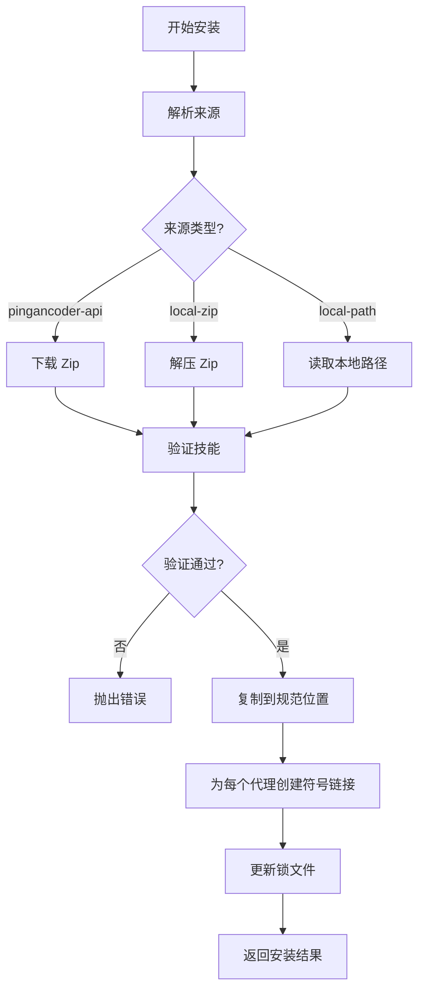
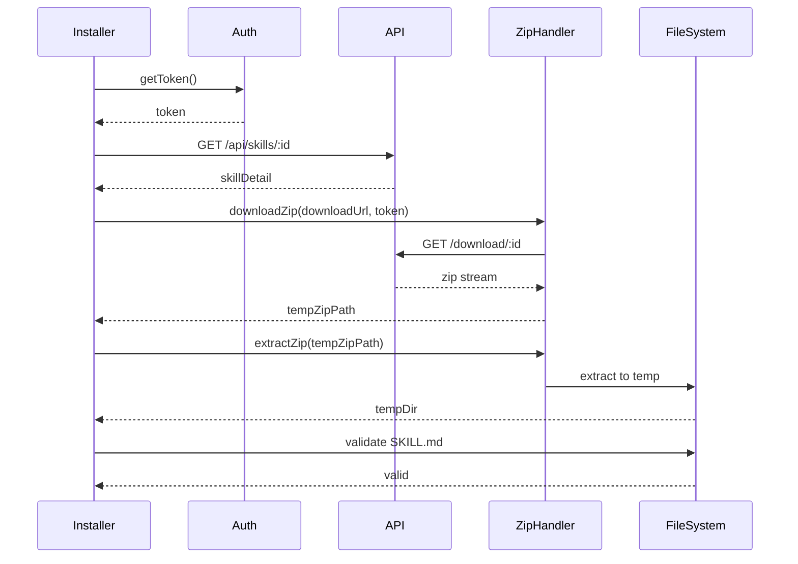
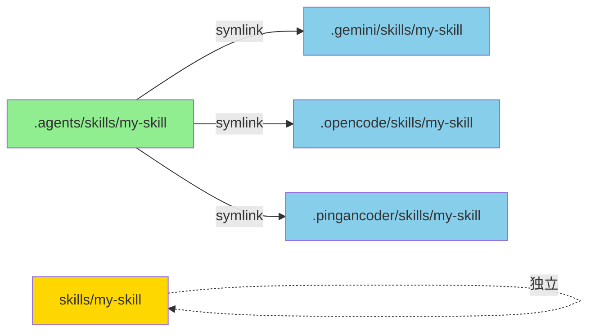
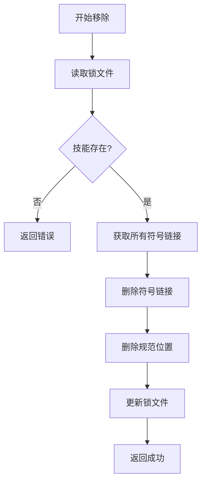

# 安装系统

## 1. 安装引擎 (installer.ts)

安装引擎是技能管理的核心，负责将技能安装到目标位置并创建符号链接。

### 1.1 安装流程



### 1.2 安装接口

```typescript
export interface InstallOptions {
  skillName?: string;        // 指定技能名称
  global?: boolean;          // 全局安装
  agents?: AgentType[];      // 目标代理
  mode?: 'symlink' | 'copy'; // 安装模式
}

export interface InstallResult {
  success: boolean;
  installName: string;
  canonicalPath: string;      // 规范位置路径
  symlinks: SymlinkResult[];  // 符号链接结果
}

export interface SymlinkResult {
  agent: AgentType;
  path: string;
  success: boolean;
  error?: string;
}
```

### 1.3 核心安装函数

```typescript
export async function installSkill(
  source: ParsedSource,
  options: InstallOptions = {}
): Promise<InstallResult> {
  const {
    skillName,
    global = false,
    agents = [],
    mode = 'symlink',
  } = options;

  try {
    // 1. 根据来源类型处理
    let tempDir: string | null = null;
    let skillPath: string;

    switch (source.type) {
      case 'pingancoder-api':
        // 从 API 下载
        tempDir = await downloadAndExtractSkill(source.identifier);
        skillPath = tempDir;
        break;

      case 'local-zip':
        // 解压本地 Zip
        tempDir = await extractLocalZip(source.url);
        skillPath = tempDir;
        break;

      case 'local-path':
        // 使用本地路径
        skillPath = source.localPath!;
        break;

      default:
        throw new Error(`不支持的来源类型: ${source.type}`);
    }

    // 2. 解析技能定义
    const skillMdPath = join(skillPath, 'SKILL.md');
    if (!existsSync(skillMdPath)) {
      throw new Error('找不到 SKILL.md 文件');
    }

    const skill = await parseSkillMd(skillMdPath);
    if (!skill) {
      throw new Error('无法解析 SKILL.md');
    }

    // 3. 确定安装名称
    const installName = skillName || skill.name;

    // 4. 复制到规范位置
    const canonicalPath = await copyToCanonicalLocation(skill.path, installName, global);

    // 5. 为每个代理创建符号链接
    const targetAgents = agents.length > 0 ? agents : await detectInstalledAgents();
    const symlinkResults = await createSymlinks(canonicalPath, installName, targetAgents, mode);

    // 6. 更新锁文件
    await updateSkillLock(installName, {
      source: source.type === 'pingancoder-api' ? source.identifier : source.url,
      version: skill.metadata?.version as string,
      installedAt: Date.now(),
      global,
    });

    // 7. 清理临时目录
    if (tempDir) {
      await rm(tempDir, { recursive: true, force: true });
    }

    return {
      success: true,
      installName,
      canonicalPath,
      symlinks: symlinkResults,
    };

  } catch (error) {
    // 清理临时文件
    if (tempDir) {
      await rm(tempDir, { recursive: true, force: true });
    }
    throw error;
  }
}
```

## 2. 从 API 下载技能

### 2.1 下载流程



### 2.2 下载实现

```typescript
async function downloadAndExtractSkill(skillId: string): Promise<string> {
  const auth = new PingancoderAuth();
  const token = await auth.ensureAuthenticated();

  // 1. 获取技能详情
  const detail = await auth.fetchSkillDetail(skillId);

  // 2. 下载 Zip
  const zipHandler = new ZipHandler();
  console.log(`📥 下载技能: ${detail.name}`);

  const zipPath = await zipHandler.downloadZip(
    detail.downloadUrl,
    token,
    (progress) => {
      console.log(`   进度: ${progress}%`);
    }
  );

  // 3. 解压
  console.log('📦 解压中...');
  const tempDir = await zipHandler.extractZip(zipPath);

  // 4. 验证
  const skillMdPath = join(tempDir, 'SKILL.md');
  if (!existsSync(skillMdPath)) {
    throw new Error('技能包中缺少 SKILL.md 文件');
  }

  // 5. 清理 Zip 文件
  await rm(zipPath);

  return tempDir;
}
```

## 3. 规范位置管理

### 3.1 规范位置计算

```typescript
export async function getCanonicalPath(
  installName: string,
  global: boolean
): Promise<string> {
  const baseDir = global
    ? join(homedir(), '.pingancoder', 'skills')
    : join(process.cwd(), '.agents', 'skills');

  return join(baseDir, installName);
}

export async function copyToCanonicalLocation(
  sourcePath: string,
  installName: string,
  global: boolean
): Promise<string> {
  const canonicalPath = await getCanonicalPath(installName, global);

  // 创建目标目录
  await mkdir(dirname(canonicalPath), { recursive: true });

  // 如果已存在，先删除
  if (existsSync(canonicalPath)) {
    await rm(canonicalPath, { recursive: true, force: true });
  }

  // 复制文件
  await cp(sourcePath, canonicalPath, { recursive: true });

  return canonicalPath;
}
```

### 3.2 目录结构

```
项目级安装：
./agents/skills/
├── skill-1/
│   └── SKILL.md
├── skill-2/
│   └── SKILL.md
└── skill-3/
    └── SKILL.md

全局级安装：
~/.pingancoder/skills/
├── skill-1/
│   └── SKILL.md
├── skill-2/
│   └── SKILL.md
└── skill-3/
    └── SKILL.md
```

## 4. 符号链接管理

### 4.1 创建符号链接

```typescript
export async function createSymlinks(
  canonicalPath: string,
  installName: string,
  targetAgents: AgentType[],
  mode: 'symlink' | 'copy'
): Promise<SymlinkResult[]> {
  const results: SymlinkResult[] = [];

  for (const agentType of targetAgents) {
    const agentConfig = getAgentConfig(agentType);
    const result = await createSymlinkForAgent(canonicalPath, installName, agentConfig, mode);
    results.push(result);
  }

  return results;
}

async function createSymlinkForAgent(
  canonicalPath: string,
  installName: string,
  agentConfig: AgentConfig,
  mode: 'symlink' | 'copy'
): Promise<SymlinkResult> {
  try {
    const isGlobal = agentConfig.globalSkillsDir.includes(homedir());
    const targetDir = isGlobal ? agentConfig.globalSkillsDir : join(process.cwd(), agentConfig.skillsDir);
    const targetPath = join(targetDir, installName);

    // 创建目标目录
    await mkdir(targetDir, { recursive: true });

    // 如果已存在，先删除
    if (existsSync(targetPath)) {
      await rm(targetPath, { recursive: true, force: true });
    }

    if (mode === 'symlink') {
      // 尝试创建符号链接
      try {
        await symlink(canonicalPath, targetPath, 'dir');
        return {
          agent: agentConfig.name,
          path: targetPath,
          success: true,
        };
      } catch (error) {
        // 如果符号链接失败，回退到 copy 模式
        if (error.code === 'EPERM' || error.code === 'EXDEV') {
          console.warn(`⚠️  无法创建符号链接，使用 copy 模式: ${targetPath}`);
          await cp(canonicalPath, targetPath, { recursive: true });
          return {
            agent: agentConfig.name,
            path: targetPath,
            success: true,
          };
        }
        throw error;
      }
    } else {
      // Copy 模式
      await cp(canonicalPath, targetPath, { recursive: true });
      return {
        agent: agentConfig.name,
        path: targetPath,
        success: true,
      };
    }

  } catch (error) {
    return {
      agent: agentConfig.name,
      path: '',
      success: false,
      error: error.message,
    };
  }
}
```

### 4.2 符号链接布局



## 5. 技能移除

### 5.1 移除流程



### 5.2 移除实现

```typescript
export async function removeSkill(
  installName: string,
  options: { global?: boolean } = {}
): Promise<void> {
  const { global = false } = options;

  // 1. 检查是否已安装
  const lockData = global
    ? await readGlobalSkillLock()
    : await readLocalSkillLock();

  if (!lockData[installName]) {
    throw new Error(`技能 "${installName}" 未安装`);
  }

  // 2. 获取规范位置
  const canonicalPath = await getCanonicalPath(installName, global);

  // 3. 删除所有符号链接
  await removeSymlinks(canonicalPath, installName);

  // 4. 删除规范位置
  if (existsSync(canonicalPath)) {
    await rm(canonicalPath, { recursive: true, force: true });
  }

  // 5. 更新锁文件
  delete lockData[installName];

  if (global) {
    await writeGlobalSkillLock(lockData);
  } else {
    await writeLocalSkillLock(lockData);
  }
}

async function removeSymlinks(canonicalPath: string, installName: string): Promise<void> {
  const agents = await detectInstalledAgents();

  for (const agentType of agents) {
    const agentConfig = getAgentConfig(agentType);
    const isGlobal = agentConfig.globalSkillsDir.includes(homedir());
    const targetDir = isGlobal ? agentConfig.globalSkillsDir : join(process.cwd(), agentConfig.skillsDir);
    const targetPath = join(targetDir, installName);

    if (existsSync(targetPath)) {
      // 检查是否是符号链接
      const stats = await lstat(targetPath);
      if (stats.isSymbolicLink()) {
        await rm(targetPath);
      } else {
        // 如果不是符号链接，说明是 copy 模式
        await rm(targetPath, { recursive: true, force: true });
      }
    }
  }
}
```

## 6. 技能列表

### 6.1 列出已安装技能

```typescript
export async function listInstalledSkills(
  options: { global?: boolean } = {}
): Promise<Skill[]> {
  const { global = false } = options;

  const lockData = global
    ? await readGlobalSkillLock()
    : await readLocalSkillLock();

  const skills: Skill[] = [];

  for (const [installName, lockInfo] of Object.entries(lockData)) {
    const canonicalPath = await getCanonicalPath(installName, global);
    const skillMdPath = join(canonicalPath, 'SKILL.md');

    if (existsSync(skillMdPath)) {
      const skill = await parseSkillMd(skillMdPath);
      if (skill) {
        skill.metadata = {
          ...skill.metadata,
          source: lockInfo.source,
          version: lockInfo.version,
          installedAt: lockInfo.installedAt,
        };
        skills.push(skill);
      }
    }
  }

  return skills;
}
```

### 6.2 格式化输出

```typescript
export function formatSkillList(skills: Skill[]): string {
  if (skills.length === 0) {
    return '未安装任何技能';
  }

  let output = '';

  for (const skill of skills) {
    output += `• ${skill.name}\n`;
    output += `  ${skill.description}\n`;
    output += `  来源: ${skill.metadata?.source || 'local'}\n`;
    if (skill.metadata?.version) {
      output += `  版本: ${skill.metadata.version}\n`;
    }
    output += `  位置: ${skill.path}\n`;
    output += '\n';
  }

  return output;
}
```

## 7. 安装验证

### 7.1 验证安装

```typescript
export async function verifyInstallation(
  installName: string,
  global: boolean
): Promise<{ valid: boolean; issues: string[] }> {
  const issues: string[] = [];

  // 1. 检查规范位置
  const canonicalPath = await getCanonicalPath(installName, global);
  if (!existsSync(canonicalPath)) {
    issues.push(`规范位置不存在: ${canonicalPath}`);
    return { valid: false, issues };
  }

  // 2. 检查 SKILL.md
  const skillMdPath = join(canonicalPath, 'SKILL.md');
  if (!existsSync(skillMdPath)) {
    issues.push('缺少 SKILL.md 文件');
  }

  // 3. 检查符号链接
  const agents = await detectInstalledAgents();
  for (const agentType of agents) {
    const agentConfig = getAgentConfig(agentType);
    const isGlobal = agentConfig.globalSkillsDir.includes(homedir());
    const targetDir = isGlobal ? agentConfig.globalSkillsDir : join(process.cwd(), agentConfig.skillsDir);
    const targetPath = join(targetDir, installName);

    if (!existsSync(targetPath)) {
      issues.push(`缺少 ${agentType} 的符号链接`);
    } else {
      // 验证链接是否有效
      const stats = await lstat(targetPath);
      if (stats.isSymbolicLink()) {
        const linkTarget = await readlink(targetPath);
        if (linkTarget !== canonicalPath) {
          issues.push(`${agentType} 的符号链接指向错误位置`);
        }
      }
    }
  }

  return {
    valid: issues.length === 0,
    issues,
  };
}
```

---

**下一篇**: [06-代理管理](./06-代理管理.md)
