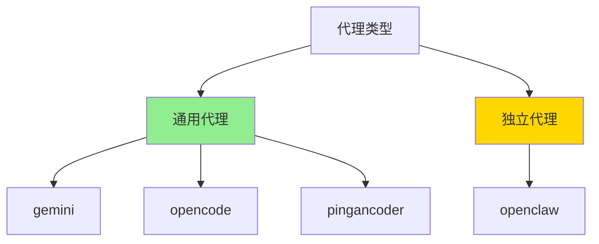

# 代理管理

## 1. 代理配置 (agents.ts)

代理管理模块负责定义和管理不同的 AI 编码代理及其技能目录配置。

### 1.1 代理类型（精简后）



### 1.2 代理配置结构

```typescript
export interface AgentConfig {
  /** 代理唯一标识符 */
  name: AgentType;

  /** 代理显示名称 */
  displayName: string;

  /** 项目级技能目录（相对于项目根目录） */
  skillsDir: string;

  /** 全局级技能目录（绝对路径） */
  globalSkillsDir: string;

  /** 检测代理是否已安装 */
  detectInstalled: () => Promise<boolean>;

  /** 是否显示在通用代理列表中 */
  showInUniversalList?: boolean;
}
```

### 1.3 代理定义

```typescript
import { homedir } from 'os';
import { join } from 'path';
import { existsSync } from 'fs';
import { xdgConfig } from 'xdg-basedir';

const home = homedir();
const configHome = xdgConfig ?? join(home, '.config');

export const agents: Record<AgentType, AgentConfig> = {
  // ===== 通用代理（使用 .agents/skills） =====

  gemini: {
    name: 'gemini',
    displayName: 'Gemini CLI',
    skillsDir: '.agents/skills',
    globalSkillsDir: join(home, '.gemini/skills'),
    detectInstalled: async () => existsSync(join(home, '.gemini')),
    showInUniversalList: true,
  },

  opencode: {
    name: 'opencode',
    displayName: 'OpenCode',
    skillsDir: '.agents/skills',
    globalSkillsDir: join(configHome, 'opencode/skills'),
    detectInstalled: async () => existsSync(join(configHome, 'opencode')),
    showInUniversalList: true,
  },

  pingancoder: {
    name: 'pingancoder',
    displayName: 'Pingancoder',
    skillsDir: '.agents/skills',
    globalSkillsDir: join(home, '.pingancoder/skills'),
    detectInstalled: async () => existsSync(join(home, '.pingancoder')),
    showInUniversalList: true,
  },

  // ===== 独立代理（有独立的技能目录） =====

  openclaw: {
    name: 'openclaw',
    displayName: 'OpenClaw',
    skillsDir: 'skills',  // 注意：不是 .agents/skills
    globalSkillsDir: getOpenClawGlobalSkillsDir(),
    detectInstalled: async () => {
      return existsSync(join(home, '.openclaw')) ||
             existsSync(join(home, '.clawdbot')) ||
             existsSync(join(home, '.moltbot'));
    },
    showInUniversalList: true,
  },
};

// OpenClaw 特殊处理：支持多个历史目录
export function getOpenClawGlobalSkillsDir(
  homeDir = home,
  pathExists: (path: string) => boolean = existsSync
): string {
  if (pathExists(join(homeDir, '.openclaw'))) {
    return join(homeDir, '.openclaw/skills');
  }
  if (pathExists(join(homeDir, '.clawdbot'))) {
    return join(homeDir, '.clawdbot/skills');
  }
  if (pathExists(join(homeDir, '.moltbot'))) {
    return join(homeDir, '.moltbot/skills');
  }
  return join(homeDir, '.openclaw/skills');
}
```

## 2. 代理检测

### 2.1 检测已安装代理

```typescript
export async function detectInstalledAgents(): Promise<AgentType[]> {
  const results = await Promise.all(
    Object.entries(agents).map(async ([type, config]) => ({
      type: type as AgentType,
      installed: await config.detectInstalled(),
    }))
  );

  return results
    .filter((r) => r.installed)
    .map((r) => r.type);
}
```

### 2.2 获取代理配置

```typescript
export function getAgentConfig(type: AgentType): AgentConfig {
  const config = agents[type];
  if (!config) {
    throw new Error(`未知的代理类型: ${type}`);
  }
  return config;
}
```

## 3. 代理分类

### 3.1 通用代理

通用代理共享 `.agents/skills` 目录，不需要创建符号链接。

```typescript
export function getUniversalAgents(): AgentType[] {
  return (Object.entries(agents) as [AgentType, AgentConfig][])
    .filter(
      ([_, config]) =>
        config.skillsDir === '.agents/skills' &&
        config.showInUniversalList !== false
    )
    .map(([type]) => type);
}

// 返回: ['gemini', 'opencode', 'pingancoder']
```

### 3.2 非通用代理

非通用代理有独立的技能目录，需要从规范位置创建符号链接。

```typescript
export function getNonUniversalAgents(): AgentType[] {
  return (Object.entries(agents) as [AgentType, AgentConfig][])
    .filter(([_, config]) => config.skillsDir !== '.agents/skills')
    .map(([type]) => type);
}

// 返回: ['openclaw']
```

### 3.3 检查代理类型

```typescript
export function isUniversalAgent(type: AgentType): boolean {
  return agents[type].skillsDir === '.agents/skills';
}
```

## 4. 路径解析

### 4.1 获取代理技能目录

```typescript
export interface AgentPathOptions {
  agent: AgentType;
  global?: boolean;
  cwd?: string;
}

export function getAgentSkillsPath(options: AgentPathOptions): string {
  const { agent, global = false, cwd = process.cwd() } = options;
  const config = getAgentConfig(agent);

  if (global) {
    return config.globalSkillsDir;
  }

  // 项目级路径
  if (config.skillsDir.startsWith('.')) {
    return join(cwd, config.skillsDir);
  }

  return config.skillsDir;
}
```

### 4.2 获取所有代理的技能目录

```typescript
export function getAllAgentSkillsPaths(
  options: { global?: boolean; cwd?: string } = {}
): Map<AgentType, string> {
  const { global = false, cwd = process.cwd() } = options;
  const paths = new Map<AgentType, string>();

  for (const [type, config] of Object.entries(agents) as [AgentType, AgentConfig][]) {
    if (global) {
      paths.set(type, config.globalSkillsDir);
    } else {
      const path = config.skillsDir.startsWith('.')
        ? join(cwd, config.skillsDir)
        : config.skillsDir;
      paths.set(type, path);
    }
  }

  return paths;
}
```

## 5. 目录布局

### 5.1 项目级布局

```
project-root/
├── .agents/                    ← 通用代理的规范位置
│   └── skills/
│       ├── skill-1/
│       │   └── SKILL.md
│       └── skill-2/
│           └── SKILL.md
│
├── .gemini/                    ← 符号链接到 .agents/skills
│   └── skills/
│       ├── skill-1 → ../../.agents/skills/skill-1
│       └── skill-2 → ../../.agents/skills/skill-2
│
├── .opencode/                  ← 符号链接到 .agents/skills
│   └── skills/
│       ├── skill-1 → ../../.agents/skills/skill-1
│       └── skill-2 → ../../.agents/skills/skill-2
│
├── .pingancoder/               ← 符号链接到 .agents/skills
│   └── skills/
│       ├── skill-1 → ../../.agents/skills/skill-1
│       └── skill-2 → ../../.agents/skills/skill-2
│
└── skills/                     ← OpenClaw 的独立目录
    ├── skill-1/
    │   └── SKILL.md
    └── skill-2/
        └── SKILL.md
```

### 5.2 全局级布局

```
~/.pingancoder/
├── auth.json                   ← 认证 Token
├── config.json                 ← 配置文件
└── skills/                     ← 全局技能目录
    ├── skill-1/
    │   └── SKILL.md
    └── skill-2/
        └── SKILL.md

~/.gemini/
└── skills/
    ├── skill-1 → ../../.pingancoder/skills/skill-1
    └── skill-2 → ../../.pingancoder/skills/skill-2

~/.config/opencode/
└── skills/
    ├── skill-1 → ../../../.pingancoder/skills/skill-1
    └── skill-2 → ../../../.pingancoder/skills/skill-2

~/.openclaw/
└── skills/
    ├── skill-1/
    │   └── SKILL.md
    └── skill-2/
        └── SKILL.md
```

## 6. 代理选择

### 6.1 交互式选择

```typescript
import { select } from '@clack/prompts';

export async function selectAgents(
  message: string = '选择要安装到的代理'
): Promise<AgentType[]> {
  const installed = await detectInstalledAgents();

  if (installed.length === 0) {
    console.log('⚠️  未检测到任何已安装的代理');
    console.log('技能将安装到通用位置 (.agents/skills/)');
    return ['universal'];
  }

  const choices = installed.map((agent) => ({
    value: agent,
    label: agents[agent].displayName,
  }));

  const selected = await select({
    message,
    options: [
      { value: 'all', label: '所有代理' },
      ...choices,
    ],
  });

  if (selected === 'all') {
    return installed;
  }

  return [selected as AgentType];
}
```

### 6.2 多选代理

```typescript
import { multiselect } from '@clack/prompts';

export async function multiSelectAgents(
  message: string = '选择要安装到的代理（可多选）'
): Promise<AgentType[]> {
  const installed = await detectInstalledAgents();

  if (installed.length === 0) {
    console.log('⚠️  未检测到任何已安装的代理');
    return [];
  }

  const choices = installed.map((agent) => ({
    value: agent,
    label: agents[agent].displayName,
  }));

  const selected = await multiselect({
    message,
    options: choices,
    required: false,
  });

  return (selected || []) as AgentType[];
}
```

## 7. 代理验证

### 7.1 验证代理目录

```typescript
export async function verifyAgentDirectory(
  agentType: AgentType,
  global: boolean = false
): Promise<{ valid: boolean; issues: string[] }> {
  const issues: string[] = [];
  const config = getAgentConfig(agentType);

  const skillsDir = getAgentSkillsPath({ agent: agentType, global });

  // 检查目录是否存在
  if (!existsSync(skillsDir)) {
    issues.push(`技能目录不存在: ${skillsDir}`);
    return { valid: false, issues };
  }

  // 检查目录权限
  try {
    await access(skillsDir, constants.R_OK | constants.W_OK);
  } catch {
    issues.push(`没有读写权限: ${skillsDir}`);
  }

  // 检查符号链接是否有效
  if (!isUniversalAgent(agentType)) {
    // 对于非通用代理，检查符号链接
    const canonicalPath = await getCanonicalPath('test', global);
    // ... 符号链接验证逻辑
  }

  return {
    valid: issues.length === 0,
    issues,
  };
}
```

### 7.2 批量验证

```typescript
export async function verifyAllAgents(
  global: boolean = false
): Promise<Map<AgentType, { valid: boolean; issues: string[] }>> {
  const results = new Map();

  for (const agentType of Object.keys(agents) as AgentType[]) {
    const result = await verifyAgentDirectory(agentType, global);
    results.set(agentType, result);
  }

  return results;
}
```

## 8. 代理统计

### 8.1 统计已安装代理

```typescript
export interface AgentStats {
  total: number;
  installed: number;
  byType: Record<AgentType, boolean>;
}

export async function getAgentStats(): Promise<AgentStats> {
  const installed = await detectInstalledAgents();
  const byType = {} as Record<AgentType, boolean>;

  for (const type of Object.keys(agents) as AgentType[]) {
    byType[type] = installed.includes(type);
  }

  return {
    total: Object.keys(agents).length,
    installed: installed.length,
    byType,
  };
}
```

### 8.2 格式化代理列表

```typescript
export function formatAgentList(installed: AgentType[]): string {
  if (installed.length === 0) {
    return '未安装任何代理';
  }

  let output = '已安装的代理:\n';

  for (const agentType of installed) {
    const config = getAgentConfig(agentType);
    const isUniversal = isUniversalAgent(agentType);
    const typeLabel = isUniversal ? '通用' : '独立';

    output += `  • ${config.displayName} (${typeUniversal})\n`;
    output += `    项目级: ${config.skillsDir}\n`;
    output += `    全局级: ${config.globalSkillsDir}\n`;
  }

  return output;
}
```

---

**下一篇**: [07-锁文件机制](./07-锁文件机制.md)
