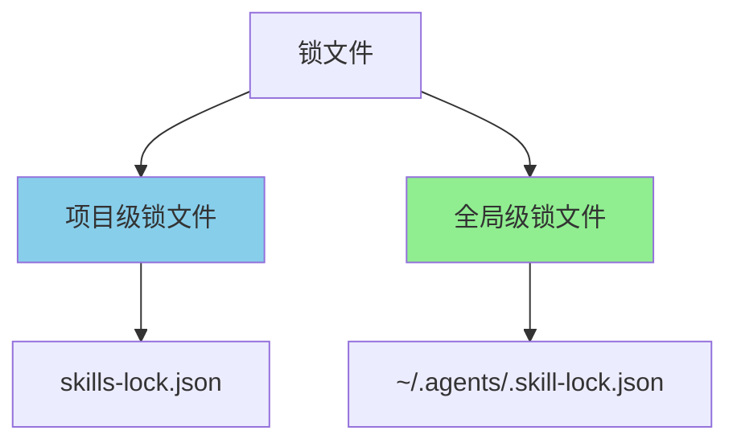

# 锁文件机制

## 1. 锁文件概述

锁文件用于追踪已安装技能的信息，包括来源、版本、安装时间等。内网版本保持与原版兼容的锁文件格式。

### 1.1 锁文件类型



### 1.2 锁文件结构

**项目级锁文件 (local-lock.ts):**

```typescript
export interface LocalSkillLockFile {
  /** 版本 */
  version: number;
  /** 技能映射（按字母排序） */
  skills: Record<string, LocalSkillLockEntry>;
}

export interface LocalSkillLockEntry {
  /** 来源 */
  source: string;
  /** 提供者类型 */
  sourceType: string;
  /** 计算的哈希 */
  computedHash: string;
  /** 版本（如果可用） */
  version?: string;
}
```

**全局锁文件 (skill-lock.ts):**

```typescript
export interface SkillLockFile {
  /** 版本 */
  version: number;
  /** 技能映射 */
  skills: Record<string, SkillLockEntry>;
  /** 忽略的提示 */
  dismissed?: DismissedPrompts;
  /** 最后选择的代理 */
  lastSelectedAgents?: string[];
}

export interface SkillLockEntry {
  /** 规范化的来源标识符 */
  source: string;
  /** 提供者类型 */
  sourceType: string;
  /** 原始 URL */
  sourceUrl: string;
  /** 子路径（如果适用） */
  skillPath?: string;
  /** 技能文件夹哈希 */
  skillFolderHash: string;
  /** 安装时间 */
  installedAt: string;
  /** 更新时间 */
  updatedAt: string;
  /** 版本（如果提供者支持） */
  version?: string;
  /** 插件名称 */
  pluginName?: string;
}
```

### 1.3 锁文件示例

**项目级锁文件示例 (skills-lock.json):**

```json
{
  "version": 1,
  "skills": {
    "test-skill": {
      "source": "/tmp/test-skill",
      "sourceType": "local",
      "computedHash": "f99aaee997b27b314fdf30bd1fec486b2bbc28facd014ba4cf96c1e99961b030"
    },
    "zip-test": {
      "source": "/tmp/zip-test.zip",
      "sourceType": "local-zip",
      "computedHash": "669ee540b51189068cdee056848875ea83e6c453bb6a46b86ce4d68a22ba44dd"
    }
  }
}
```

**全局锁文件示例 (~/.agents/.skill-lock.json):**

```json
{
  "version": 3,
  "skills": {
    "find-skills": {
      "source": "vercel-labs/skills",
      "sourceType": "github",
      "sourceUrl": "https://github.com/vercel-labs/skills.git",
      "skillPath": "skills/find-skills/SKILL.md",
      "skillFolderHash": "c2f31172b6f256272305a5e6e7228b258446899f",
      "installedAt": "2026-01-28T03:35:58.486Z",
      "updatedAt": "2026-01-28T03:35:58.486Z"
    }
  },
  "dismissed": {
    "findSkillsPrompt": true
  },
  "lastSelectedAgents": ["gemini", "opencode", "pingancoder"]
}
```

## 2. 本地锁文件 (local-lock.ts)

### 2.1 锁文件路径

```typescript
import { join } from 'path';

const LOCAL_LOCK_FILE = 'skills-lock.json';

export function getLocalLockPath(cwd?: string): string {
  return join(cwd || process.cwd(), LOCAL_LOCK_FILE);
}
```

### 2.2 读取本地锁文件

```typescript
import { readFile } from 'fs/promises';
import { existsSync } from 'fs';

export async function readLocalSkillLock(): Promise<SkillLockData> {
  const lockPath = getLocalLockPath();

  if (!existsSync(lockPath)) {
    return {};
  }

  try {
    const content = await readFile(lockPath, 'utf-8');
    return JSON.parse(content);
  } catch (error) {
    console.error(`读取锁文件失败: ${error.message}`);
    return {};
  }
}
```

### 2.3 写入本地锁文件

```typescript
import { writeFile, mkdir } from 'fs/promises';
import { dirname } from 'path';

export async function writeLocalSkillLock(data: SkillLockData): Promise<void> {
  const lockPath = getLocalLockPath();

  // 确保目录存在
  await mkdir(dirname(lockPath), { recursive: true });

  // 写入文件
  await writeFile(lockPath, JSON.stringify(data, null, 2), 'utf-8');
}
```

### 2.4 更新本地锁文件

```typescript
export async function updateLocalSkillLock(
  installName: string,
  entry: SkillLockEntry
): Promise<void> {
  const lockData = await readLocalSkillLock();
  lockData[installName] = entry;
  await writeLocalSkillLock(lockData);
}

export async function removeFromLocalSkillLock(installName: string): Promise<void> {
  const lockData = await readLocalSkillLock();
  delete lockData[installName];
  await writeLocalSkillLock(lockData);
}
```

## 3. 全局锁文件 (skill-lock.ts)

### 3.1 锁文件路径

```typescript
import { join } from 'path';
import { homedir } from 'os';
import { AGENTS_DIR } from './constants.js';

const LOCK_FILE = '.skill-lock.json';

export function getSkillLockPath(): string {
  return join(homedir(), AGENTS_DIR, LOCK_FILE);
}
```

### 3.2 读取全局锁文件

```typescript
export async function readGlobalSkillLock(): Promise<SkillLockData> {
  const lockPath = getGlobalLockPath();

  if (!existsSync(lockPath)) {
    return {};
  }

  try {
    const content = await readFile(lockPath, 'utf-8');
    return JSON.parse(content);
  } catch (error) {
    console.error(`读取全局锁文件失败: ${error.message}`);
    return {};
  }
}
```

### 3.3 写入全局锁文件

```typescript
export async function writeGlobalSkillLock(data: SkillLockData): Promise<void> {
  const lockPath = getGlobalLockPath();

  // 确保目录存在
  await mkdir(dirname(lockPath), { recursive: true });

  // 写入文件
  await writeFile(lockPath, JSON.stringify(data, null, 2), 'utf-8');
}
```

### 3.4 更新全局锁文件

```typescript
export async function updateGlobalSkillLock(
  installName: string,
  entry: SkillLockEntry
): Promise<void> {
  const lockData = await readGlobalSkillLock();
  lockData[installName] = entry;
  await writeGlobalSkillLock(lockData);
}

export async function removeFromGlobalSkillLock(installName: string): Promise<void> {
  const lockData = await readGlobalSkillLock();
  delete lockData[installName];
  await writeGlobalSkillLock(lockData);
}
```

## 4. 统一接口

### 4.1 读取锁文件

```typescript
export async function readSkillLock(
  global: boolean = false
): Promise<SkillLockData> {
  return global
    ? await readGlobalSkillLock()
    : await readLocalSkillLock();
}
```

### 4.2 写入锁文件

```typescript
export async function writeSkillLock(
  data: SkillLockData,
  global: boolean = false
): Promise<void> {
  return global
    ? await writeGlobalSkillLock(data)
    : await writeLocalSkillLock(data);
}
```

### 4.3 更新锁文件

```typescript
export async function updateSkillLockEntry(
  installName: string,
  entry: SkillLockEntry,
  global: boolean = false
): Promise<void> {
  return global
    ? await updateGlobalSkillLock(installName, entry)
    : await updateLocalSkillLock(installName, entry);
}
```

## 5. 哈希计算

### 5.1 计算技能哈希

```typescript
import { createHash } from 'crypto';

export async function calculateSkillHash(skillMdPath: string): Promise<string> {
  const content = await readFile(skillMdPath, 'utf-8');
  const hash = createHash('sha256');
  hash.update(content);
  return hash.digest('hex');
}
```

### 5.2 验证技能完整性

```typescript
export async function verifySkillIntegrity(
  installName: string,
  expectedHash: string,
  global: boolean = false
): Promise<boolean> {
  const canonicalPath = await getCanonicalPath(installName, global);
  const skillMdPath = join(canonicalPath, 'SKILL.md');

  if (!existsSync(skillMdPath)) {
    return false;
  }

  const actualHash = await calculateSkillHash(skillMdPath);
  return actualHash === expectedHash;
}
```

## 6. 锁文件同步

### 6.1 合并锁文件

```typescript
export function mergeLockFiles(
  local: SkillLockData,
  global: SkillLockData
): SkillLockData {
  const merged = { ...global };

  for (const [name, entry] of Object.entries(local)) {
    // 如果全局已存在，保留全局的（优先级更高）
    if (!merged[name]) {
      merged[name] = entry;
    }
  }

  return merged;
}
```

### 6.2 获取所有技能

```typescript
export async function getAllInstalledSkills(): Promise<
  Map<string, { entry: SkillLockEntry; global: boolean }>
> {
  const allSkills = new Map();

  // 读取全局锁文件
  const globalLock = await readGlobalSkillLock();
  for (const [name, entry] of Object.entries(globalLock)) {
    allSkills.set(name, { entry, global: true });
  }

  // 读取本地锁文件
  const localLock = await readLocalSkillLock();
  for (const [name, entry] of Object.entries(localLock)) {
    // 本地优先
    allSkills.set(name, { entry, global: false });
  }

  return allSkills;
}
```

## 7. 锁文件迁移

### 7.1 从 skills-main 迁移

```typescript
export async function migrateFromOldLock(): Promise<void> {
  // 检查旧的锁文件位置
  const oldLockPaths = [
    join(cwd(), '.claude', 'skills.json'),
    join(cwd(), '.cursor', 'skills.json'),
    join(homedir(), '.claude', 'skills.json'),
  ];

  for (const oldPath of oldLockPaths) {
    if (existsSync(oldPath)) {
      console.log(`发现旧锁文件: ${oldPath}`);

      // 读取旧锁文件
      const oldData = JSON.parse(await readFile(oldPath, 'utf-8'));

      // 迁移到新锁文件
      for (const [name, entry] of Object.entries(oldData)) {
        await updateLocalSkillLock(name, entry as SkillLockEntry);
      }

      // 备份旧锁文件
      const backupPath = oldPath + '.backup';
      await rename(oldPath, backupPath);

      console.log(`已迁移并备份到: ${backupPath}`);
    }
  }
}
```

## 8. 锁文件验证

### 8.1 验证锁文件完整性

```typescript
export interface LockFileValidationResult {
  valid: boolean;
  missing: string[];
  corrupted: string[];
  mismatched: string[];
}

export async function validateLockFile(
  global: boolean = false
): Promise<LockFileValidationResult> {
  const result: LockFileValidationResult = {
    valid: true,
    missing: [],
    corrupted: [],
    mismatched: [],
  };

  const lockData = await readSkillLock(global);

  for (const [installName, entry] of Object.entries(lockData)) {
    const canonicalPath = await getCanonicalPath(installName, global);
    const skillMdPath = join(canonicalPath, 'SKILL.md');

    // 检查文件是否存在
    if (!existsSync(skillMdPath)) {
      result.missing.push(installName);
      result.valid = false;
      continue;
    }

    // 检查是否可以解析
    try {
      const skill = await parseSkillMd(skillMdPath);
      if (!skill) {
        result.corrupted.push(installName);
        result.valid = false;
      }
    } catch (error) {
      result.corrupted.push(installName);
      result.valid = false;
    }

    // 检查版本是否匹配（如果有哈希）
    if (entry.metadata?.hash) {
      const actualHash = await calculateSkillHash(skillMdPath);
      if (actualHash !== entry.metadata.hash) {
        result.mismatched.push(installName);
        result.valid = false;
      }
    }
  }

  return result;
}
```

### 8.2 修复锁文件

```typescript
export async function repairLockFile(
  global: boolean = false
): Promise<void> {
  const validation = await validateLockFile(global);

  if (validation.valid) {
    console.log('✅ 锁文件有效，无需修复');
    return;
  }

  console.log('🔧 开始修复锁文件...');

  const lockData = await readSkillLock(global);

  // 移除缺失的技能
  for (const installName of validation.missing) {
    console.log(`移除缺失的技能: ${installName}`);
    delete lockData[installName];
  }

  // 移除损坏的技能
  for (const installName of validation.corrupted) {
    console.log(`移除损坏的技能: ${installName}`);
    delete lockData[installName];
  }

  // 更新不匹配的哈希
  for (const installName of validation.mismatched) {
    console.log(`更新哈希: ${installName}`);
    const canonicalPath = await getCanonicalPath(installName, global);
    const skillMdPath = join(canonicalPath, 'SKILL.md');
    const hash = await calculateSkillHash(skillMdPath);

    if (lockData[installName]) {
      lockData[installName].metadata = {
        ...lockData[installName].metadata,
        hash,
      };
    }
  }

  // 写入修复后的锁文件
  await writeSkillLock(lockData, global);

  console.log('✅ 锁文件修复完成');
}
```

---

**下一篇**: [08-远程技能提供者](./08-远程技能提供者.md)
