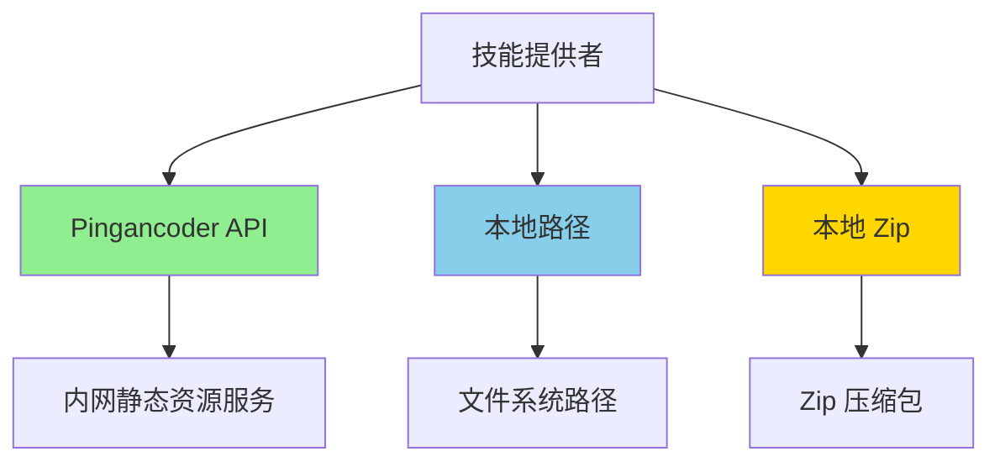

# 远程技能提供者

## 1. 提供者系统概述

内网版本的提供者系统从原来的 7+ 个提供者精简为 3 个核心提供者。

### 1.1 提供者类型



### 1.2 提供者接口

```typescript
export interface HostProvider {
  /** 提供者唯一标识符 */
  readonly id: string;

  /** 提供者显示名称 */
  readonly displayName: string;

  /** 检查 URL 是否匹配此提供者 */
  match(url: string): ProviderMatch;

  /** 获取技能详情 */
  fetchSkill(url: string): Promise<RemoteSkill | null>;

  /** 转换为原始内容 URL */
  toRawUrl(url: string): string;

  /** 获取来源标识符 */
  getSourceIdentifier(url: string): string;
}

export interface ProviderMatch {
  matches: boolean;
  sourceIdentifier?: string;
}

export interface RemoteSkill {
  name: string;
  description: string;
  content: string;
  installName: string;
  sourceUrl: string;
  metadata?: Record<string, unknown>;
}
```

## 2. Pingancoder API 提供者

### 2.1 提供者实现

```typescript
// src/providers/pingancoder-provider.ts

import { PingancoderAuth } from './pingancoder-auth.js';

export class PingancoderProvider implements HostProvider {
  id = 'pingancoder';
  displayName = 'Pingancoder 内网服务';

  constructor(
    private auth: PingancoderAuth,
    private config: { baseUrl: string }
  ) {}

  match(url: string): ProviderMatch {
    // 匹配 pingancoder:// 协议
    if (url.startsWith('pingancoder://')) {
      const skillId = url.replace('pingancoder://', '');
      return { matches: true, sourceIdentifier: skillId };
    }

    // 匹配内部 API 地址
    if (url.includes(this.config.baseUrl)) {
      return { matches: true, sourceIdentifier: this.extractSkillId(url) };
    }

    // 匹配纯技能 ID
    if (/^[a-z0-9-]+$/.test(url)) {
      return { matches: true, sourceIdentifier: url };
    }

    return { matches: false };
  }

  async fetchSkill(url: string): Promise<RemoteSkill | null> {
    const skillId = this.getSourceIdentifier(url);
    const token = await this.auth.ensureAuthenticated();

    // 获取技能详情
    const detail = await this.fetchSkillDetail(skillId, token);

    // 生成默认内容（如果没有）
    const content = detail.content || this.generateDefaultContent(detail);

    return {
      name: detail.name,
      description: detail.description,
      content,
      installName: detail.id,
      sourceUrl: url,
      metadata: {
        version: detail.version,
        category: detail.category,
        downloadUrl: detail.downloadUrl,
      },
    };
  }

  toRawUrl(url: string): string {
    return url; // 内网服务直接返回
  }

  getSourceIdentifier(url: string): string {
    if (url.startsWith('pingancoder://')) {
      return url.replace('pingancoder://', '');
    }
    return url;
  }

  private async fetchSkillDetail(
    skillId: string,
    token: string
  ): Promise<PingancoderSkillDetail> {
    const url = `${this.config.baseUrl}/skills/${skillId}`;

    const response = await fetch(url, {
      headers: {
        'Authorization': `Bearer ${token}`,
        'Content-Type': 'application/json',
      },
    });

    if (!response.ok) {
      if (response.status === 401) {
        // Token 失效，清除并重试
        await this.auth.clearToken();
        const newToken = await this.auth.ensureAuthenticated();
        return this.fetchSkillDetail(skillId, newToken);
      }
      throw new Error(`获取技能失败: ${response.statusText}`);
    }

    return response.json();
  }

  private generateDefaultContent(detail: PingancoderSkillDetail): string {
    return `---
name: ${detail.name}
description: ${detail.description}
version: ${detail.version}
category: ${detail.category || 'general'}
---

# ${detail.name}

${detail.description}
`;
  }

  private extractSkillId(url: string): string {
    // 从 URL 中提取技能 ID
    const match = url.match(/\/skills\/([a-z0-9-]+)/);
    return match ? match[1] : url;
  }
}

interface PingancoderSkillDetail {
  id: string;
  name: string;
  description: string;
  version: string;
  category?: string;
  downloadUrl: string;
  content?: string;
  metadata?: Record<string, unknown>;
}
```

### 2.2 技能搜索

```typescript
export async function searchPingancoderSkills(
  query: string,
  options: {
    limit?: number;
    category?: string;
  } = {}
): Promise<PingancoderSearchResult[]> {
  const auth = new PingancoderAuth();
  const token = await auth.ensureAuthenticated();

  const params = new URLSearchParams({
    q: query,
    limit: String(options.limit || 10),
  });

  if (options.category) {
    params.set('category', options.category);
  }

  const url = `${auth.config.baseUrl}/skills/search?${params}`;

  const response = await fetch(url, {
    headers: {
      'Authorization': `Bearer ${token}`,
    },
  });

  if (!response.ok) {
    throw new Error(`搜索失败: ${response.statusText}`);
  }

  const data = await response.json();
  return data.skills || [];
}

interface PingancoderSearchResult {
  id: string;
  name: string;
  description: string;
  version: string;
  category?: string;
  downloads?: number;
}
```

### 2.3 技能下载

```typescript
export async function downloadPingancoderSkill(
  skillId: string,
  onProgress?: (progress: number) => void
): Promise<Buffer> {
  const auth = new PingancoderAuth();
  const token = await auth.ensureAuthenticated();

  // 获取技能详情
  const detail = await auth.fetchSkillDetail(skillId);

  // 下载 Zip
  const response = await fetch(detail.downloadUrl, {
    headers: {
      'Authorization': `Bearer ${token}`,
    },
  });

  if (!response.ok) {
    throw new Error(`下载失败: ${response.statusText}`);
  }

  const contentLength = response.headers.get('content-length');
  const total = contentLength ? parseInt(contentLength, 10) : 0;
  let loaded = 0;

  const chunks: Buffer[] = [];
  const reader = response.body?.getReader();

  if (!reader) {
    throw new Error('无法读取响应流');
  }

  while (true) {
    const { done, value } = await reader.read();

    if (done) break;

    chunks.push(Buffer.from(value));
    loaded += value.length;

    if (onProgress && total > 0) {
      onProgress(Math.floor((loaded / total) * 100));
    }
  }

  return Buffer.concat(chunks);
}
```

## 3. 本地路径提供者

### 3.1 提供者实现

```typescript
// src/providers/local-path-provider.ts

export class LocalPathProvider implements HostProvider {
  id = 'local-path';
  displayName = '本地路径';

  match(url: string): ProviderMatch {
    // 匹配绝对路径
    if (url.startsWith('/')) {
      return { matches: true, sourceIdentifier: `local/${basename(url)}` };
    }

    // 匹配相对路径
    if (url.startsWith('./') || url.startsWith('../')) {
      return { matches: true, sourceIdentifier: `local/${basename(url)}` };
    }

    return { matches: false };
  }

  async fetchSkill(url: string): Promise<RemoteSkill | null> {
    const skillPath = resolve(url);
    const skillMdPath = join(skillPath, 'SKILL.md');

    if (!existsSync(skillMdPath)) {
      throw new Error(`找不到 SKILL.md 文件: ${skillMdPath}`);
    }

    const content = await readFile(skillMdPath, 'utf-8');
    const { data, content: markdown } = matter(content);

    if (!data.name || !data.description) {
      throw new Error('SKILL.md 缺少必需字段 (name, description)');
    }

    return {
      name: data.name,
      description: data.description,
      content: markdown,
      installName: data.name,
      sourceUrl: url,
      metadata: data,
    };
  }

  toRawUrl(url: string): string {
    return resolve(url);
  }

  getSourceIdentifier(url: string): string {
    return `local/${basename(url)}`;
  }
}
```

## 4. 本地 Zip 提供者

### 4.1 提供者实现

```typescript
// src/providers/local-zip-provider.ts

import { extract } from 'extract-zip';
import { tmpdir } from 'os';

export class LocalZipProvider implements HostProvider {
  id = 'local-zip';
  displayName = '本地 Zip 文件';

  match(url: string): ProviderMatch {
    if (url.endsWith('.zip')) {
      return { matches: true, sourceIdentifier: `zip/${basename(url)}` };
    }
    return { matches: false };
  }

  async fetchSkill(url: string): Promise<RemoteSkill | null> {
    const zipPath = resolve(url);

    if (!existsSync(zipPath)) {
      throw new Error(`Zip 文件不存在: ${zipPath}`);
    }

    // 解压到临时目录
    const tempDir = join(tmpdir(), `pingancoder-skill-${Date.now()}`);

    try {
      await extract(zipPath, { dir: tempDir });

      // 验证 Zip 结构
      const skillMdPath = join(tempDir, 'SKILL.md');
      if (!existsSync(skillMdPath)) {
        throw new Error('Zip 包中缺少 SKILL.md 文件');
      }

      // 解析技能
      const content = await readFile(skillMdPath, 'utf-8');
      const { data, content: markdown } = matter(content);

      if (!data.name || !data.description) {
        throw new Error('SKILL.md 缺少必需字段 (name, description)');
      }

      return {
        name: data.name,
        description: data.description,
        content: markdown,
        installName: data.name,
        sourceUrl: url,
        metadata: {
          ...data,
          zipPath,
        },
      };

    } catch (error) {
      // 清理临时目录
      await rm(tempDir, { recursive: true, force: true });
      throw error;
    }
  }

  toRawUrl(url: string): string {
    return resolve(url);
  }

  getSourceIdentifier(url: string): string {
    return `zip/${basename(url, '.zip')}`;
  }
}
```

### 4.2 Zip 验证

```typescript
export async function validateZipFile(zipPath: string): Promise<{
  valid: boolean;
  errors: string[];
}> {
  const errors: string[] = [];

  // 检查文件是否存在
  if (!existsSync(zipPath)) {
    errors.push('Zip 文件不存在');
    return { valid: false, errors };
  }

  // 检查文件扩展名
  if (!zipPath.endsWith('.zip')) {
    errors.push('文件扩展名必须是 .zip');
  }

  // 尝试解压并验证结构
  const tempDir = join(tmpdir(), `validation-${Date.now()}`);

  try {
    await extract(zipPath, { dir: tempDir });

    const skillMdPath = join(tempDir, 'SKILL.md');
    if (!existsSync(skillMdPath)) {
      errors.push('Zip 包中缺少 SKILL.md 文件');
    } else {
      // 验证 SKILL.md 格式
      const content = await readFile(skillMdPath, 'utf-8');
      const { data } = matter(content);

      if (!data.name) {
        errors.push('SKILL.md 缺少 name 字段');
      }

      if (!data.description) {
        errors.push('SKILL.md 缺少 description 字段');
      }
    }

  } catch (error) {
    errors.push(`解压失败: ${error.message}`);
  } finally {
    // 清理临时目录
    await rm(tempDir, { recursive: true, force: true });
  }

  return {
    valid: errors.length === 0,
    errors,
  };
}
```

## 5. 提供者注册

### 5.1 注册表实现

```typescript
// src/providers/registry.ts

class ProviderRegistryImpl {
  private providers: Map<string, HostProvider> = new Map();

  register(provider: HostProvider): void {
    if (this.providers.has(provider.id)) {
      throw new Error(`提供者 "${provider.id}" 已注册`);
    }
    this.providers.set(provider.id, provider);
  }

  findProvider(url: string): HostProvider | null {
    for (const provider of this.providers.values()) {
      const match = provider.match(url);
      if (match.matches) {
        return provider;
      }
    }
    return null;
  }

  getProvider(id: string): HostProvider | undefined {
    return this.providers.get(id);
  }

  getAllProviders(): HostProvider[] {
    return Array.from(this.providers.values());
  }
}

export const registry = new ProviderRegistryImpl();

export function registerProvider(provider: HostProvider): void {
  registry.register(provider);
}

export function findProvider(url: string): HostProvider | null {
  return registry.findProvider(url);
}

export function getProvider(id: string): HostProvider | undefined {
  return registry.getProvider(id);
}

export function getAllProviders(): HostProvider[] {
  return registry.getAllProviders();
}
```

### 5.2 初始化提供者

```typescript
// src/providers/index.ts

import { registerProvider } from './registry.js';
import { PingancoderProvider } from './pingancoder-provider.js';
import { LocalPathProvider } from './local-path-provider.js';
import { LocalZipProvider } from './local-zip-provider.js';

export function initProviders(): void {
  // Pingancoder API 提供者
  const auth = new PingancoderAuth();
  const pingancoderProvider = new PingancoderProvider(auth, {
    baseUrl: process.env.PINGANCODER_API_URL || 'http://internal-server/api',
  });
  registerProvider(pingancoderProvider);

  // 本地路径提供者
  registerProvider(new LocalPathProvider());

  // 本地 Zip 提供者
  registerProvider(new LocalZipProvider());
}
```

## 6. 提供者使用

### 6.1 获取技能

```typescript
export async function fetchSkill(source: string): Promise<RemoteSkill> {
  const provider = findProvider(source);

  if (!provider) {
    throw new Error(`不支持的来源: ${source}`);
  }

  const skill = await provider.fetchSkill(source);

  if (!skill) {
    throw new Error(`无法获取技能: ${source}`);
  }

  return skill;
}
```

### 6.2 批量获取

```typescript
export async function fetchSkills(sources: string[]): Promise<RemoteSkill[]> {
  const results = await Promise.allSettled(
    sources.map(source => fetchSkill(source))
  );

  const skills: RemoteSkill[] = [];
  const errors: Array<{ source: string; error: Error }> = [];

  for (let i = 0; i < results.length; i++) {
    const result = results[i]!;

    if (result.status === 'fulfilled') {
      skills.push(result.value);
    } else {
      errors.push({
        source: sources[i]!,
        error: result.reason,
      });
    }
  }

  // 记录错误
  for (const { source, error } of errors) {
    console.error(`获取技能失败 (${source}): ${error.message}`);
  }

  return skills;
}
```

---

**下一篇**: [09-安全机制](./09-安全机制.md)
