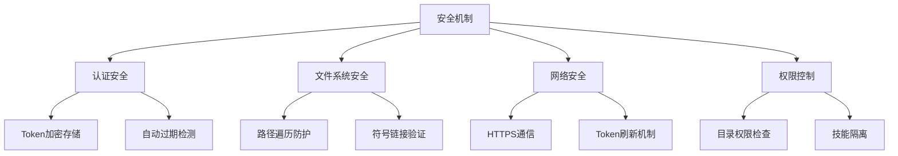

# 安全机制

## 1. 安全概述

内网版本的安全机制重点关注内网环境下的特殊安全需求，包括 Token 加密存储、路径遍历防护、权限验证等。

### 1.1 安全层次



## 2. 认证安全

### 2.1 Token 加密存储

```typescript
// src/security/token-storage.ts

import { createCipher, createDecipher } from 'crypto';
import { homedir } from 'os';
import { join } from 'path';

const ENCRYPTION_KEY = process.env.PINGANCODER_ENCRYPTION_KEY || 'pingancoder-default-key';
const ALGORITHM = 'aes-256-cbc';

export class TokenStorage {
  private tokenPath: string;

  constructor() {
    this.tokenPath = join(homedir(), '.pingancoder', 'auth.json');
  }

  async saveToken(token: string, expiresAt: number): Promise<void> {
    const data = {
      token: this.encrypt(token),
      expiresAt,
      savedAt: Date.now(),
    };

    await mkdir(dirname(this.tokenPath), { recursive: true });
    await writeFile(this.tokenPath, JSON.stringify(data, null, 2), 'utf-8');

    // 设置文件权限（仅用户可读写）
    await chmod(this.tokenPath, 0o600);
  }

  async loadToken(): Promise<{ token: string; expiresAt: number } | null> {
    try {
      if (!existsSync(this.tokenPath)) {
        return null;
      }

      const content = await readFile(this.tokenPath, 'utf-8');
      const data = JSON.parse(content);

      // 验证文件权限
      const stats = await stat(this.tokenPath);
      const mode = stats.mode & 0o777;

      if (mode !== 0o600) {
        console.warn('⚠️  Token 文件权限不安全，正在修复...');
        await chmod(this.tokenPath, 0o600);
      }

      return {
        token: this.decrypt(data.token),
        expiresAt: data.expiresAt,
      };
    } catch (error) {
      console.error('读取 Token 失败:', error.message);
      return null;
    }
  }

  async clearToken(): Promise<void> {
    if (existsSync(this.tokenPath)) {
      await rm(this.tokenPath);
    }
  }

  private encrypt(text: string): string {
    const iv = crypto.randomBytes(16);
    const cipher = createCipheriv(ALGORITHM, ENCRYPTION_KEY, iv);
    let encrypted = cipher.update(text, 'utf8', 'hex');
    encrypted += cipher.final('hex');
    return `${iv.toString('hex')}:${encrypted}`;
  }

  private decrypt(encrypted: string): string {
    const [ivHex, encryptedText] = encrypted.split(':');
    const iv = Buffer.from(ivHex!, 'hex');
    const decipher = createDecipheriv(ALGORITHM, ENCRYPTION_KEY, iv);
    let decrypted = decipher.update(encryptedText!, 'hex', 'utf8');
    decrypted += decipher.final('utf8');
    return decrypted;
  }
}
```

### 2.2 Token 过期检测

```typescript
export class TokenValidator {
  private readonly EXPIRY_BUFFER = 5 * 60 * 1000; // 5分钟缓冲

  isTokenExpired(expiresAt: number): boolean {
    const now = Date.now();
    return now >= (expiresAt - this.EXPIRY_BUFFER);
  }

  getTokenLifetime(expiresAt: number): number {
    const now = Date.now();
    return Math.max(0, expiresAt - now);
  }

  formatTokenLifetime(expiresAt: number): string {
    const lifetime = this.getTokenLifetime(expiresAt);

    if (lifetime === 0) {
      return '已过期';
    }

    const hours = Math.floor(lifetime / (60 * 60 * 1000));
    const minutes = Math.floor((lifetime % (60 * 60 * 1000)) / (60 * 1000));

    if (hours > 24) {
      const days = Math.floor(hours / 24);
      return `${days}天${hours % 24}小时`;
    }

    if (hours > 0) {
      return `${hours}小时${minutes}分钟`;
    }

    return `${minutes}分钟`;
  }
}
```

## 3. 文件系统安全

### 3.1 路径遍历防护

```typescript
// src/security/path-validator.ts

import { resolve, normalize, dirname } from 'path';
import { existsSync } from 'fs';

export class PathValidator {
  /**
   * 验证路径是否安全（防止路径遍历攻击）
   */
  validatePath(path: string, allowedBase: string): boolean {
    const normalized = normalize(path);
    const resolved = resolve(allowedBase, normalized);
    const resolvedBase = resolve(allowedBase);

    // 确保解析后的路径在允许的基础目录内
    return resolved.startsWith(resolvedBase + sep) || resolved === resolvedBase;
  }

  /**
   * 安全地解析路径
   */
  safeResolvePath(base: string, target: string): string {
    const resolved = resolve(base, target);
    const normalized = normalize(resolved);
    const baseNormalized = normalize(base);

    if (!normalized.startsWith(baseNormalized)) {
      throw new Error('路径遍历攻击检测：路径在允许的基础目录之外');
    }

    return normalized;
  }

  /**
   * 验证 Zip 文件中的路径
   */
  validateZipEntry(entryPath: string): boolean {
    const normalized = normalize(entryPath);

    // 检查是否包含路径遍历
    if (normalized.includes('..')) {
      return false;
    }

    // 检查是否是绝对路径
    if (normalized.startsWith('/')) {
      return false;
    }

    // 检查是否包含驱动器字母（Windows）
    if (/^[A-Za-z]:/.test(normalized)) {
      return false;
    }

    return true;
  }
}
```

### 3.2 符号链接验证

```typescript
export class SymlinkValidator {
  /**
   * 验证符号链接是否安全
   */
  async validateSymlink(
    linkPath: string,
    expectedTarget: string
  ): Promise<{ valid: boolean; error?: string }> {
    try {
      // 检查链接是否存在
      if (!existsSync(linkPath)) {
        return { valid: false, error: '符号链接不存在' };
      }

      // 检查是否是符号链接
      const stats = await lstat(linkPath);
      if (!stats.isSymbolicLink()) {
        return { valid: false, error: '不是符号链接' };
      }

      // 读取链接目标
      const actualTarget = await readlink(linkPath);

      // 验证链接目标
      if (actualTarget !== expectedTarget) {
        return {
          valid: false,
          error: `链接目标不匹配：期望 "${expectedTarget}"，实际 "${actualTarget}"`,
        };
      }

      // 验证目标是否存在
      if (!existsSync(expectedTarget)) {
        return { valid: false, error: '链接目标不存在' };
      }

      return { valid: true };

    } catch (error) {
      return { valid: false, error: error.message };
    }
  }

  /**
   * 检查符号链接循环
   */
  async checkSymlinkLoop(
    linkPath: string,
    maxDepth = 10
  ): Promise<{ hasLoop: boolean; loopPath?: string }> {
    const visited = new Set<string>();
    let currentPath = linkPath;
    let depth = 0;

    while (depth < maxDepth) {
      // 检查是否已访问过
      if (visited.has(currentPath)) {
        return { hasLoop: true, loopPath: currentPath };
      }

      visited.add(currentPath);

      // 检查是否是符号链接
      try {
        const stats = await lstat(currentPath);
        if (!stats.isSymbolicLink()) {
          return { hasLoop: false };
        }

        // 读取链接目标
        const target = await readlink(currentPath);
        currentPath = resolve(dirname(currentPath), target);
        depth++;

      } catch {
        return { hasLoop: false };
      }
    }

    return { hasLoop: true, loopPath: '超过最大深度' };
  }
}
```

## 4. 网络安全

### 4.1 HTTPS 通信

```typescript
// src/security/http-client.ts

import type { RequestInit } from 'node-fetch';

export class SecureHttpClient {
  constructor(
    private baseUrl: string,
    private token: string
  ) {}

  async request(
    endpoint: string,
    options: RequestInit = {}
  ): Promise<Response> {
    const url = `${this.baseUrl}${endpoint}`;

    const headers = {
      'Authorization': `Bearer ${this.token}`,
      'Content-Type': 'application/json',
      ...options.headers,
    };

    try {
      const response = await fetch(url, {
        ...options,
        headers,
      });

      return response;

    } catch (error) {
      if (error.code === 'CERT_HAS_EXPIRED') {
        throw new Error('SSL 证书已过期，请联系管理员');
      }

      if (error.code === 'UNABLE_TO_VERIFY_LEAF_SIGNATURE') {
        throw new Error('无法验证 SSL 证书，请联系管理员');
      }

      throw error;
    }
  }

  async get(endpoint: string): Promise<Response> {
    return this.request(endpoint, { method: 'GET' });
  }

  async post(endpoint: string, data: unknown): Promise<Response> {
    return this.request(endpoint, {
      method: 'POST',
      body: JSON.stringify(data),
    });
  }
}
```

### 4.2 Token 刷新机制

```typescript
export class TokenRefreshManager {
  private refreshing: boolean = false;
  private refreshPromise: Promise<string> | null = null;

  async refreshToken(auth: PingancoderAuth): Promise<string> {
    // 如果正在刷新，等待刷新完成
    if (this.refreshing) {
      return this.refreshPromise!;
    }

    this.refreshing = true;
    this.refreshPromise = this.doRefresh(auth);

    try {
      const newToken = await this.refreshPromise;
      return newToken;
    } finally {
      this.refreshing = false;
      this.refreshPromise = null;
    }
  }

  private async doRefresh(auth: PingancoderAuth): Promise<string> {
    try {
      // 使用 refresh token 获取新的 access token
      const session = await auth.refreshToken();

      if (!session.token) {
        throw new Error('刷新 Token 失败');
      }

      return session.token;

    } catch (error) {
      // 如果刷新失败，清除缓存并要求重新登录
      await auth.clearToken();
      throw new Error('Token 刷新失败，请重新登录');
    }
  }
}
```

## 5. 权限控制

### 5.1 目录权限检查

```typescript
export class PermissionChecker {
  /**
   * 检查目录读写权限
   */
  async checkDirectoryPermissions(dir: string): Promise<{
    readable: boolean;
    writable: boolean;
    executable: boolean;
  }> {
    try {
      await access(dir, constants.R_OK);
      const readable = true;

      await access(dir, constants.W_OK);
      const writable = true;

      await access(dir, constants.X_OK);
      const executable = true;

      return { readable, writable, executable };

    } catch {
      return { readable: false, writable: false, executable: false };
    }
  }

  /**
   * 确保目录权限正确
   */
  async ensureDirectoryPermissions(dir: string): Promise<void> {
    const perms = await this.checkDirectoryPermissions(dir);

    if (!perms.readable || !perms.writable || !perms.executable) {
      throw new Error(`目录权限不足: ${dir}`);
    }
  }

  /**
   * 设置安全的文件权限
   */
  async setSecurePermissions(filePath: string): Promise<void> {
    // 设置为仅用户可读写
    await chmod(filePath, 0o600);
  }

  /**
   * 设置安全的目录权限
   */
  async setSecureDirectoryPermissions(dirPath: string): Promise<void> {
    // 设置为用户可读写执行，其他人只能读执行
    await chmod(dirPath, 0o755);
  }
}
```

### 5.2 技能隔离

```typescript
export class SkillIsolation {
  /**
   * 检查技能是否在允许的目录中
   */
  isSkillAllowed(skillPath: string, allowedPaths: string[]): boolean {
    const normalized = normalize(skillPath);

    return allowedPaths.some(allowed => {
      const normalizedAllowed = normalize(allowed);
      return normalized.startsWith(normalizedAllowed);
    });
  }

  /**
   * 获取允许的技能路径
   */
  async getAllowedSkillPaths(): Promise<string[]> {
    const paths: string[] = [];

    // 项目级路径
    paths.push(join(process.cwd(), '.agents', 'skills'));

    // 全局路径
    paths.push(join(homedir(), '.pingancoder', 'skills'));

    // 代理特定路径
    const agents = await detectInstalledAgents();
    for (const agent of agents) {
      const config = getAgentConfig(agent);
      paths.push(config.globalSkillsDir);
      paths.push(join(process.cwd(), config.skillsDir));
    }

    return paths;
  }

  /**
   * 验证技能是否在允许的位置
   */
  async validateSkillLocation(skillPath: string): Promise<boolean> {
    const allowedPaths = await this.getAllowedSkillPaths();
    return this.isSkillAllowed(skillPath, allowedPaths);
  }
}
```

## 6. 安全审计

### 6.1 审计日志

```typescript
export class SecurityAuditLogger {
  private logPath: string;

  constructor() {
    this.logPath = join(homedir(), '.pingancoder', 'security.log');
  }

  async log(event: AuditEvent): Promise<void> {
    const logEntry = {
      timestamp: new Date().toISOString(),
      event: event.type,
      details: event.details,
      userId: event.userId || 'unknown',
      result: event.result,
    };

    const logLine = JSON.stringify(logEntry) + '\n';

    try {
      await mkdir(dirname(this.logPath), { recursive: true });
      await appendFile(this.logPath, logLine);
    } catch (error) {
      console.error('写入审计日志失败:', error.message);
    }
  }

  async logAuthEvent(
    type: 'login' | 'logout' | 'token_refresh',
    userId: string,
    result: 'success' | 'failure',
    details?: Record<string, unknown>
  ): Promise<void> {
    await this.log({
      type: 'auth',
      subType: type,
      userId,
      result,
      details,
    });
  }

  async logSkillEvent(
    type: 'install' | 'remove' | 'update',
    skillName: string,
    result: 'success' | 'failure',
    details?: Record<string, unknown>
  ): Promise<void> {
    await this.log({
      type: 'skill',
      subType: type,
      userId: 'current',
      result,
      details: {
        skillName,
        ...details,
      },
    });
  }
}

interface AuditEvent {
  type: string;
  subType?: string;
  userId: string;
  result: 'success' | 'failure';
  details?: Record<string, unknown>;
}
```

### 6.2 安全检查

```typescript
export class SecurityChecker {
  /**
   * 执行完整的安全检查
   */
  async performSecurityCheck(): Promise<SecurityCheckResult> {
    const issues: SecurityIssue[] = [];

    // 1. 检查 Token 文件权限
    const tokenPath = join(homedir(), '.pingancoder', 'auth.json');
    if (existsSync(tokenPath)) {
      const stats = await stat(tokenPath);
      const mode = stats.mode & 0o777;

      if (mode !== 0o600) {
        issues.push({
          type: 'permission',
          severity: 'high',
          message: 'Token 文件权限不安全',
          path: tokenPath,
          recommendation: '运行: chmod 600 ~/.pingancoder/auth.json',
        });
      }
    }

    // 2. 检查符号链接
    const installed = await detectInstalledAgents();
    for (const agent of installed) {
      const config = getAgentConfig(agent);
      // ... 符号链接检查逻辑
    }

    // 3. 检查目录权限
    const permissionChecker = new PermissionChecker();
    const paths = await new SkillIsolation().getAllowedSkillPaths();

    for (const path of paths) {
      if (existsSync(path)) {
        const perms = await permissionChecker.checkDirectoryPermissions(path);

        if (!perms.writable) {
          issues.push({
            type: 'permission',
            severity: 'medium',
            message: '目录不可写',
            path,
            recommendation: '检查目录权限',
          });
        }
      }
    }

    return {
      valid: issues.filter(i => i.severity === 'high').length === 0,
      issues,
    };
  }
}

interface SecurityIssue {
  type: string;
  severity: 'low' | 'medium' | 'high';
  message: string;
  path?: string;
  recommendation?: string;
}

interface SecurityCheckResult {
  valid: boolean;
  issues: SecurityIssue[];
}
```

---

**下一篇**: [10-认证与会话管理](./10-认证与会话管理.md)
