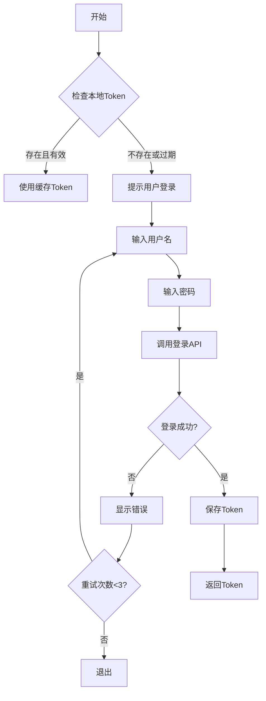

# 认证与会话管理

## 1. 认证系统概述

认证系统负责管理用户与内网静态资源服务之间的认证状态，包括登录、Token 管理、自动刷新等。

### 1.1 认证流程



## 2. 认证模块实现

### 2.1 PingancoderAuth 类

```typescript
// src/providers/pingancoder-auth.ts

import { readFile, writeFile, mkdir } from 'fs/promises';
import { existsSync } from 'fs';
import { join, dirname } from 'path';
import { homedir } from 'os';
import { createHash } from 'crypto';

export interface AuthSession {
  token: string;
  expiresAt: number;
  username: string;
}

export interface PingancoderConfig {
  baseUrl: string;
  username?: string;
  password?: string;
  tokenPath: string;
}

export class PingancoderAuth {
  private readonly AUTH_FILE = join(homedir(), '.pingancoder', 'auth.json');

  constructor(
    private config: PingancoderConfig = {
      baseUrl: process.env.PINGANCODER_API_URL || 'http://internal-server/api',
      tokenPath: join(homedir(), '.pingancoder', 'auth.json'),
    }
  ) {}

  /**
   * 检查登录状态
   */
  async checkLoginStatus(): Promise<{
    loggedIn: boolean;
    session?: AuthSession;
  }> {
    const session = await this.loadCachedToken();

    if (!session) {
      return { loggedIn: false };
    }

    if (this.isTokenExpired(session)) {
      return { loggedIn: false };
    }

    return { loggedIn: true, session };
  }

  /**
   * 登录
   */
  async login(): Promise<AuthSession> {
    // 1. 检查本地是否有有效的 token
    const cached = await this.loadCachedToken();
    if (cached && !this.isTokenExpired(cached)) {
      return cached;
    }

    // 2. 交互式登录
    return await this.interactiveLogin();
  }

  /**
   * 交互式登录
   */
  private async interactiveLogin(): Promise<AuthSession> {
    const readline = require('readline');
    const rl = readline.createInterface({
      input: process.stdin,
      output: process.stdout,
    });

    try {
      // 输入用户名
      const username = await this.question(rl, '请输入用户名: ');

      // 输入密码（隐藏）
      const password = await this.question(rl, '请输入密码: ', true);

      console.log('正在登录...');

      // 3. 调用登录 API
      const session = await this.callLoginAPI(username, password);

      // 4. 缓存 token
      await this.saveToken(session);

      console.log(`✓ 登录成功！欢迎, ${session.username}`);

      return session;

    } catch (error) {
      if (error.status === 401) {
        throw new Error('用户名或密码错误，请重试');
      }
      throw error;
    } finally {
      rl.close();
    }
  }

  /**
   * 调用登录 API
   */
  private async callLoginAPI(
    username: string,
    password: string
  ): Promise<AuthSession> {
    const url = `${this.config.baseUrl}/auth/login`;

    const response = await fetch(url, {
      method: 'POST',
      headers: {
        'Content-Type': 'application/json',
      },
      body: JSON.stringify({ username, password }),
    });

    if (!response.ok) {
      const error = await response.json();
      throw Object.assign(new Error(error.message || '登录失败'), {
        status: response.status,
      });
    }

    const data = await response.json();

    return {
      token: data.token,
      expiresAt: Date.now() + data.expiresIn * 1000,
      username: data.username || username,
    };
  }

  /**
   * 确保已认证
   */
  async ensureAuthenticated(): Promise<string> {
    const session = await this.checkLoginStatus();

    if (!session.loggedIn || !session.session) {
      console.log('⚠️  未登录，请先登录');
      console.log('运行: pingancoder-skills auth --login');
      throw new Error('未登录');
    }

    // 检查是否即将过期
    const timeLeft = session.session.expiresAt - Date.now();
    if (timeLeft < 5 * 60 * 1000) { // 少于5分钟
      console.log('⚠️  Token 即将过期，正在刷新...');
      return await this.refreshToken();
    }

    return session.session.token;
  }

  /**
   * 刷新 Token
   */
  async refreshToken(): Promise<string> {
    const session = await this.loadCachedToken();

    if (!session) {
      throw new Error('没有有效的 Token 可刷新');
    }

    try {
      const url = `${this.config.baseUrl}/auth/refresh`;

      const response = await fetch(url, {
        method: 'POST',
        headers: {
          'Authorization': `Bearer ${session.token}`,
          'Content-Type': 'application/json',
        },
      });

      if (!response.ok) {
        throw new Error('Token 刷新失败');
      }

      const data = await response.json();

      const newSession: AuthSession = {
        token: data.token,
        expiresAt: Date.now() + data.expiresIn * 1000,
        username: session.username,
      };

      await this.saveToken(newSession);

      return newSession.token;

    } catch (error) {
      // 刷新失败，清除缓存
      await this.clearToken();
      throw error;
    }
  }

  /**
   * 登出
   */
  async logout(): Promise<void> {
    await this.clearToken();
    console.log('✓ 已登出');
  }

  /**
   * 加载缓存的 Token
   */
  private async loadCachedToken(): Promise<AuthSession | null> {
    try {
      if (!existsSync(this.AUTH_FILE)) {
        return null;
      }

      const content = await readFile(this.AUTH_FILE, 'utf-8');
      const data = JSON.parse(content);

      return {
        token: data.token,
        expiresAt: data.expiresAt,
        username: data.username,
      };
    } catch (error) {
      return null;
    }
  }

  /**
   * 保存 Token
   */
  private async saveToken(session: AuthSession): Promise<void> {
    await mkdir(dirname(this.AUTH_FILE), { recursive: true });

    const data = {
      token: session.token,
      expiresAt: session.expiresAt,
      username: session.username,
      savedAt: Date.now(),
    };

    await writeFile(this.AUTH_FILE, JSON.stringify(data, null, 2), 'utf-8');

    // 设置文件权限（仅用户可读写）
    const { chmod } = require('fs/promises');
    await chmod(this.AUTH_FILE, 0o600);
  }

  /**
   * 清除 Token
   */
  async clearToken(): Promise<void> {
    const { rm } = require('fs/promises');

    if (existsSync(this.AUTH_FILE)) {
      await rm(this.AUTH_FILE);
    }
  }

  /**
   * 检查 Token 是否过期
   */
  private isTokenExpired(session: AuthSession): boolean {
    const now = Date.now();
    return now >= session.expiresAt;
  }

  /**
   * 读取用户输入
   */
  private question(
    rl: any,
    query: string,
    silent = false
  ): Promise<string> {
    return new Promise((resolve) => {
      if (silent) {
        // 隐藏输入（密码）
        const { stdin, stdout } = require('process');
        const mute = require('mute-stream');
        const output = mute(stdout);

        rl.question(query, (answer: string) => {
          output.unmute();
          resolve(answer);
        });
      } else {
        rl.question(query, (answer: string) => {
          resolve(answer);
        });
      }
    });
  }

  /**
   * 获取技能详情（需要认证）
   */
  async fetchSkillDetail(skillId: string): Promise<any> {
    const token = await this.ensureAuthenticated();

    const url = `${this.config.baseUrl}/skills/${skillId}`;

    const response = await fetch(url, {
      headers: {
        'Authorization': `Bearer ${token}`,
      },
    });

    if (!response.ok) {
      if (response.status === 401) {
        // Token 失效，清除并重试
        await this.clearToken();
        return this.fetchSkillDetail(skillId);
      }
      throw new Error(`获取技能详情失败: ${response.statusText}`);
    }

    return response.json();
  }
}
```

## 3. Token 管理

### 3.1 Token 存储格式

```json
{
  "token": "eyJhbGciOiJIUzI1NiIsInR5cCI6IkpXVCJ9...",
  "expiresAt": 1699123456789,
  "username": "user@example.com",
  "savedAt": 1699123456789
}
```

### 3.2 Token 刷新策略

```typescript
export class TokenRefreshStrategy {
  private readonly REFRESH_THRESHOLD = 5 * 60 * 1000; // 5分钟
  private refreshing = false;
  private refreshPromise: Promise<string> | null = null;

  async shouldRefresh(token: AuthSession): boolean {
    const timeLeft = token.expiresAt - Date.now();
    return timeLeft < this.REFRESH_THRESHOLD;
  }

  async refreshToken(auth: PingancoderAuth): Promise<string> {
    // 如果正在刷新，等待刷新完成
    if (this.refreshing) {
      return this.refreshPromise!;
    }

    this.refreshing = true;
    this.refreshPromise = this.doRefresh(auth);

    try {
      const newToken = await this.refreshPromise;
      return newToken;
    } finally {
      this.refreshing = false;
      this.refreshPromise = null;
    }
  }

  private async doRefresh(auth: PingancoderAuth): Promise<string> {
    try {
      return await auth.refreshToken();
    } catch (error) {
      // 刷新失败，清除缓存
      await auth.clearToken();
      throw new Error('Token 刷新失败，请重新登录');
    }
  }
}
```

## 4. 认证状态查询

### 4.1 状态查询

```typescript
export class AuthStatusChecker {
  async getStatus(): Promise<AuthStatus> {
    const auth = new PingancoderAuth();
    const status = await auth.checkLoginStatus();

    if (!status.loggedIn) {
      return {
        authenticated: false,
        message: '未登录',
      };
    }

    const session = status.session!;
    const timeLeft = session.expiresAt - Date.now();

    return {
      authenticated: true,
      username: session.username,
      expiresAt: new Date(session.expiresAt),
      timeLeft,
      expiresIn: this.formatTimeLeft(timeLeft),
    };
  }

  private formatTimeLeft(ms: number): string {
    if (ms <= 0) {
      return '已过期';
    }

    const hours = Math.floor(ms / (60 * 60 * 1000));
    const minutes = Math.floor((ms % (60 * 60 * 1000)) / (60 * 1000));

    if (hours > 24) {
      const days = Math.floor(hours / 24);
      return `${days}天${hours % 24}小时`;
    }

    if (hours > 0) {
      return `${hours}小时${minutes}分钟`;
    }

    return `${minutes}分钟`;
  }
}

interface AuthStatus {
  authenticated: boolean;
  username?: string;
  expiresAt?: Date;
  timeLeft?: number;
  expiresIn?: string;
  message?: string;
}
```

## 5. 错误处理

### 5.1 认证错误处理

```typescript
export class AuthErrorHandler {
  handleError(error: any): string {
    if (error.status === 401) {
      return '用户名或密码错误';
    }

    if (error.status === 403) {
      return '没有权限访问';
    }

    if (error.code === 'ECONNREFUSED') {
      return '无法连接到认证服务器，请检查网络';
    }

    if (error.code === 'ENOTFOUND') {
      return '认证服务器地址不存在';
    }

    if (error.message) {
      return error.message;
    }

    return '认证失败，请重试';
  }

  async handleErrorWithRetry(
    error: any,
    auth: PingancoderAuth,
    maxRetries = 3
  ): Promise<boolean> {
    const message = this.handleError(error);

    if (error.status === 401) {
      // 认证失败，提示重新登录
      console.log('❌', message);
      console.log('请检查用户名和密码');
      return false;
    }

    if (maxRetries > 0 && this.isNetworkError(error)) {
      console.log(`⚠️  网络错误: ${message}`);
      console.log(`正在重试... (剩余 ${maxRetries} 次)`);

      await this.delay(2000);
      return true; // 表示可以重试
    }

    console.log('❌', message);
    return false;
  }

  private isNetworkError(error: any): boolean {
    return (
      error.code === 'ECONNREFUSED' ||
      error.code === 'ENOTFOUND' ||
      error.code === 'ETIMEDOUT' ||
      error.code === 'ECONNRESET'
    );
  }

  private delay(ms: number): Promise<void> {
    return new Promise(resolve => setTimeout(resolve, ms));
  }
}
```

## 6. 登录命令实现

### 6.1 命令实现

```typescript
// src/auth.ts

import { PingancoderAuth } from './providers/pingancoder-auth.js';
import { AuthStatusChecker } from './security/auth-status-checker.js';

interface AuthOptions {
  login?: boolean;
  logout?: boolean;
}

export async function runAuth(options: AuthOptions = {}): Promise<void> {
  const auth = new PingancoderAuth();

  try {
    if (options.logout) {
      // 登出
      await auth.logout();
      console.log('✅ 已登出');
      return;
    }

    if (options.login) {
      // 登录
      const session = await auth.login();
      console.log(`✅ 登录成功: ${session.username}`);
      console.log(`   过期时间: ${new Date(session.expiresAt).toLocaleString()}`);
      return;
    }

    // 显示状态
    const checker = new AuthStatusChecker();
    const status = await checker.getStatus();

    if (status.authenticated) {
      console.log('✅ 已登录');
      console.log(`   用户: ${status.username}`);
      console.log(`   过期时间: ${status.expiresAt?.toLocaleString()}`);
      console.log(`   剩余时间: ${status.expiresIn}`);

      // 检查是否即将过期
      if (status.timeLeft && status.timeLeft < 24 * 60 * 60 * 1000) {
        console.log('⚠️  Token 即将过期，建议重新登录');
      }
    } else {
      console.log('❌ 未登录');
      console.log('   请运行: pingancoder-skills auth --login');
    }

  } catch (error) {
    console.error(`❌ 操作失败: ${error.message}`);
    process.exit(1);
  }
}
```

---

**下一篇**: [11-测试策略](./11-测试策略.md)
