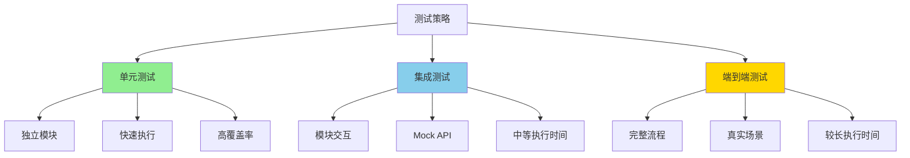

# 测试策略

## 1. 测试概述

内网版本的测试策略需要适配内网环境，使用 Mock API 和测试数据来确保功能完整性。

### 1.1 测试金字塔



### 1.2 测试覆盖率目标

| 测试类型 | 覆盖率目标 | 说明 |
|---------|-----------|------|
| 核心逻辑 | > 90% | 认证、安装、锁文件 |
| 工具函数 | > 95% | 路径解析、哈希计算 |
| 提供者 | > 85% | API 调用、数据解析 |
| 整体 | > 80% | 所有代码 |

## 2. 单元测试

### 2.1 目录结构

```
tests/unit/
├── core/
│   ├── source-parser.test.ts
│   ├── path-validator.test.ts
│   └── hash-calculator.test.ts
├── providers/
│   ├── pingancoder-auth.test.ts
│   ├── pingancoder-provider.test.ts
│   ├── local-path-provider.test.ts
│   └── local-zip-provider.test.ts
├── agents/
│   └── agents.test.ts
└── security/
    ├── token-storage.test.ts
    └── permission-checker.test.ts
```

### 2.2 认证模块测试

```typescript
// tests/unit/providers/pingancoder-auth.test.ts

import { describe, it, expect, beforeEach, afterEach } from 'vitest';
import { PingancoderAuth } from '../../src/providers/pingancoder-auth';
import { MockApiServer } from '../helpers/mock-server';
import { rimraf } from 'rimraf';
import { join } from 'path';
import { homedir } from 'os';

describe('PingancoderAuth', () => {
  const authDir = join(homedir(), '.pingancoder-test');
  let mockServer: MockApiServer;
  let auth: PingancoderAuth;

  beforeEach(async () => {
    // 清理测试目录
    await rimraf(authDir);

    // 启动 Mock 服务器
    mockServer = new MockApiServer();
    await mockServer.start();

    // 创建认证实例
    auth = new PingancoderAuth({
      baseUrl: mockServer.url,
      tokenPath: join(authDir, 'auth.json'),
    });
  });

  afterEach(async () => {
    // 停止 Mock 服务器
    await mockServer.stop();

    // 清理测试目录
    await rimraf(authDir);
  });

  describe('登录流程', () => {
    it('应该成功登录并缓存 token', async () => {
      // Mock 登录 API
      mockServer.mockLogin({
        username: 'test-user',
        password: 'test-pass',
        response: {
          token: 'mock-token-123',
          expiresIn: 3600,
          username: 'test-user',
        },
      });

      // 执行登录
      const session = await auth.login();

      // 验证结果
      expect(session.token).toBe('mock-token-123');
      expect(session.username).toBe('test-user');
      expect(session.expiresAt).toBeGreaterThan(Date.now());

      // 验证 token 已缓存
      const status = await auth.checkLoginStatus();
      expect(status.loggedIn).toBe(true);
      expect(status.session?.token).toBe('mock-token-123');
    });

    it('应该在用户名密码错误时抛出异常', async () => {
      // Mock 登录失败
      mockServer.mockLogin({
        username: 'test-user',
        password: 'wrong-pass',
        response: {
          message: 'Invalid credentials',
        },
        status: 401,
      });

      // 验证抛出异常
      await expect(auth.login()).rejects.toThrow('用户名或密码错误');
    });

    it('应该在网络错误时重试', async () => {
      let attemptCount = 0;

      // Mock 第一次失败，第二次成功
      mockServer.mockLogin({
        username: 'test-user',
        password: 'test-pass',
        response: {
          token: 'mock-token-123',
          expiresIn: 3600,
          username: 'test-user',
        },
        handler: () => {
          attemptCount++;
          if (attemptCount === 1) {
            throw new Error('ECONNREFUSED');
          }
        },
      });

      // 执行登录（应该重试）
      const session = await auth.login();

      // 验证重试成功
      expect(attemptCount).toBe(2);
      expect(session.token).toBe('mock-token-123');
    });
  });

  describe('Token 管理', () => {
    it('应该正确检测 token 过期', async () => {
      // 保存过期的 token
      await auth['saveToken']({
        token: 'expired-token',
        expiresAt: Date.now() - 1000,
        username: 'test-user',
      });

      // 检查登录状态
      const status = await auth.checkLoginStatus();

      expect(status.loggedIn).toBe(false);
    });

    it('应该在 token 即将过期时自动刷新', async () => {
      // 保存即将过期的 token（4分钟后过期）
      const expiresAt = Date.now() + 4 * 60 * 1000;

      await auth['saveToken']({
        token: 'expiring-token',
        expiresAt,
        username: 'test-user',
      });

      // Mock 刷新 API
      mockServer.mockRefresh({
        token: 'expiring-token',
        response: {
          token: 'new-token-456',
          expiresIn: 3600,
          username: 'test-user',
        },
      });

      // 调用 ensureAuthenticated（应该触发刷新）
      const newToken = await auth.ensureAuthenticated();

      expect(newToken).toBe('new-token-456');
    });
  });
});
```

### 2.3 提供者测试

```typescript
// tests/unit/providers/pingancoder-provider.test.ts

import { describe, it, expect, beforeEach } from 'vitest';
import { PingancoderProvider } from '../../src/providers/pingancoder-provider';
import { PingancoderAuth } from '../../src/providers/pingancoder-auth';
import { MockApiServer } from '../helpers/mock-server';

describe('PingancoderProvider', () => {
  let provider: PingancoderProvider;
  let auth: PingancoderAuth;
  let mockServer: MockApiServer;

  beforeEach(async () => {
    mockServer = new MockApiServer();
    await mockServer.start();

    auth = new PingancoderAuth({
      baseUrl: mockServer.url,
    });

    provider = new PingancoderProvider(auth, {
      baseUrl: mockServer.url,
    });
  });

  it('应该正确匹配内部 URL', () => {
    expect(provider.match('pingancoder://code-review').matches).toBe(true);
    expect(provider.match('http://internal-server/api/skills/code-review').matches).toBe(true);
    expect(provider.match('code-review').matches).toBe(true);
    expect(provider.match('https://github.com/user/skill').matches).toBe(false);
  });

  it('应该获取技能详情', async () => {
    // Mock API 响应
    mockServer.mockSkillDetail({
      id: 'code-review',
      name: 'Code Review',
      description: '代码审查技能',
      version: '1.0.0',
      downloadUrl: 'http://internal-server/downloads/code-review.zip',
    });

    // 获取技能
    const skill = await provider.fetchSkill('pingancoder://code-review');

    expect(skill.name).toBe('Code Review');
    expect(skill.description).toBe('代码审查技能');
    expect(skill.installName).toBe('code-review');
    expect(skill.metadata?.version).toBe('1.0.0');
  });

  it('应该在 token 过期时自动重新获取', async () => {
    // 第一次请求返回 401
    let attemptCount = 0;

    mockServer.mockSkillDetail({
      id: 'code-review',
      name: 'Code Review',
      description: '代码审查技能',
      version: '1.0.0',
      downloadUrl: 'http://internal-server/downloads/code-review.zip',
      handler: () => {
        attemptCount++;
        if (attemptCount === 1) {
          throw Object.assign(new Error('Unauthorized'), { status: 401 });
        }
      },
    });

    // Mock 刷新 token
    mockServer.mockRefresh({
      token: 'old-token',
      response: {
        token: 'new-token',
        expiresIn: 3600,
        username: 'test-user',
      },
    });

    // 获取技能（应该自动重试）
    const skill = await provider.fetchSkill('pingancoder://code-review');

    expect(attemptCount).toBe(2);
    expect(skill.name).toBe('Code Review');
  });
});
```

## 3. 集成测试

### 3.1 目录结构

```
tests/integration/
├── mock-server.test.ts
├── local-zip-install.test.ts
├── api-skill-install.test.ts
└── symlink-creation.test.ts
```

### 3.2 Mock API 服务器

```typescript
// tests/helpers/mock-server.ts

import { createServer, Server } from 'http';
import { URL } from 'url';

export class MockApiServer {
  private server: Server | null = null;
  public url: string = '';

  private loginHandlers: Array<{
    username: string;
    password: string;
    response: any;
    status?: number;
    handler?: () => void;
  }> = [];

  private skillDetails: Map<string, any> = new Map();
  private refreshHandlers: Map<string, any> = new Map();

  async start(): Promise<void> {
    return new Promise((resolve) => {
      this.server = createServer((req, res) => {
        this.handleRequest(req, res);
      });

      this.server.listen(0, () => {
        const address = this.server!.address() as any;
        this.url = `http://localhost:${address.port}`;
        resolve();
      });
    });
  }

  async stop(): Promise<void> {
    return new Promise((resolve) => {
      if (this.server) {
        this.server.close(() => {
          this.server = null;
          resolve();
        });
      } else {
        resolve();
      }
    });
  }

  private handleRequest(req, res): void {
    const url = new URL(req.url, this.url);

    // 路由处理
    if (url.pathname === '/auth/login' && req.method === 'POST') {
      this.handleLogin(req, res);
    } else if (url.pathname === '/auth/refresh' && req.method === 'POST') {
      this.handleRefresh(req, res);
    } else if (url.pathname.startsWith('/skills/') && req.method === 'GET') {
      this.handleSkillDetail(url, res);
    } else {
      res.statusCode = 404;
      res.end('Not Found');
    }
  }

  private async handleLogin(req, res): Promise<void> {
    let body = '';
    req.on('data', chunk => body += chunk);
    req.on('end', () => {
      const { username, password } = JSON.parse(body);

      // 查找匹配的 mock
      const mock = this.loginHandlers.find(
        m => m.username === username && m.password === password
      );

      if (mock) {
        if (mock.handler) {
          mock.handler();
        }

        res.statusCode = mock.status || 200;
        res.end(JSON.stringify(mock.response));
      } else {
        res.statusCode = 401;
        res.end(JSON.stringify({ message: 'Invalid credentials' }));
      }
    });
  }

  private async handleRefresh(req, res): Promise<void> {
    const authHeader = req.headers.authorization;
    const token = authHeader?.replace('Bearer ', '');

    const mock = this.refreshHandlers.get(token);

    if (mock) {
      res.end(JSON.stringify(mock));
    } else {
      res.statusCode = 401;
      res.end(JSON.stringify({ message: 'Invalid token' }));
    }
  }

  private async handleSkillDetail(url, res): Promise<void> {
    const skillId = url.pathname.split('/').pop();
    const mock = this.skillDetails.get(skillId);

    if (mock) {
      if (mock.handler) {
        mock.handler();
      }

      res.statusCode = 200;
      res.end(JSON.stringify(mock));
    } else {
      res.statusCode = 404;
      res.end(JSON.stringify({ message: 'Skill not found' }));
    }
  }

  mockLogin(config: {
    username: string;
    password: string;
    response: any;
    status?: number;
    handler?: () => void;
  }): void {
    this.loginHandlers.push(config);
  }

  mockRefresh(config: {
    token: string;
    response: any;
  }): void {
    this.refreshHandlers.set(config.token, config.response);
  }

  mockSkillDetail(config: {
    id: string;
    name: string;
    description: string;
    version: string;
    downloadUrl: string;
    handler?: () => void;
  }): void {
    this.skillDetails.set(config.id, config);
  }
}
```

### 3.3 集成测试示例

```typescript
// tests/integration/api-skill-install.test.ts

import { describe, it, expect, beforeEach, afterEach } from 'vitest';
import { installSkill } from '../../src/installer';
import { parseSource } from '../../src/source-parser';
import { MockApiServer } from '../helpers/mock-server';
import { PingancoderAuth } from '../../src/providers/pingancoder-auth';
import { rimraf } from 'rimraf';
import { join } from 'path';
import { tmpdir } from 'os';

describe('API 技能安装集成测试', () => {
  let mockServer: MockApiServer;
  let testDir: string;

  beforeEach(async () => {
    // 创建临时测试目录
    testDir = join(tmpdir(), `pingancoder-test-${Date.now()}`);

    // 启动 Mock 服务器
    mockServer = new MockApiServer();
    await mockServer.start();
  });

  afterEach(async () => {
    // 停止 Mock 服务器
    await mockServer.stop();

    // 清理测试目录
    await rimraf(testDir);
  });

  it('应该完成从 API 下载到安装的完整流程', async () => {
    // 1. Mock 登录
    mockServer.mockLogin({
      username: 'test-user',
      password: 'test-pass',
      response: {
        token: 'test-token',
        expiresIn: 3600,
        username: 'test-user',
      },
    });

    // 2. Mock 技能详情
    mockServer.mockSkillDetail({
      id: 'test-skill',
      name: 'Test Skill',
      description: '测试技能',
      version: '1.0.0',
      downloadUrl: `${mockServer.url}/downloads/test-skill.zip`,
    });

    // 3. 设置测试目录为当前目录
    const originalCwd = process.cwd();
    process.chdir(testDir);

    try {
      // 4. 执行安装
      const source = parseSource('pingancoder://test-skill');
      const result = await installSkill(source, {
        agents: [],
      });

      // 5. 验证结果
      expect(result.success).toBe(true);
      expect(result.installName).toBe('test-skill');

      // 验证文件存在
      const skillPath = join(testDir, '.agents', 'skills', 'test-skill');
      expect(existsSync(join(skillPath, 'SKILL.md'))).toBe(true);

    } finally {
      process.chdir(originalCwd);
    }
  });
});
```

## 4. 端到端测试

### 4.1 目录结构

```
tests/e2e/
├── full-flow.test.ts
├── auth-flow.test.ts
└── update-flow.test.ts
```

### 4.2 完整流程测试

```typescript
// tests/e2e/full-flow.test.ts

import { describe, it, expect } from 'vitest';
import { exec } from 'child_process';
import { promisify } from 'util';

const execAsync = promisify(exec);

describe('完整安装流程 E2E', () => {
  it('应该完成从登录到安装的完整流程', async () => {
    // 1. 启动测试环境
    await execAsync('npm run test:env:start');

    try {
      // 2. 登录
      const loginResult = await execAsync(
        'npm run cli -- auth --login',
        {
          env: {
            ...process.env,
            TEST_USERNAME: 'test-user',
            TEST_PASSWORD: 'test-pass',
          },
        }
      );

      expect(loginResult.stdout).toContain('登录成功');

      // 3. 搜索技能
      const findResult = await execAsync('npm run cli -- find test');
      expect(findResult.stdout).toContain('Test Skill');

      // 4. 安装技能
      const addResult = await execAsync('npm run cli -- add test-skill');
      expect(addResult.stdout).toContain('安装成功');

      // 5. 列出技能
      const listResult = await execAsync('npm run cli -- list');
      expect(listResult.stdout).toContain('test-skill');

      // 6. 移除技能
      const removeResult = await execAsync('npm run cli -- remove test-skill');
      expect(removeResult.stdout).toContain('移除成功');

    } finally {
      // 7. 清理测试环境
      await execAsync('npm run test:env:stop');
    }
  });
});
```

## 5. 测试配置

### 5.1 Vitest 配置

```typescript
// vitest.config.ts

import { defineConfig } from 'vitest/config';

export default defineConfig({
  test: {
    globals: true,
    environment: 'node',
    coverage: {
      provider: 'v8',
      reporter: ['text', 'json', 'html'],
      exclude: [
        'node_modules/',
        'tests/',
        '**/*.test.ts',
        '**/*.spec.ts',
      ],
    },
    setupFiles: ['./tests/setup.ts'],
  },
});
```

### 5.2 测试脚本

```json
{
  "scripts": {
    "test": "vitest",
    "test:unit": "vitest tests/unit",
    "test:integration": "vitest tests/integration",
    "test:e2e": "vitest tests/e2e",
    "test:coverage": "vitest --coverage",
    "test:watch": "vitest --watch"
  }
}
```

### 5.3 测试设置

```typescript
// tests/setup.ts

import { beforeAll, afterAll } from 'vitest';

beforeAll(async () => {
  // 设置测试环境变量
  process.env.PINGANCODER_API_URL = 'http://localhost:3000';
  process.env.NODE_ENV = 'test';
});

afterAll(async () => {
  // 清理测试环境
});
```

## 6. CI/CD 集成

### 6.1 GitHub Actions 配置

```yaml
# .github/workflows/test.yml

name: Test

on: [push, pull_request]

jobs:
  test:
    runs-on: ubuntu-latest

    steps:
      - uses: actions/checkout@v3

      - name: Setup Node.js
        uses: actions/setup-node@v3
        with:
          node-version: '18'

      - name: Install dependencies
        run: npm ci

      - name: Run unit tests
        run: npm run test:unit

      - name: Run integration tests
        run: npm run test:integration

      - name: Run E2E tests
        run: npm run test:e2e

      - name: Generate coverage
        run: npm run test:coverage

      - name: Upload coverage
        uses: codecov/codecov-action@v3
        with:
          files: ./coverage/coverage-final.json
```

---

**文档结束**
