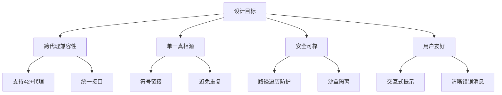
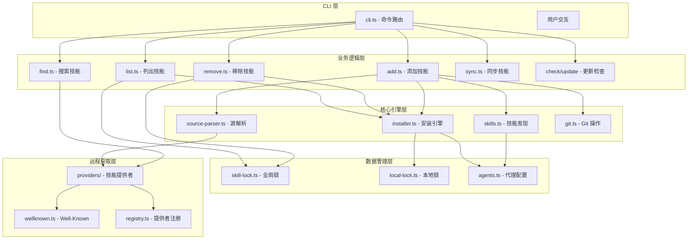
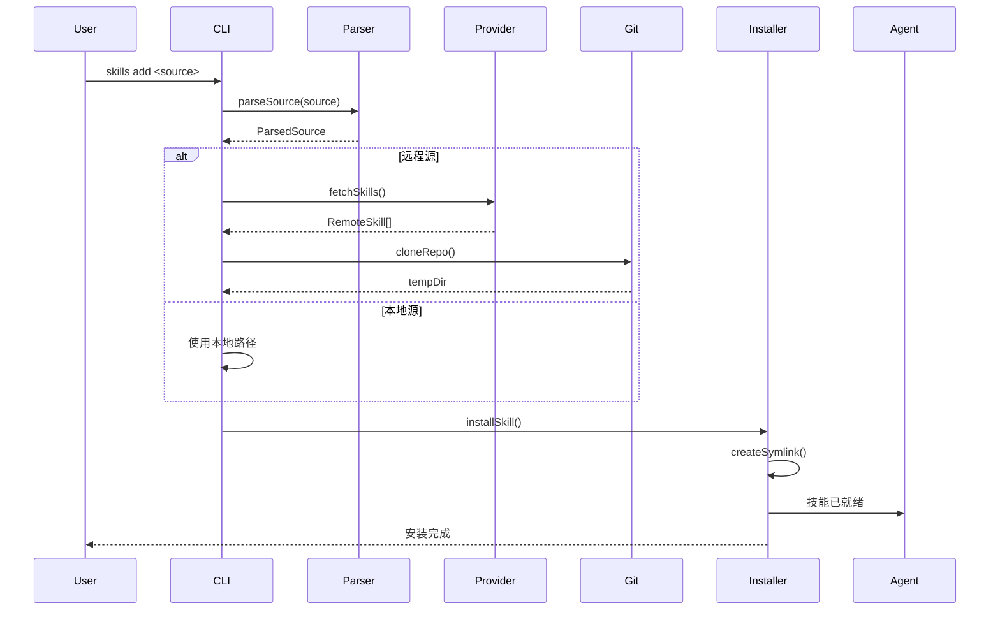
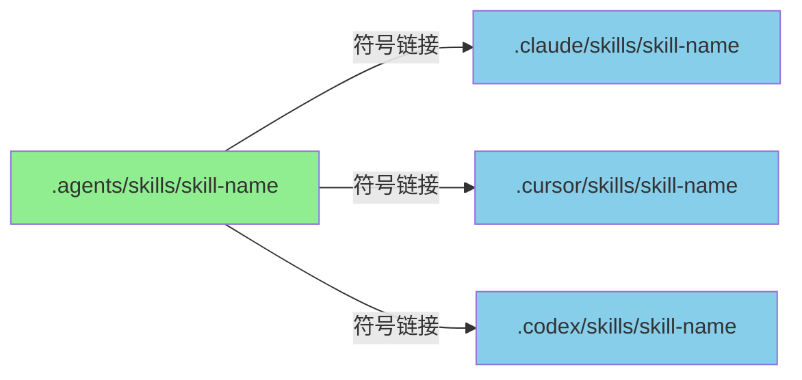
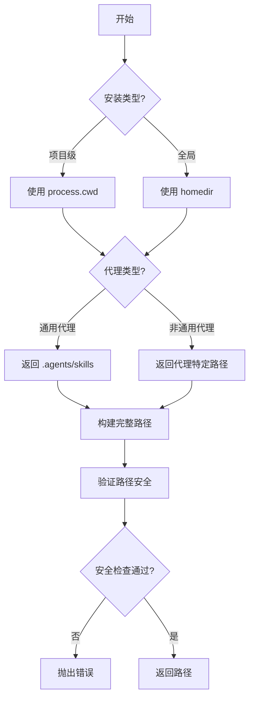
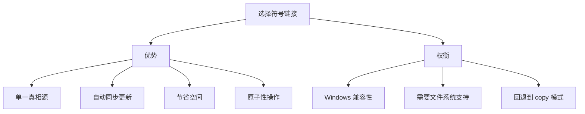
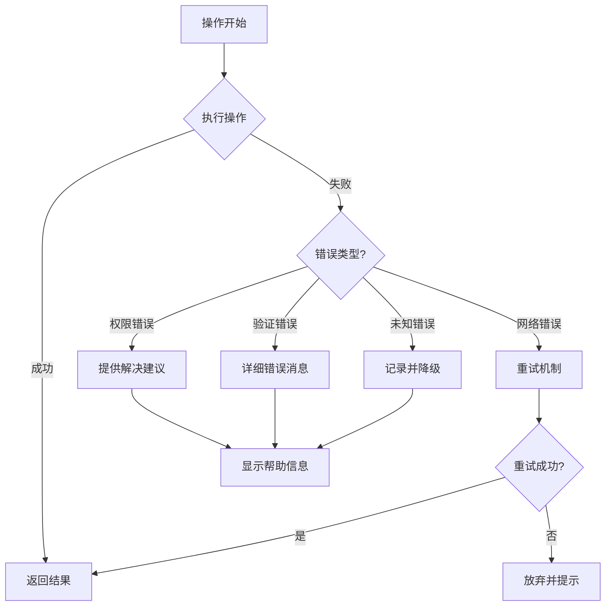

# 项目概述与架构设计

## 1. 项目简介

Skills CLI 是开放代理技能生态系统的命令行工具，旨在为各种 AI 编码代理（如 Claude Code、Cursor、Codex 等）提供统一的技能安装、管理和分发机制。

### 1.1 核心功能

- **技能安装**: 从 Git 仓库、本地路径或远程源安装技能
- **技能管理**: 列出、搜索、移除已安装的技能
- **更新检测**: 检查并更新技能到最新版本
- **多代理支持**: 支持 42+ 种不同的 AI 编码代理
- **版本锁定**: 通过锁文件追踪技能版本

### 1.2 设计目标



## 2. 整体架构

### 2.1 系统分层架构



### 2.2 数据流架构



## 3. 核心概念

### 3.1 技能 (Skill)

技能是可重用的指令集，扩展 AI 代理的能力。每个技能包含：

- **SKILL.md**: 技能定义文件（Markdown + YAML 前言）
- **name**: 唯一标识符
- **description**: 功能描述
- **metadata**: 可选元数据

### 3.2 代理 (Agent)

代理是指支持技能的 AI 编码工具。系统支持 42+ 种代理，每种代理有：

- **技能目录**: 项目级和全局级
- **检测机制**: 自动检测已安装代理
- **通用代理**: 使用统一的 `.agents/skills` 目录

### 3.3 单一真相源架构



**优势**：
- 避免文件重复
- 简化更新流程
- 节省磁盘空间
- 保持一致性

### 3.4 安装模式

| 模式 | 描述 | 适用场景 |
|------|------|----------|
| **Symlink** | 创建符号链接到规范位置 | 推荐，支持更新 |
| **Copy** | 复制文件到代理目录 | 不支持符号链接的系统 |

## 4. 路径管理

### 4.1 目录结构

```
┌─────────────────────────────────────────────────────────┐
│ 项目级安装                                              │
├─────────────────────────────────────────────────────────┤
│ .agents/skills/           ← 规范位置（所有通用代理）    │
│ .claude/skills/           → symlink → .agents/skills/   │
│ .cursor/skills/           → symlink → .agents/skills/   │
│ .codex/skills/            → symlink → .agents/skills/   │
│                                                          │
│ （非通用代理有独立的规范位置）                          │
│ .augment/skills/          规范位置                      │
│ .openclaw/skills/         规范位置                      │
└─────────────────────────────────────────────────────────┘

┌─────────────────────────────────────────────────────────┐
│ 全局级安装 (~/.agents/skills/)                          │
├─────────────────────────────────────────────────────────┤
│ ~/.agents/skills/          ← 规范位置                   │
│ ~/.claude/skills/          → symlink → 规范位置         │
│ ~/.cursor/skills/          → symlink → 规范位置         │
│ └─────────────────────────────────────────────────────┘
```

### 4.2 路径解析流程



## 5. 技术选型

### 5.1 为什么选择 TypeScript？

- **类型安全**: 编译时错误检测
- **更好的 IDE 支持**: 自动完成和重构
- **易于维护**: 大型项目必备
- **生态系统**: 丰富的类型定义

### 5.2 为什么使用符号链接？



### 5.3 为什么选择 simple-git？

- **跨平台**: 支持 Windows、macOS、Linux
- **Promise API**: 与现代异步模式兼容
- **错误处理**: 详细的错误信息
- **超时控制**: 防止挂起

## 6. 扩展性设计

### 6.1 代理扩展机制

添加新代理只需：

1. 在 `agents.ts` 中定义配置
2. 指定项目级和全局级路径
3. 提供检测函数

```typescript
// 示例：添加新代理
newAgent: {
  name: 'new-agent',
  displayName: 'New Agent',
  skillsDir: '.newagent/skills',
  globalSkillsDir: join(home, '.newagent/skills'),
  detectInstalled: async () => existsSync(join(home, '.newagent')),
}
```

### 6.2 提供者扩展机制

通过注册模式支持多种技能源：

```typescript
// 注册新的提供者
registerProvider({
  id: 'custom-provider',
  displayName: 'Custom Provider',
  match: (url) => { /* ... */ },
  fetchSkill: async (url) => { /* ... */ },
});
```

### 6.3 插件清单支持

兼容 Claude Code 插件市场：

```json
// .claude-plugin/marketplace.json
{
  "metadata": { "pluginRoot": "./plugins" },
  "plugins": [
    {
      "name": "my-plugin",
      "source": "my-plugin",
      "skills": ["./skills/review", "./skills/test"]
    }
  ]
}
```

## 7. 性能考虑

### 7.1 并发处理

- **并行发现**: 同时搜索多个目录
- **并行安装**: 同时安装到多个代理
- **并行文件操作**: 使用 `Promise.all`

### 7.2 缓存策略

- **锁文件缓存**: 避免重复计算哈希
- **检测结果缓存**: 避免重复文件系统检查
- **API 响应缓存**: 减少 GitHub API 调用

### 7.3 浅克隆

使用 `--depth 1` 进行 Git 浅克隆：

```bash
git clone --depth 1 <url>
```

**优势**：
- 减少克隆时间
- 节省网络带宽
- 减少磁盘使用

## 8. 错误处理策略



## 9. 测试策略

### 9.1 测试层级

```
tests/
├── 单元测试/
│   ├── sanitize-name.test.ts
│   ├── source-parser.test.ts
│   └── skill-matching.test.ts
├── 集成测试/
│   ├── installer-symlink.test.ts
│   └── list-installed.test.ts
└── 端到端测试/
    ├── full-depth-discovery.test.ts
    └── dist.test.ts
```

### 9.2 测试覆盖率目标

- **核心逻辑**: > 90%
- **工具函数**: > 95%
- **整体**: > 80%

## 10. 未来展望

### 10.1 短期计划

- [ ] 支持更多代理
- [ ] 改进错误消息
- [ ] 性能优化

### 10.2 长期计划

- [ ] 技能依赖管理
- [ ] 技能版本化
- [ ] 插件系统
- [ ] Web UI

---

**下一篇**: [02-核心模块分析](./02-核心模块分析.md)
