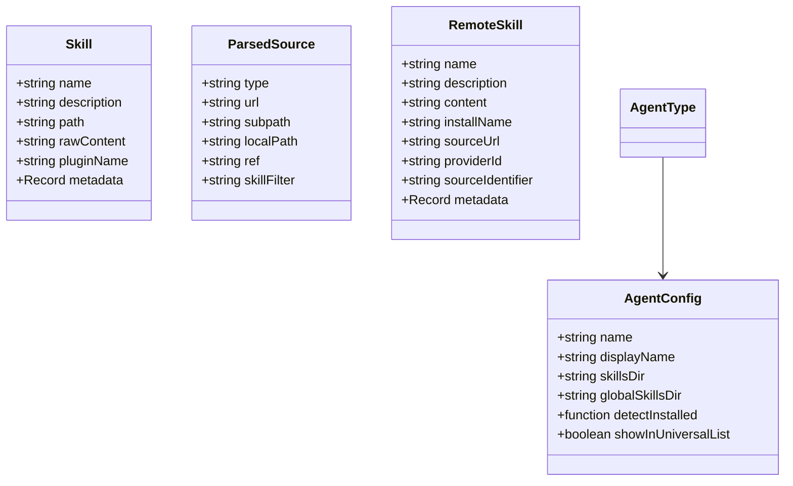
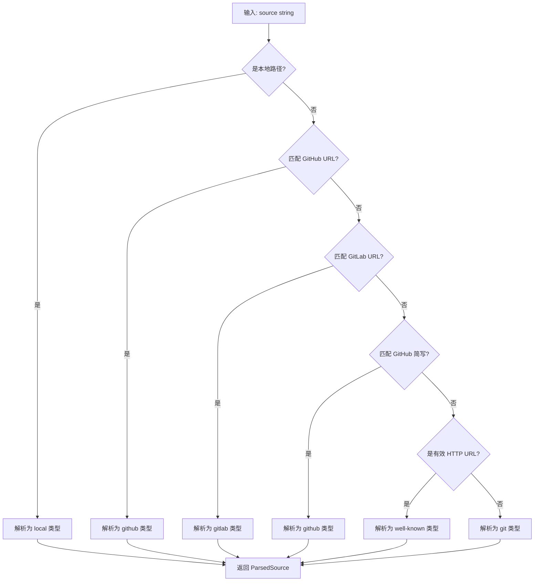
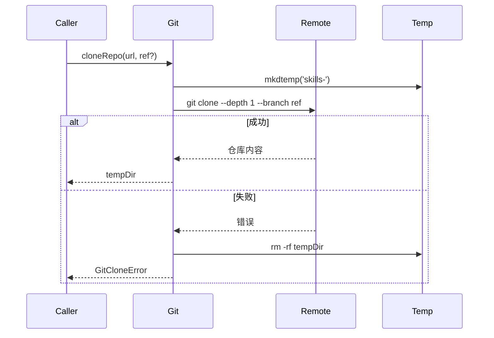
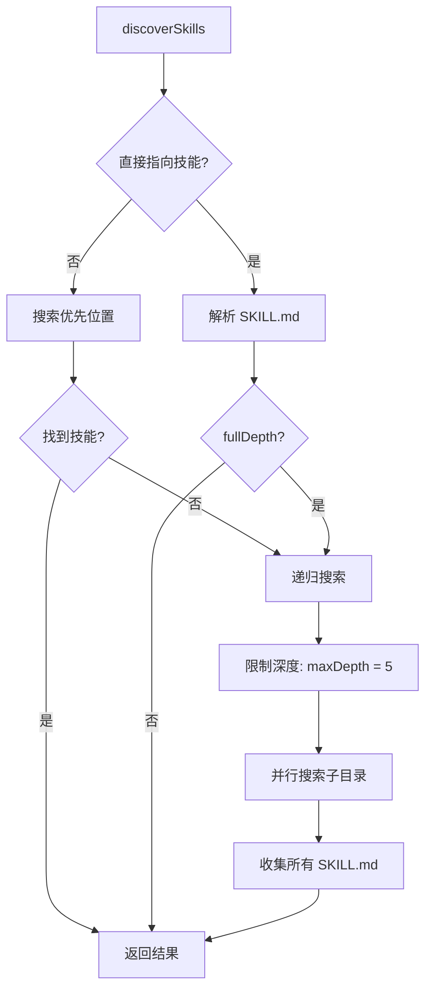
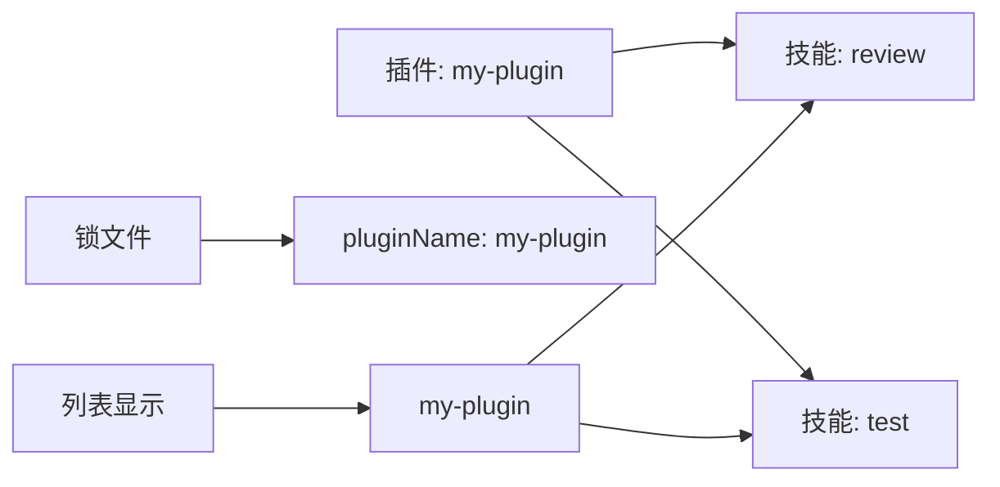
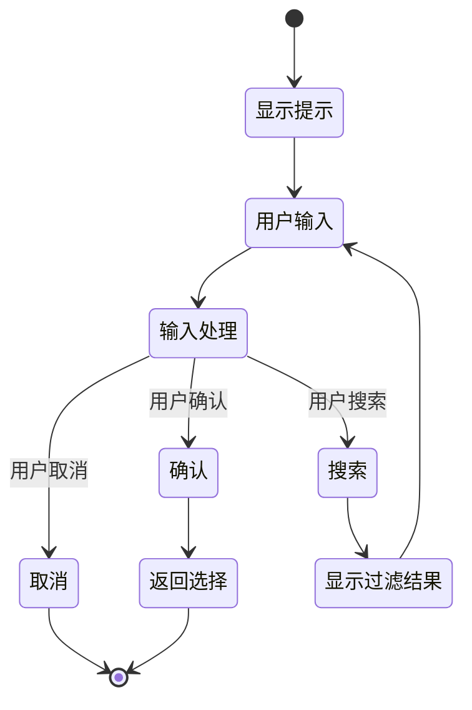

# 核心模块分析

## 1. 类型系统 (types.ts)

类型系统是整个项目的基础，定义了所有核心数据结构。

### 1.1 核心类型定义



### 1.2 代理类型枚举

```typescript
export type AgentType =
  | 'amp' | 'antigravity' | 'augment' | 'claude-code' | 'openclaw'
  | 'cline' | 'codebuddy' | 'codex' | 'command-code' | 'continue'
  | 'cortex' | 'crush' | 'cursor' | 'droid' | 'gemini-cli'
  | 'github-copilot' | 'goose' | 'iflow-cli' | 'junie' | 'kilo'
  | 'kimi-cli' | 'kiro-cli' | 'kode' | 'mcpjam' | 'mistral-vibe'
  | 'mux' | 'neovate' | 'opencode' | 'openhands' | 'pi'
  | 'qoder' | 'qwen-code' | 'replit' | 'roo' | 'trae'
  | 'trae-cn' | 'windsurf' | 'zencoder' | 'pochi' | 'adal'
  | 'universal';
```

### 1.3 技能结构

```typescript
export interface Skill {
  name: string;              // 技能名称（唯一标识符）
  description: string;       // 技能描述
  path: string;              // 技能目录路径
  rawContent?: string;       // SKILL.md 原始内容（用于哈希计算）
  pluginName?: string;       // 所属插件名称
  metadata?: Record<string, unknown>; // 额外元数据
}
```

## 2. 常量定义 (constants.ts)

```typescript
export const AGENTS_DIR = '.agents';
export const SKILLS_SUBDIR = 'skills';
export const WELL_KNOWN_PATH = '.well-known/skills';
```

**路径构建**：
- 规范位置: `{cwd}/{AGENTS_DIR}/{SKILLS_SUBDIR}`
- 示例: `.agents/skills/`

## 3. 源解析器 (source-parser.ts)

### 3.1 支持的源格式

```mermaid
graph TD
    A[源输入] --> B{格式类型?}

    B -->|本地路径| C[local]
    B -->|GitHub URL| D[github]
    B -->|GitLab URL| E[gitlab]
    B -->|GitHub 简写| F[github]
    B -->|Well-Known URL| G[well-known]
    B -->|其他 Git URL| H[git]

    C --> C1[./path]
    C --> C2[../path]
    C --> C3[/absolute/path]

    D --> D1[https://github.com/owner/repo]
    D --> D2[https://github.com/owner/repo/tree/branch/path]

    E --> E1[https://gitlab.com/owner/repo]
    E --> E2[https://gitlab.com/group/subgroup/repo]

    F --> F1[owner/repo]
    F --> F2[owner/repo/path]
    F --> F3[owner/repo@skill-name]

    G --> G1[https://example.com]
    G --> G2[https://example.com/docs]

    H --> H1[git@github.com:owner/repo.git]
    H --> H2[https://any-git-host.com/owner/repo]
```

### 3.2 解析流程



### 3.3 关键函数

#### `parseSource(input: string): ParsedSource`

```typescript
// 示例解析结果
parseSource('vercel-labs/agent-skills')
// => { type: 'github', url: 'https://github.com/vercel-labs/agent-skills.git' }

parseSource('./local-skills')
// => { type: 'local', url: '/absolute/path', localPath: '/absolute/path' }

parseSource('https://github.com/owner/repo/tree/main/skills/my-skill')
// => { type: 'github', url: 'https://github.com/owner/repo.git', ref: 'main', subpath: 'skills/my-skill' }
```

#### `getOwnerRepo(parsed: ParsedSource): string | null`

```typescript
// 用于锁文件追踪和遥测
getOwnerRepo({ type: 'github', url: 'https://github.com/vercel-labs/agent-skills.git' })
// => 'vercel-labs/agent-skills'

getOwnerRepo({ type: 'local', localPath: './skills' })
// => null
```

## 4. Git 操作 (git.ts)

### 4.1 克隆流程



### 4.2 错误处理

```typescript
export class GitCloneError extends Error {
  readonly url: string;
  readonly isTimeout: boolean;
  readonly isAuthError: boolean;
}
```

**错误类型**：
- **超时错误**: 60秒后超时，常见于需要认证的私有仓库
- **认证错误**: 权限不足或凭证配置问题
- **其他错误**: 网络问题、仓库不存在等

### 4.3 安全措施

```typescript
// 清理临时目录前验证路径
if (!normalizedDir.startsWith(normalizedTmpDir + sep)) {
  throw new Error('Attempted to clean up directory outside of temp directory');
}
```

## 5. 技能发现 (skills.ts)

### 5.1 发现策略



### 5.2 优先搜索位置

```typescript
const prioritySearchDirs = [
  searchPath,                          // 根目录
  join(searchPath, 'skills'),           // skills/
  join(searchPath, 'skills/.curated'),  // skills/.curated/
  join(searchPath, 'skills/.experimental'), // skills/.experimental/
  join(searchPath, 'skills/.system'),   // skills/.system/
  join(searchPath, '.agent/skills'),    // .agent/skills/
  join(searchPath, '.agents/skills'),   // .agents/skills/
  // ... 所有代理的技能目录
];
```

### 5.3 技能解析

```typescript
export async function parseSkillMd(
  skillMdPath: string,
  options?: { includeInternal?: boolean }
): Promise<Skill | null>
```

**解析步骤**：
1. 读取文件内容
2. 使用 `gray-matter` 解析 YAML 前言
3. 验证必需字段（name, description）
4. 检查是否为内部技能
5. 返回 Skill 对象或 null

### 5.4 内部技能处理

```typescript
function shouldInstallInternalSkills(): boolean {
  const envValue = process.env.INSTALL_INTERNAL_SKILLS;
  return envValue === '1' || envValue === 'true';
}

// 内部技能示例
---
name: internal-skill
description: An internal skill
metadata:
  internal: true
---
```

**行为**：
- 默认隐藏内部技能
- `INSTALL_INTERNAL_SKILLS=1` 时显示
- `includeInternal: true` 选项覆盖

## 6. 插件清单 (plugin-manifest.ts)

### 6.1 兼容 Claude Code 插件

```typescript
// .claude-plugin/marketplace.json
{
  "metadata": { "pluginRoot": "./plugins" },
  "plugins": [
    {
      "name": "my-plugin",
      "source": "my-plugin",
      "skills": ["./skills/review", "./skills/test"]
    }
  ]
}
```

### 6.2 技能分组



## 7. 遥测系统 (telemetry.ts)

### 7.1 数据收集

```typescript
track({
  event: 'add',
  source: 'vercel-labs/agent-skills',
  skills: 'frontend-design,web-design',
  agents: 'claude-code,cursor',
  global: '1',
  sourceType: 'github',
});
```

### 7.2 审计功能

```typescript
interface AuditResponse {
  skills: SkillAuditData[];
  partners?: PartnerAudit[];
}

interface SkillAuditData {
  name: string;
  source: string;
  isPartner?: boolean;
}
```

### 7.3 隐私保护

- 匿名收集
- CI 环境自动禁用
- `DISABLE_TELEMETRY` 环境变量
- `DO_NOT_TRACK` 环境变量

## 8. 提示系统 (prompts/)

### 8.1 搜索多选

```typescript
// prompts/search-multiselect.ts
export async function searchMultiselect<T>({
  message,
  items,
  initialSelected,
  lockedSection,
}: SearchMultiselectOptions<T>): Promise<T[]>
```

**特性**：
- 实时搜索过滤
- 锁定部分（不可取消选择）
- 键盘导航支持

### 8.2 用户交互流程



---

**下一篇**: [03-命令系统](./03-命令系统.md)
