# 命令系统

## 1. 命令路由架构

### 1.1 主入口 (cli.ts)

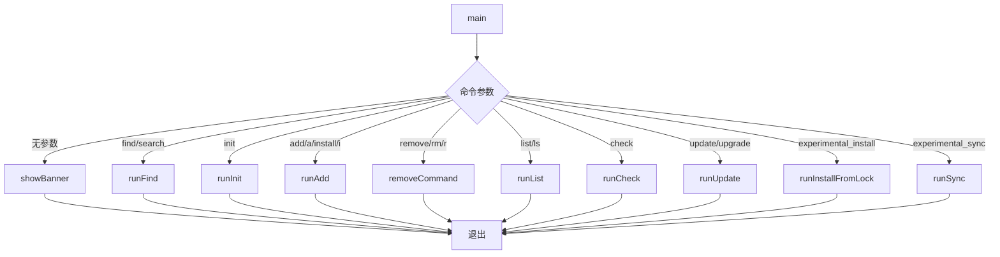

### 1.2 命令映射表

| 命令 | 别名 | 处理函数 | 描述 |
|------|------|----------|------|
| `add` | `a`, `install`, `i` | `runAdd` | 安装技能 |
| `remove` | `rm`, `r` | `removeCommand` | 移除技能 |
| `list` | `ls` | `runList` | 列出已安装技能 |
| `find` | `search`, `f`, `s` | `runFind` | 搜索技能 |
| `check` | - | `runCheck` | 检查更新 |
| `update` | `upgrade` | `runUpdate` | 更新技能 |
| `init` | - | `runInit` | 创建技能模板 |
| `experimental_install` | - | `runInstallFromLock` | 从锁文件恢复 |
| `experimental_sync` | - | `runSync` | 从 node_modules 同步 |

## 2. 添加命令 (add.ts)

### 2.1 执行流程

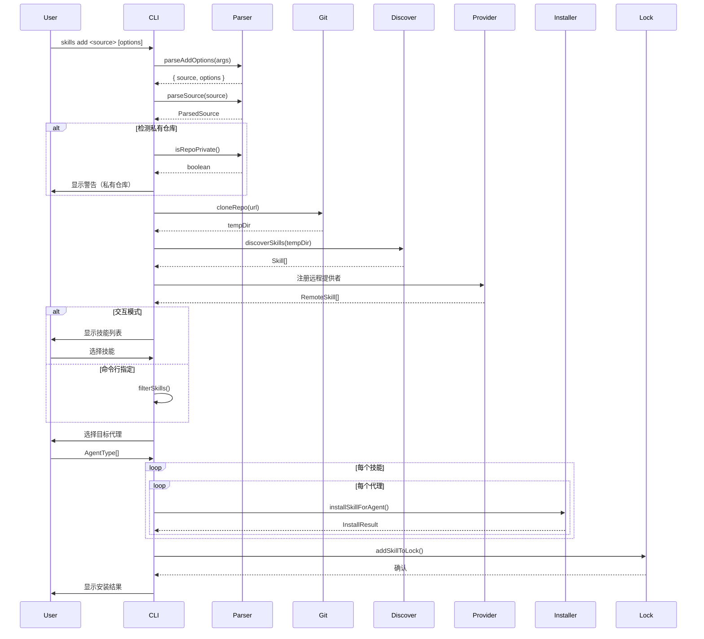

### 2.2 选项解析

```typescript
export interface AddOptions {
  global?: boolean;      // -g, --global
  agent?: string[];      // -a, --agent
  skill?: string[];      // -s, --skill
  list?: boolean;        // -l, --list
  yes?: boolean;         // -y, --yes
  copy?: boolean;        // --copy
  all?: boolean;         // --all
  fullDepth?: boolean;   // --full-depth
}
```

### 2.3 私有仓库检测

```typescript
async function isSourcePrivate(source: string): Promise<boolean | null> {
  const ownerRepo = parseOwnerRepo(source);
  if (!ownerRepo) return false;
  return isRepoPrivate(ownerRepo.owner, ownerRepo.repo);
}
```

**流程**：
1. 解析 owner/repo
2. 调用 GitHub API 检查 private 字段
3. 显示警告提示

## 3. 移除命令 (remove.ts)

### 3.1 移除流程

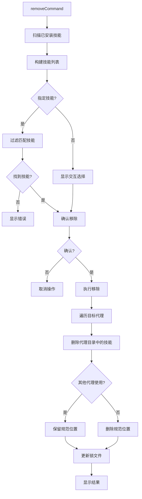

### 3.2 幽灵符号链接清理

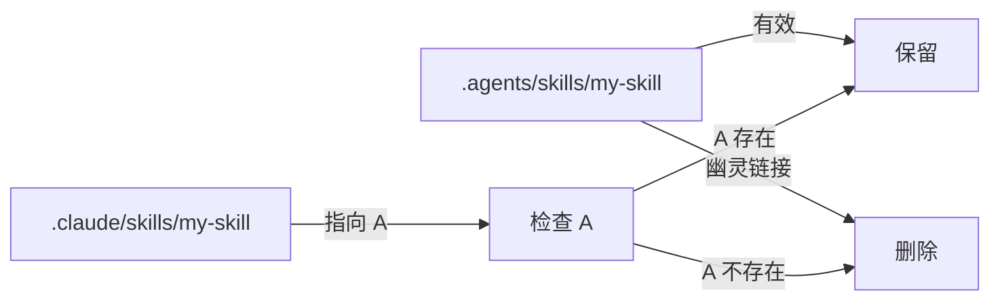

### 3.3 安全检查

```typescript
// 扫描所有可能的路径
for (const agentKey of targetAgents) {
  const agent = agents[agentKey];
  const pathsToCleanup = new Set([skillPath]);

  // 添加代理原生路径
  if (isGlobal && agent.globalSkillsDir) {
    pathsToCleanup.add(join(agent.globalSkillsDir, sanitizedName));
  } else {
    pathsToCleanup.add(join(cwd, agent.skillsDir, sanitizedName));
  }

  // 清理除规范路径外的所有路径
  for (const pathToCleanup of pathsToCleanup) {
    if (pathToCleanup !== canonicalPath) {
      await rm(pathToCleanup, { recursive: true, force: true });
    }
  }
}
```

## 4. 列表命令 (list.ts)

### 4.1 列表流程

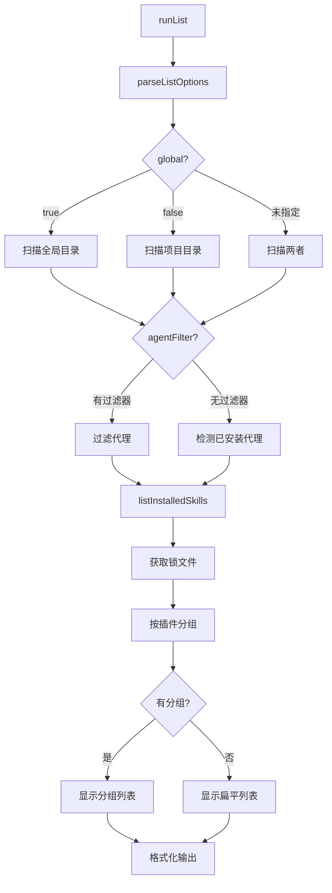

### 4.2 显示格式

```bash
# 扁平列表
React Best Practices
  .agents/skills/react-best-practices
  Agents: Claude Code, Cursor, Codex

# 分组列表
Vercel AI SDK
  vercel-ai-sdk-chat .agents/skills/vercel-ai-sdk-chat
    Agents: Claude Code, Cursor
  vercel-ai-sdk-stream .agents/skills/vercel-ai-sdk-stream
    Agents: Claude Code
```

### 4.3 路径缩短

```typescript
function shortenPath(fullPath: string, cwd: string): string {
  const home = homedir();
  if (fullPath.startsWith(home)) {
    return fullPath.replace(home, '~');
  }
  if (fullPath.startsWith(cwd)) {
    return '.' + fullPath.slice(cwd.length);
  }
  return fullPath;
}
```

## 5. 查找命令 (find.ts)

### 5.1 查找模式

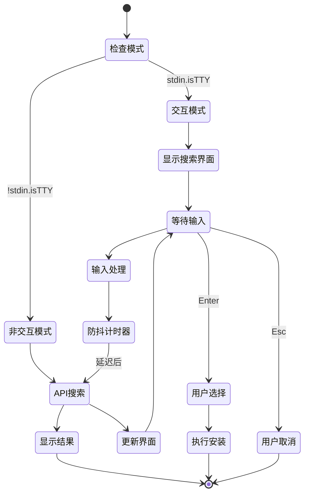

### 5.2 实时搜索

```typescript
function triggerSearch(q: string): void {
  // 清除待处理的计时器
  if (debounceTimer) {
    clearTimeout(debounceTimer);
  }

  if (!q || q.length < 2) {
    results = [];
    selectedIndex = 0;
    render();
    return;
  }

  loading = true;
  render();

  // 自适应防抖：根据查询长度调整延迟
  const debounceMs = Math.max(150, 350 - q.length * 50);

  debounceTimer = setTimeout(async () => {
    results = await searchSkillsAPI(q);
    selectedIndex = 0;
    loading = false;
    render();
  }, debounceMs);
}
```

### 5.3 键盘处理

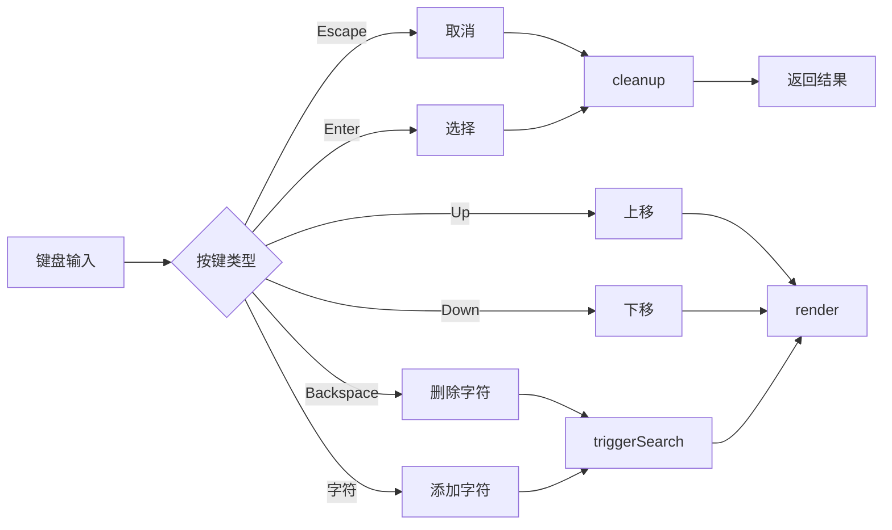

### 5.4 API 搜索

```typescript
async function searchSkillsAPI(query: string): Promise<SearchSkill[]> {
  const url = `${SEARCH_API_BASE}/api/search?q=${encodeURIComponent(query)}&limit=10`;
  const res = await fetch(url);

  if (!res.ok) return [];

  const data = await res.json();
  return data.skills.map(skill => ({
    name: skill.name,
    slug: skill.id,
    source: skill.source || '',
    installs: skill.installs,
  }));
}
```

## 6. 检查更新 (check)

### 6.1 检查流程

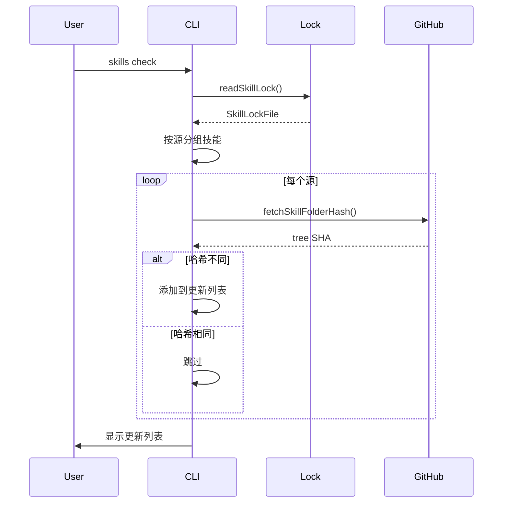

### 6.2 跳过原因

```typescript
function getSkipReason(entry: SkillLockEntry): string {
  if (entry.sourceType === 'local') {
    return 'Local path';
  }
  if (entry.sourceType === 'git') {
    return 'Git URL (hash tracking not supported)';
  }
  if (!entry.skillFolderHash) {
    return 'No version hash available';
  }
  if (!entry.skillPath) {
    return 'No skill path recorded';
  }
  return 'No version tracking';
}
```

## 7. 更新命令 (update)

### 7.1 更新流程

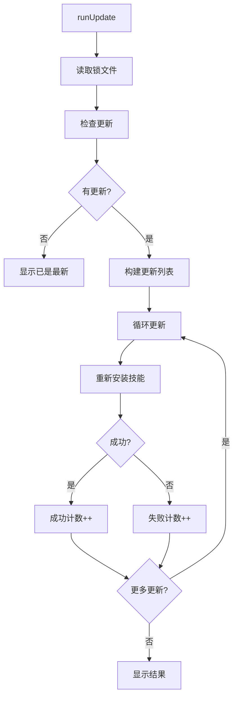

### 7.2 重新安装策略

```typescript
// 构建安装 URL
let installUrl = update.entry.sourceUrl;
if (update.entry.skillPath) {
  // 转换为 tree URL
  installUrl = `${installUrl}/tree/main/${skillFolder}`;
}

// 调用 skills CLI 重新安装
const result = spawnSync('npx', ['-y', 'skills', 'add', installUrl, '-g', '-y'], {
  stdio: ['inherit', 'pipe', 'pipe'],
  shell: process.platform === 'win32',
});
```

## 8. 初始化命令 (init)

### 8.1 初始化流程

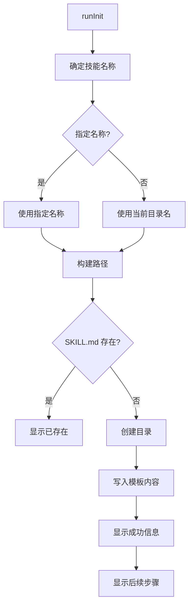

### 8.2 模板内容

```markdown
---
name: {skillName}
description: A brief description of what this skill does
---

# {skillName}

Instructions for the agent to follow when this skill is activated.

## When to use

Describe when this skill should be used.

## Instructions

1. First step
2. Second step
3. Additional steps as needed
```

## 9. 同步命令 (sync.ts)

### 9.1 同步流程

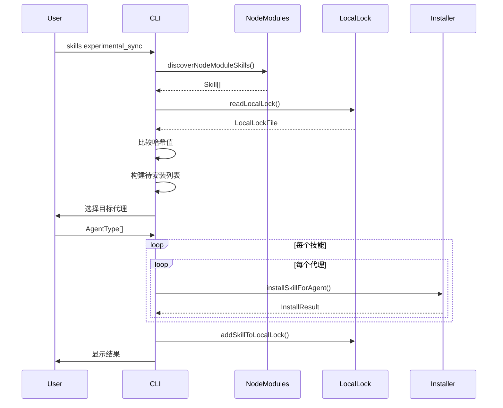

### 9.2 node_modules 发现

```typescript
async function discoverNodeModuleSkills(cwd: string) {
  const nodeModulesDir = join(cwd, 'node_modules');

  // 检查顶层包
  for (const name of topNames) {
    // 处理作用域包 @org/pkg
    if (name.startsWith('@')) {
      // 读取作用域下的所有包
    } else {
      // 处理普通包
    }

    // 检查 SKILL.md
    // 检查 skills/ 目录
    // 检查 .agents/skills/ 目录
  }
}
```

### 9.3 哈希比较

```typescript
for (const skill of discoveredSkills) {
  const existingEntry = localLock.skills[skill.name];
  if (existingEntry) {
    const currentHash = await computeSkillFolderHash(skill.path);
    if (currentHash === existingEntry.computedHash) {
      upToDate.push(skill.name);
      continue;
    }
  }
  toInstall.push(skill);
}
```

---

**下一篇**: [04-技能发现与解析](./04-技能发现与解析.md)
