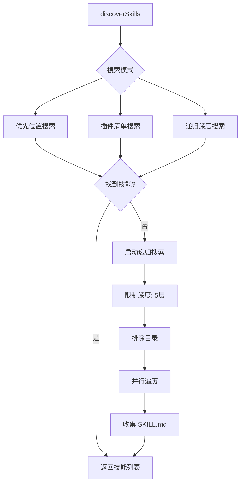
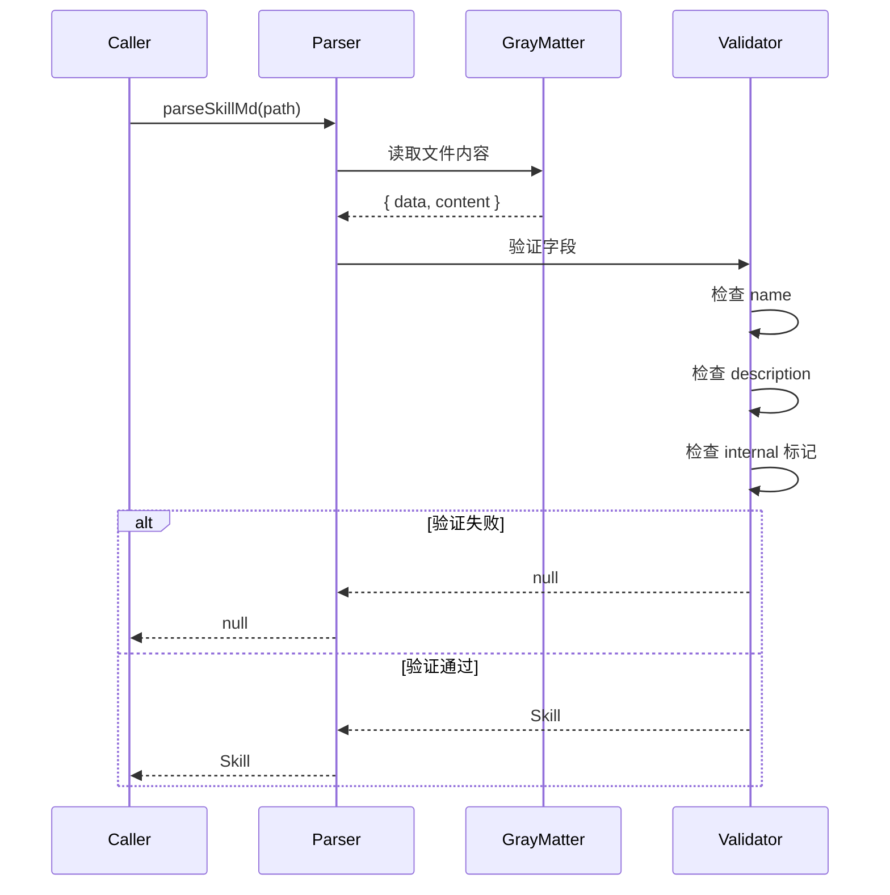
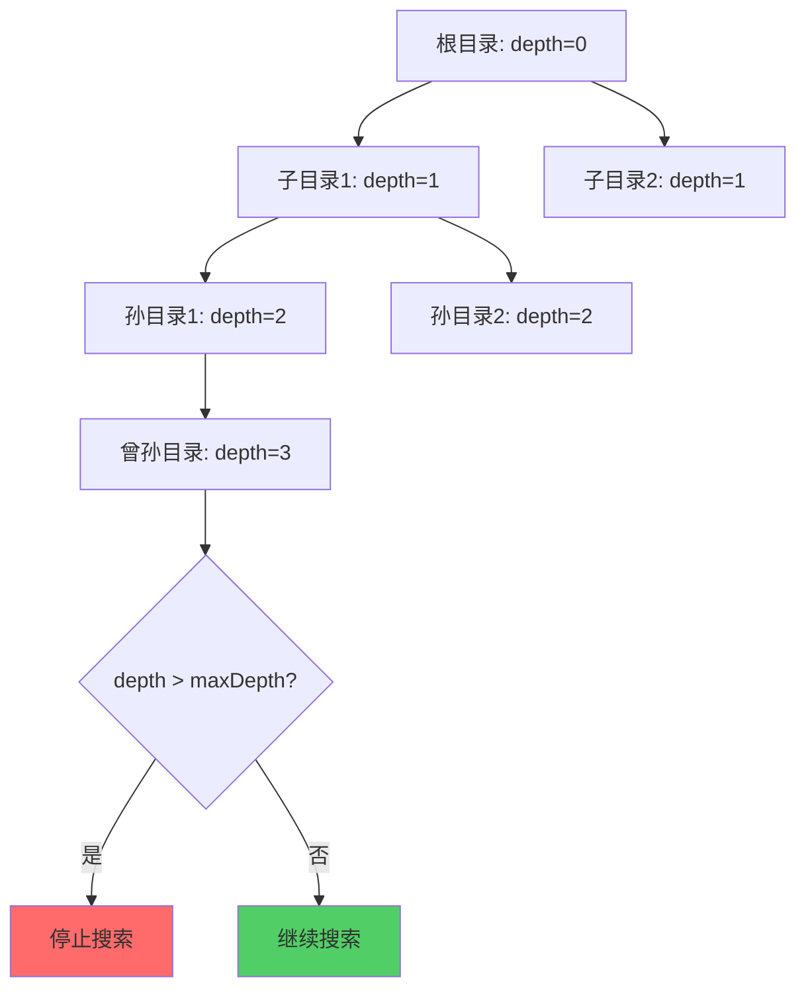
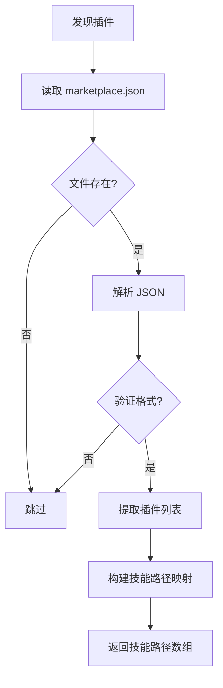
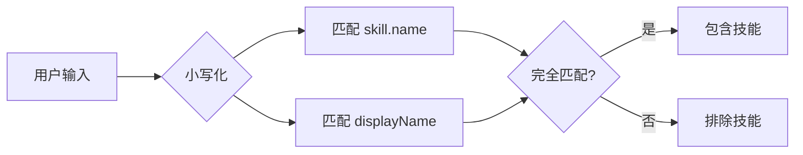

# 技能发现与解析

## 1. 发现系统架构

### 1.1 发现策略概览



### 1.2 发现位置优先级

```
优先级 1: 直接路径（如果是技能目录）
优先级 2: 标准技能目录
  ├── skills/
  ├── skills/.curated/
  ├── skills/.experimental/
  └── skills/.system/
优先级 3: 代理特定目录
  ├── .agents/skills/
  ├── .claude/skills/
  ├── .cursor/skills/
  └── ... (42+ 代理目录)
优先级 4: 插件清单声明
优先级 5: 递归搜索（fullDepth 模式）
```

## 2. SKILL.md 解析

### 2.1 文件格式

```markdown
---
name: react-best-practices
description: React 最佳实践和模式指南
metadata:
  internal: false
  category: frontend
  tags:
    - react
    - frontend
    - best-practices
---

# React Best Practices

## 使用场景

当需要创建或修改 React 组件时使用此技能。

## 指导原则

1. 使用函数组件和 Hooks
2. 避免不必要的重新渲染
3. 使用 TypeScript 类型
```

### 2.2 解析流程



### 2.3 验证规则

```typescript
// 必需字段
if (!data.name || !data.description) {
  return null;
}

// 类型检查
if (typeof data.name !== 'string' || typeof data.description !== 'string') {
  return null;
}

// 内部技能检查
const isInternal = data.metadata?.internal === true;
if (isInternal && !shouldInstallInternalSkills() && !options?.includeInternal) {
  return null;
}
```

### 2.4 元数据结构

```typescript
interface SkillMetadata {
  internal?: boolean;      // 内部技能标记
  category?: string;        // 技能分类
  tags?: string[];          // 标签
  version?: string;         // 版本号
  author?: string;          // 作者
  [key: string]: unknown;   // 其他自定义字段
}
```

## 3. 递归搜索机制

### 3.1 搜索算法

```typescript
async function findSkillDirs(dir: string, depth = 0, maxDepth = 5): Promise<string[]> {
  // 深度限制
  if (depth > maxDepth) return [];

  try {
    // 并行检查
    const [hasSkill, entries] = await Promise.all([
      hasSkillMd(dir),
      readdir(dir, { withFileTypes: true }).catch(() => []),
    ]);

    const currentDir = hasSkill ? [dir] : [];

    // 并行搜索子目录
    const subDirResults = await Promise.all(
      entries
        .filter(entry => entry.isDirectory() && !SKIP_DIRS.includes(entry.name))
        .map(entry => findSkillDirs(join(dir, entry.name), depth + 1, maxDepth))
    );

    return [...currentDir, ...subDirResults.flat()];
  } catch {
    return [];
  }
}
```

### 3.2 排除目录

```typescript
const SKIP_DIRS = [
  'node_modules',  // 依赖包
  '.git',          // 版本控制
  'dist',          // 构建输出
  'build',         // 构建输出
  '__pycache__',   // Python 缓存
];
```

### 3.3 深度限制



## 4. 插件清单发现

### 4.1 清单文件格式

```json
// .claude-plugin/marketplace.json
{
  "metadata": {
    "pluginRoot": "./plugins",
    "displayName": "My Plugin"
  },
  "plugins": [
    {
      "name": "code-review",
      "source": "code-review",
      "skills": [
        "./plugins/code-review/skills/pr-review",
        "./plugins/code-review/skills/code-quality"
      ]
    },
    {
      "name": "testing",
      "source": "testing",
      "skills": [
        "./plugins/testing/skills/unit-test",
        "./plugins/testing/skills/integration-test"
      ]
    }
  ]
}
```

### 4.2 清单解析



### 4.3 技能分组

```typescript
// 按插件分组技能
const pluginGroupings = await getPluginGroupings(searchPath);

// 为技能添加插件信息
const enhanceSkill = (skill: Skill) => {
  const resolvedPath = resolve(skill.path);
  if (pluginGroupings.has(resolvedPath)) {
    skill.pluginName = pluginGroupings.get(resolvedPath);
  }
  return skill;
};
```

### 4.4 分组显示

```
Code Review
  pr-review .agents/skills/pr-review
    Agents: Claude Code, Cursor
  code-quality .agents/skills/code-quality
    Agents: Claude Code

Testing
  unit-test .agents/skills/unit-test
    Agents: Cursor, Codex
  integration-test .agents/skills/integration-test
    Agents: Claude Code
```

## 5. 技能过滤

### 5.1 过滤机制

```typescript
export function filterSkills(skills: Skill[], inputNames: string[]): Skill[] {
  const normalizedInputs = inputNames.map(n => n.toLowerCase());

  return skills.filter(skill => {
    const name = skill.name.toLowerCase();
    const displayName = getSkillDisplayName(skill).toLowerCase();

    return normalizedInputs.some(input =>
      input === name || input === displayName
    );
  });
}
```

### 5.2 匹配规则



### 5.3 多词技能名

```bash
# 必须使用引号
skills add owner/repo --skill "React Best Practices"
skills add owner/repo --skill "Convex Best Practices"

# 错误示例（只匹配第一个词）
skills add owner/repo --skill React Best Practices
# 只会匹配 "React"，忽略 "Best Practices"
```

## 6. 内部技能处理

### 6.1 检测逻辑

```typescript
function shouldInstallInternalSkills(): boolean {
  const envValue = process.env.INSTALL_INTERNAL_SKILLS;
  return envValue === '1' || envValue === 'true';
}
```

### 6.2 内部技能示例

```markdown
---
name: internal-debug-tool
description: Internal debugging utilities
metadata:
  internal: true
  visibility: developers-only
---

# Internal Debug Tool

This skill is only visible when INSTALL_INTERNAL_SKILLS=1.
```

### 6.3 可见性控制

```mermaid
stateDiagram-v2
    [*] --> 检查技能
    检查技能 --> 解析 SKILL.md

    解析 SKILL.md --> 读取 metadata
    读取 metadata --> {internal: true?}

    {internal: true?} --> 是: 检查环境变量
    {internal: true?} --> 否: 正常显示

    检查环境变量 --> {INSTALL_INTERNAL_SKILLS?}
    {INSTALL_INTERNAL_SKILLS?} --> 是: 显示技能
    {INSTALL_INTERNAL_SKILLS?} --> 否: 隐藏技能

    正常显示 --> [*]
    显示技能 --> [*]
    隐藏技能 --> [*]
```

## 7. 性能优化

### 7.1 并行处理

```typescript
// 并行读取目录条目
const entries = await readdir(dir, { withFileTypes: true });

// 并行检查子目录
const subDirResults = await Promise.all(
  entries
    .filter(entry => entry.isDirectory())
    .map(entry => findSkillDirs(join(dir, entry.name), depth + 1, maxDepth))
);
```

### 7.2 缓存策略

```typescript
// 避免重复解析
const seenNames = new Set<string>();

for (const skill of discoveredSkills) {
  if (seenNames.has(skill.name)) {
    continue; // 跳过重复
  }
  seenNames.add(skill.name);
  skills.push(skill);
}
```

### 7.3 早期退出

```typescript
// 如果直接指向技能且不需要深度搜索
if (await hasSkillMd(searchPath)) {
  const skill = await parseSkillMd(join(searchPath, 'SKILL.md'));
  if (skill) {
    if (!options?.fullDepth) {
      return [skill]; // 早期退出
    }
  }
}
```

## 8. 错误处理

### 8.1 容错策略

```typescript
try {
  const entries = await readdir(dir, { withFileTypes: true });
  // 处理条目
} catch {
  // 静默失败，继续处理其他目录
  return [];
}
```

### 8.2 验证失败

```typescript
// 解析失败时返回 null
export async function parseSkillMd(
  skillMdPath: string
): Promise<Skill | null> {
  try {
    const content = await readFile(skillMdPath, 'utf-8');
    const { data } = matter(content);

    // 验证失败
    if (!data.name || !data.description) {
      return null;
    }

    return { /* ... */ };
  } catch {
    return null;
  }
}
```

### 8.3 路径安全

```typescript
// 防止路径遍历
if (!isPathSafe(basePath, targetPath)) {
  throw new Error('Invalid skill name: potential path traversal detected');
}
```

## 9. 扩展点

### 9.1 自定义搜索位置

```typescript
// 添加自定义搜索目录
const customSearchDirs = [
  join(searchPath, 'custom-skills'),
  join(searchPath, '.my-skills'),
];

for (const dir of customSearchDirs) {
  try {
    const entries = await readdir(dir, { withFileTypes: true });
    // 处理条目
  } catch {
    // 目录不存在，跳过
  }
}
```

### 9.2 自定义验证器

```typescript
// 扩展验证逻辑
function validateSkill(skill: Skill): boolean {
  // 基本验证
  if (!skill.name || !skill.description) {
    return false;
  }

  // 自定义验证
  if (skill.metadata?.category === 'deprecated') {
    return false;
  }

  return true;
}
```

### 9.3 插件系统

```typescript
// 注册自定义发现器
interface SkillDiscoverer {
  name: string;
  priority: number;
  discover(path: string): Promise<Skill[]>;
}

const discoverers: SkillDiscoverer[] = [];

// 注册发现器
discoverers.push({
  name: 'custom-discoverer',
  priority: 100,
  discover: async (path) => {
    // 自定义发现逻辑
    return [];
  },
});

// 按优先级排序并执行
discoverers
  .sort((a, b) => b.priority - a.priority)
  .forEach(async discoverer => {
    const skills = await discoverer.discover(searchPath);
    allSkills.push(...skills);
  });
```

---

**下一篇**: [05-安装系统](./05-安装系统.md)
