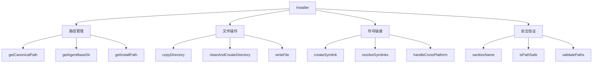
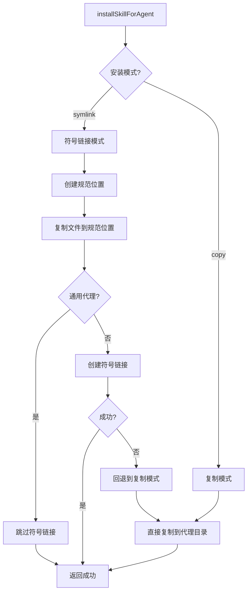
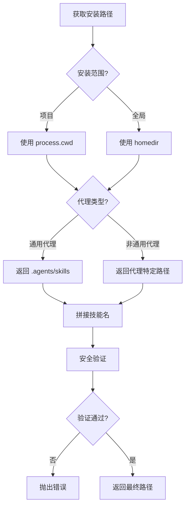
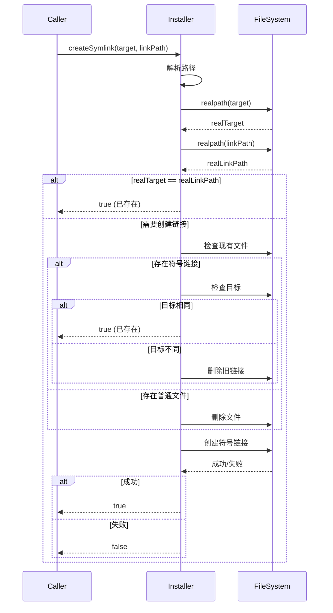
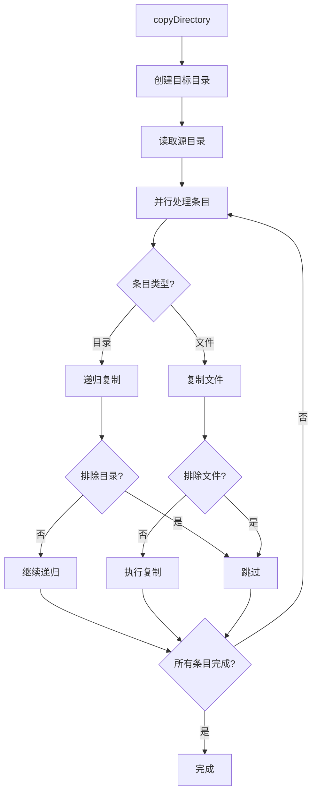
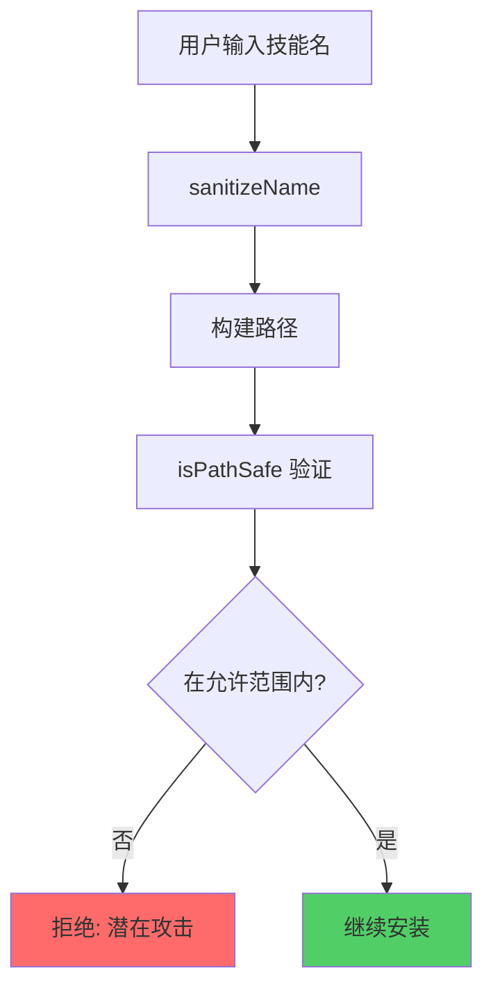
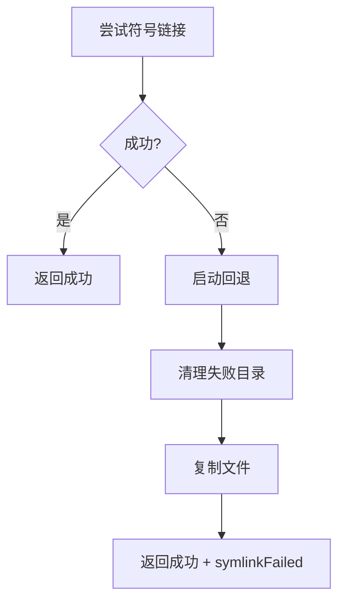
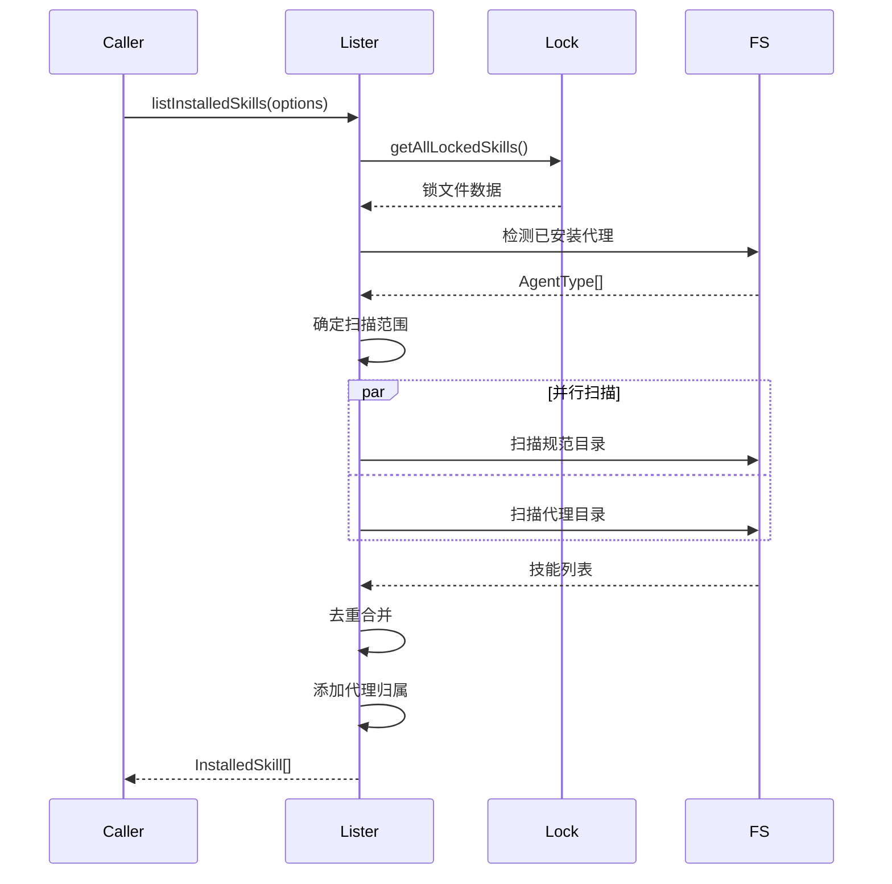
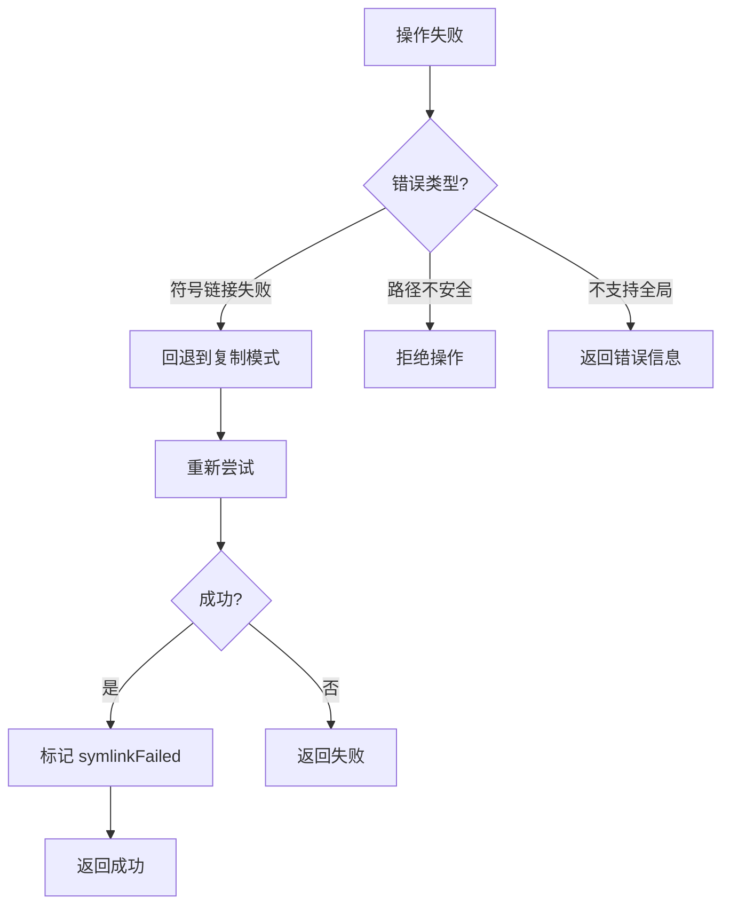

# 安装系统

## 1. 安装引擎架构

### 1.1 核心组件



### 1.2 安装模式



## 2. 路径管理系统

### 2.1 路径类型

```typescript
// 规范位置（所有通用代理共享）
getCanonicalSkillsDir(global, cwd)
// => .agents/skills/ 或 ~/.agents/skills/

// 代理特定位置
getAgentBaseDir(agentType, global, cwd)
// => .claude/skills/ 或 ~/.claude/skills/
// => .cursor/skills/ 或 ~/.cursor/skills/
```

### 2.2 路径解析流程



### 2.3 路径安全验证

```typescript
function isPathSafe(basePath: string, targetPath: string): boolean {
  const normalizedBase = normalize(resolve(basePath));
  const normalizedTarget = normalize(resolve(targetPath));

  return normalizedTarget.startsWith(normalizedBase + sep) ||
         normalizedTarget === normalizedBase;
}
```

**防护目标**：
- 路径遍历攻击 (`../../../etc/passwd`)
- 符号链接逃逸
- 绝对路径注入

## 3. 符号链接系统

### 3.1 符号链接创建



### 3.2 跨平台处理

```typescript
// Windows 使用 junction，Unix 使用 symlink
const symlinkType = platform() === 'win32' ? 'junction' : undefined;

await symlink(relativePath, linkPath, symlinkType);
```

**平台差异**：

| 平台 | 符号链接类型 | 需要权限 |
|------|-------------|----------|
| Linux/Mac | `symlink` | 否 |
| Windows | `junction` | 否（推荐）|
| Windows | `symlink` | 是（开发者模式）|

### 3.3 相对路径计算

```typescript
// 使用真实父目录计算相对路径
const realLinkDir = await resolveParentSymlinks(linkDir);
const relativePath = relative(realLinkDir, target);
```

**示例**：
```
目标: /home/user/.agents/skills/my-skill
链接: /home/user/.claude/skills/my-skill
相对路径: ../../.agents/skills/my-skill
```

### 3.4 父目录符号链接解析

```typescript
async function resolveParentSymlinks(path: string): Promise<string> {
  const resolved = resolve(path);
  const dir = dirname(resolved);
  const base = basename(resolved);

  try {
    const realDir = await realpath(dir);
    return join(realDir, base);
  } catch {
    return resolved;
  }
}
```

**处理场景**：
```
~/.claude -> ~/.agents/
~/.claude/skills/my-skill
  解析为: ~/.agents/skills/my-skill
```

## 4. 文件复制系统

### 4.1 复制流程



### 4.2 排除规则

```typescript
const EXCLUDE_FILES = new Set(['metadata.json']);
const EXCLUDE_DIRS = new Set(['.git']);

const isExcluded = (name: string, isDirectory: boolean = false): boolean => {
  if (EXCLUDE_FILES.has(name)) return true;
  if (name.startsWith('_')) return true;
  if (isDirectory && EXCLUDE_DIRS.has(name)) return true;
  return false;
};
```

### 4.3 符号链接处理

```typescript
await cp(srcPath, destPath, {
  dereference: true,   // 解引用符号链接
  recursive: true,     // 递归复制目录
});
```

**解引用原因**：
- 远程技能中的符号链接在本地可能无效
- 确保复制实际内容而非链接

## 5. 安全机制

### 5.1 名称清理

```typescript
export function sanitizeName(name: string): string {
  const sanitized = name
    .toLowerCase()
    // 替换非法字符为连字符
    .replace(/[^a-z0-9._]+/g, '-')
    // 移除前后的点和连字符
    .replace(/^[.\-]+|[.\-]+$/g, '');

  // 限制长度
  return sanitized.substring(0, 255) || 'unnamed-skill';
}
```

**示例转换**：

| 输入 | 输出 |
|------|------|
| `My Skill` | `my-skill` |
| `../../../etc` | `etc` |
| `skill_Name.v1` | `skill_name.v1` |
| `` `rm -rf` `` | `rm-rf` |

### 5.2 路径遍历防护



### 5.3 目录清理安全

```typescript
async function cleanAndCreateDirectory(path: string): Promise<void> {
  try {
    await rm(path, { recursive: true, force: true });
  } catch {
    // 忽略清理错误
  }
  await mkdir(path, { recursive: true });
}
```

**安全措施**：
- 清理前验证路径在允许范围内
- 使用 `force: true` 忽略不存在的情况
- 创建目录时使用 `recursive: true`

## 6. 安装状态管理

### 6.1 安装检查

```typescript
export async function isSkillInstalled(
  skillName: string,
  agentType: AgentType,
  options: { global?: boolean; cwd?: string } = {}
): Promise<boolean> {
  const agent = agents[agentType];
  const sanitized = sanitizeName(skillName);

  // 检查全局支持
  if (options.global && agent.globalSkillsDir === undefined) {
    return false;
  }

  const targetBase = options.global
    ? agent.globalSkillsDir!
    : join(options.cwd || process.cwd(), agent.skillsDir);

  const skillDir = join(targetBase, sanitized);

  // 安全验证
  if (!isPathSafe(targetBase, skillDir)) {
    return false;
  }

  try {
    await access(skillDir);
    return true;
  } catch {
    return false;
  }
}
```

### 6.2 安装结果

```typescript
interface InstallResult {
  success: boolean;
  path: string;
  canonicalPath?: string;
  mode: InstallMode;
  symlinkFailed?: boolean;
  error?: string;
}
```

### 6.3 回退机制



## 7. 列表系统

### 7.1 列表流程



### 7.2 技能去重

```typescript
// 使用 Map 按范围和名称去重
const skillsMap: Map<string, InstalledSkill> = new Map();

const scopeKey = scope.global ? 'global' : 'project';
const skillKey = `${scopeKey}:${skill.name}`;

if (skillsMap.has(skillKey)) {
  // 合并代理列表
  const existing = skillsMap.get(skillKey)!;
  for (const agent of installedAgents) {
    if (!existing.agents.includes(agent)) {
      existing.agents.push(agent);
    }
  }
} else {
  skillsMap.set(skillKey, {
    name: skill.name,
    description: skill.description,
    path: skillDir,
    canonicalPath: skillDir,
    scope: scopeKey,
    agents: installedAgents,
  });
}
```

### 7.3 代理归属检测

```typescript
// 检查技能是否安装在代理目录
for (const agentType of agentsToCheck) {
  const agent = agents[agentType];
  const agentBase = scope.global ? agent.globalSkillsDir! : join(cwd, agent.skillsDir);

  // 尝试可能的名称变体
  const possibleNames = Array.from(new Set([
    entry.name,
    sanitizedSkillName,
    skill.name.toLowerCase().replace(/\s+/g, '-'),
  ]));

  for (const possibleName of possibleNames) {
    const agentSkillDir = join(agentBase, possibleName);
    if (!isPathSafe(agentBase, agentSkillDir)) continue;

    try {
      await access(agentSkillDir);
      found = true;
      break;
    } catch {
      // 尝试下一个名称
    }
  }

  // 回退: 扫描所有目录并检查 SKILL.md
  if (!found) {
    const agentEntries = await readdir(agentBase, { withFileTypes: true });
    for (const agentEntry of agentEntries) {
      if (!agentEntry.isDirectory()) continue;

      const candidateDir = join(agentBase, agentEntry.name);
      const candidateSkillMd = join(candidateDir, 'SKILL.md');
      try {
        await stat(candidateSkillMd);
        const candidateSkill = await parseSkillMd(candidateSkillMd);
        if (candidateSkill && candidateSkill.name === skill.name) {
          found = true;
          break;
        }
      } catch {
        // 不是有效技能目录
      }
    }
  }

  if (found) {
    installedAgents.push(agentType);
  }
}
```

## 8. 性能优化

### 8.1 并行操作

```typescript
// 并行复制文件
await Promise.all(
  entries
    .filter(entry => !isExcluded(entry.name, entry.isDirectory()))
    .map(async entry => {
      const srcPath = join(src, entry.name);
      const destPath = join(dest, entry.name);

      if (entry.isDirectory()) {
        await copyDirectory(srcPath, destPath);
      } else {
        await cp(srcPath, destPath, {
          dereference: true,
          recursive: true,
        });
      }
    })
);
```

### 8.2 早期退出

```typescript
// 对于通用代理全局安装，跳过符号链接
if (isGlobal && isUniversalAgent(agentType)) {
  return {
    success: true,
    path: canonicalDir,
    canonicalPath: canonicalDir,
    mode: 'symlink',
  };
}
```

### 8.3 缓存检测结果

```typescript
// 缓存代理检测结果
const detectedAgents = await detectInstalledAgents();
// 后续操作重用此结果
```

## 9. 错误处理

### 9.1 错误分类

```typescript
interface InstallError {
  type: 'path-unsafe' | 'no-global-support' | 'copy-failed' | 'symlink-failed';
  message: string;
  recoverable: boolean;
}
```

### 9.2 错误恢复



---

**下一篇**: [06-代理管理](./06-代理管理.md)
