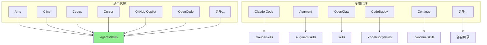
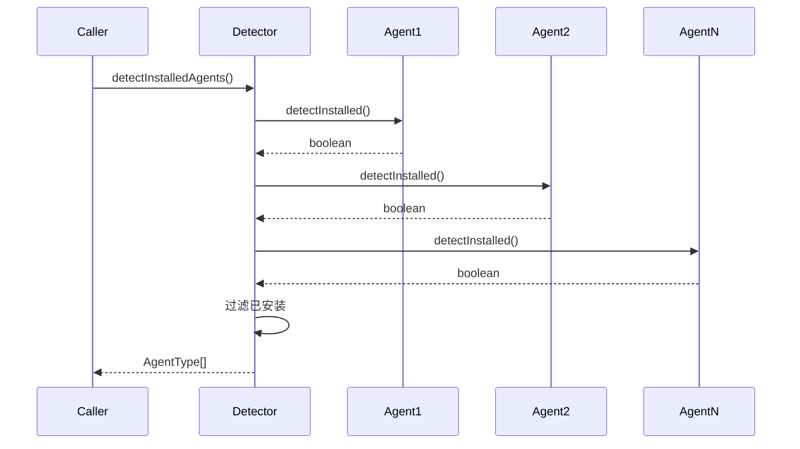
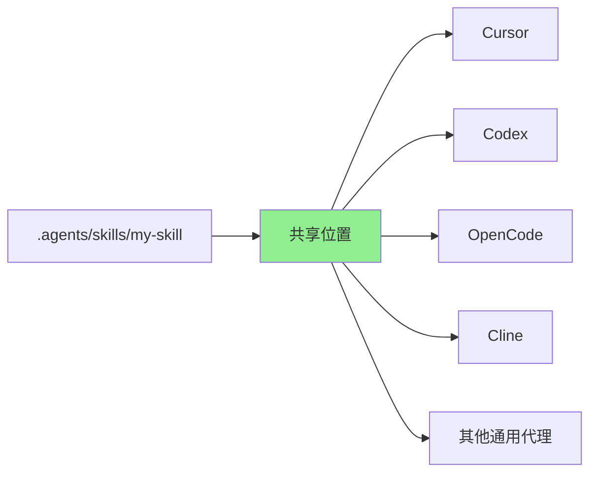
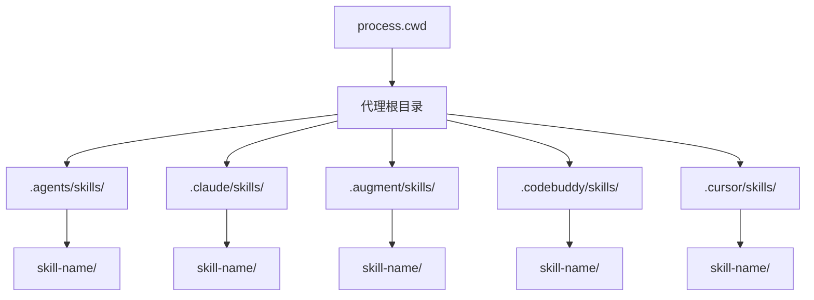
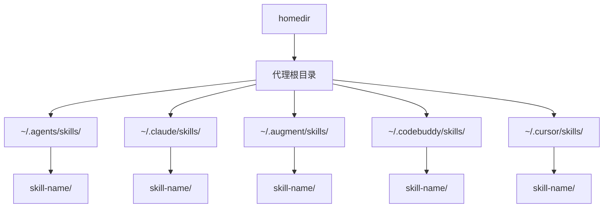
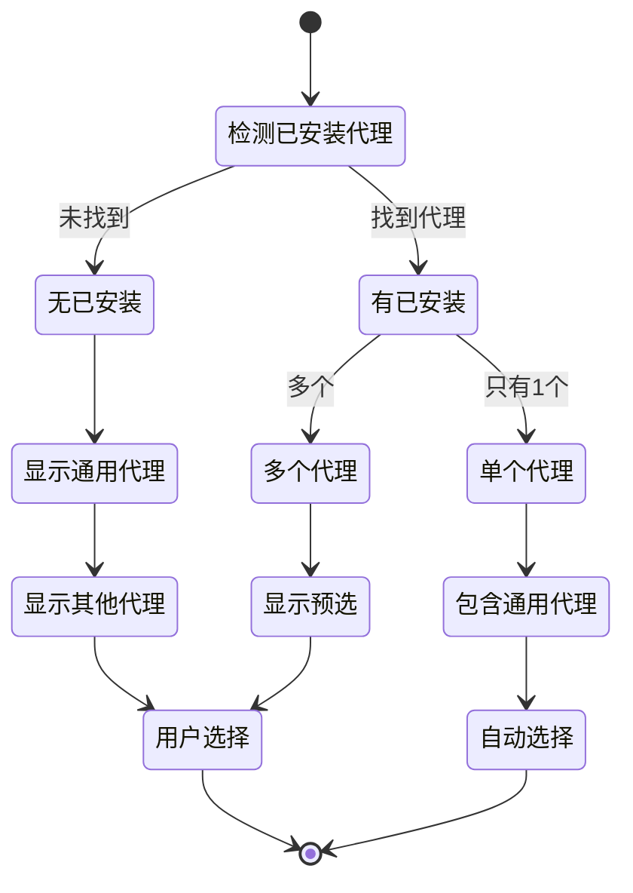

# 代理管理

## 1. 代理系统架构

### 1.1 代理类型



### 1.2 代理配置接口

```typescript
interface AgentConfig {
  name: string;                      // 代理标识符
  displayName: string;               // 显示名称
  skillsDir: string;                 // 项目级技能目录
  globalSkillsDir: string | undefined; // 全局级技能目录
  detectInstalled: () => Promise<boolean>; // 检测函数
  showInUniversalList?: boolean;     // 是否在通用列表中显示
}
```

## 2. 代理检测系统

### 2.1 检测流程



### 2.2 检测方法

```typescript
// 检测 Claude Code
'claude-code': {
  detectInstalled: async () => {
    return existsSync(claudeHome);
  },
}

// 检测 Cursor
'cursor': {
  detectInstalled: async () => {
    return existsSync(join(home, '.cursor'));
  },
}

// 检测 OpenCode
'opencode': {
  detectInstalled: async () => {
    return existsSync(join(configHome, 'opencode'));
  },
}

// 检测 CodeBuddy (项目或全局)
'codebuddy': {
  detectInstalled: async () => {
    return existsSync(join(process.cwd(), '.codebuddy')) ||
           existsSync(join(home, '.codebuddy'));
  },
}
```

### 2.3 检测策略

| 代理 | 项目检测 | 全局检测 | 检测方法 |
|------|---------|----------|----------|
| Claude Code | `.claude/` | `~/.claude/` | 目录存在 |
| Cursor | `.agents/skills` | `~/.cursor/skills` | 目录存在 |
| Codex | `.agents/skills` | `~/.codex/skills` | 目录或 `/etc/codex` |
| CodeBuddy | `.codebuddy/` | `~/.codebuddy/` | 任一存在 |
| OpenCode | `.agents/skills` | `~/.config/opencode/skills` | XDG 目录 |

## 3. 通用代理系统

### 3.1 通用代理概念



**优势**：
- 单一存储位置
- 自动同步到所有通用代理
- 减少磁盘使用
- 简化更新流程

### 3.2 通用代理识别

```typescript
export function isUniversalAgent(type: AgentType): boolean {
  return agents[type].skillsDir === '.agents/skills';
}

export function getUniversalAgents(): AgentType[] {
  return (Object.entries(agents) as [AgentType, AgentConfig][])
    .filter(([_, config]) =>
      config.skillsDir === '.agents/skills' &&
      config.showInUniversalList !== false
    )
    .map(([type]) => type);
}

export function getNonUniversalAgents(): AgentType[] {
  return (Object.entries(agents) as [AgentType, AgentConfig][])
    .filter(([_, config]) => config.skillsDir !== '.agents/skills')
    .map(([type]) => type);
}
```

### 3.3 通用代理列表

```typescript
// 示例通用代理
const universalAgents = [
  'amp',
  'cline',
  'codex',
  'cursor',
  'github-copilot',
  'opencode',
  // ... 更多
];
```

## 4. 路径管理

### 4.1 项目级路径



### 4.2 全局级路径



### 4.3 路径获取

```typescript
// 获取代理基础目录
export function getAgentBaseDir(
  agentType: AgentType,
  global: boolean,
  cwd?: string
): string {
  if (isUniversalAgent(agentType)) {
    return getCanonicalSkillsDir(global, cwd);
  }

  const agent = agents[agentType];
  const baseDir = global ? homedir() : cwd || process.cwd();

  if (global) {
    if (agent.globalSkillsDir === undefined) {
      throw new Error(`${agent.displayName} does not support global installation`);
    }
    return agent.globalSkillsDir;
  }

  return join(baseDir, agent.skillsDir);
}
```

## 5. 特殊代理处理

### 5.1 OpenClaw 多路径支持

```typescript
export function getOpenClawGlobalSkillsDir(
  homeDir = home,
  pathExists: (path: string) => boolean = existsSync
) {
  // 检测多种可能的路径
  if (pathExists(join(homeDir, '.openclaw'))) {
    return join(homeDir, '.openclaw/skills');
  }
  if (pathExists(join(homeDir, '.clawdbot'))) {
    return join(homeDir, '.clawdbot/skills');
  }
  if (pathExists(join(homeDir, '.moltbot'))) {
    return join(homeDir, '.moltbot/skills');
  }
  return join(homeDir, '.openclaw/skills'); // 默认
}

// 检测也支持多路径
'openclaw': {
  detectInstalled: async () => {
    return (
      existsSync(join(home, '.openclaw')) ||
      existsSync(join(home, '.clawdbot')) ||
      existsSync(join(home, '.moltbot'))
    );
  },
}
```

### 5.2 XDG 目录规范

```typescript
// 使用 xdg-basedir 遵循 XDG 规范
import { xdgConfig } from 'xdg-basedir';

const configHome = xdgConfig ?? join(home, '.config');

// Amp
{
  globalSkillsDir: join(configHome, 'agents/skills'),
}

// OpenCode
{
  globalSkillsDir: join(configHome, 'opencode/skills'),
}

// Goose
{
  globalSkillsDir: join(configHome, 'goose/skills'),
}
```

### 5.3 环境变量覆盖

```typescript
// Codex 支持自定义 HOME
const codexHome = process.env.CODEX_HOME?.trim() || join(home, '.codex');

// Claude Code 支持自定义配置目录
const claudeHome = process.env.CLAUDE_CONFIG_DIR?.trim() || join(home, '.claude');
```

## 6. 代理选择交互

### 6.1 选择流程



### 6.2 锁定选择

```typescript
// 搜索多选提示支持锁定部分
const selected = await searchMultiselect({
  message: 'Which agents do you want to install to?',
  items: otherChoices,
  initialSelected: installedAgents.filter(a => !universalAgents.includes(a)),
  lockedSection: {
    title: 'Universal (.agents/skills)',
    items: universalAgents.map(a => ({
      value: a,
      label: agents[a].displayName,
    })),
  },
});
```

### 6.3 记忆选择

```typescript
// 保存用户选择
await saveSelectedAgents(selectedAgents);

// 获取上次选择
const lastSelected = await getLastSelectedAgents();

// 使用上次选择作为默认值
```

## 7. 代理扩展

### 7.1 添加新代理

```typescript
// 1. 添加到 AgentType 类型
export type AgentType =
  | 'existing-agents'
  | 'new-agent';  // 新代理

// 2. 添加配置
export const agents: Record<AgentType, AgentConfig> = {
  // ... 现有代理
  'new-agent': {
    name: 'new-agent',
    displayName: 'New Agent',
    skillsDir: '.newagent/skills',
    globalSkillsDir: join(home, '.newagent/skills'),
    detectInstalled: async () => {
      return existsSync(join(home, '.newagent'));
    },
  },
};
```

### 7.2 验证脚本

```bash
# scripts/validate-agents.ts
# 验证代理配置的一致性和正确性

pnpm run -C scripts validate-agents.ts
```

### 7.3 同步脚本

```bash
# scripts/sync-agents.ts
# 同步代理列表到 README.md

pnpm run -C scripts sync-agents.ts
```

## 8. 代理兼容性

### 8.1 功能兼容性矩阵

| 功能 | Claude Code | Cursor | Codex | 其他 |
|------|-----------|--------|-------|------|
| 基本技能 | ✓ | ✓ | ✓ | ✓ |
| `allowed-tools` | ✓ | ✓ | ✓ | 部分 |
| `context: fork` | ✓ | ✗ | ✗ | ✗ |
| Hooks | ✓ | ✗ | ✗ | 部分 |

### 8.2 技能格式兼容

```typescript
// 所有代理支持基本格式
---
name: my-skill
description: A basic skill
---

# 技能内容

Instructions for the agent.

// 高级功能需要代理支持
metadata:
  allowed-tools: ['read', 'write']
  context: fork
  hooks:
    before: 'setup.md'
    after: 'cleanup.md'
```

## 9. 性能考虑

### 9.1 检测优化

```typescript
// 并行检测所有代理
const results = await Promise.all(
  Object.entries(agents).map(async ([type, config]) => ({
    type: type as AgentType,
    installed: await config.detectInstalled(),
  }))
);

// 过滤已安装
return results.filter(r => r.installed).map(r => r.type);
```

### 9.2 缓存策略

```typescript
// 缓存检测结果（可选）
let detectedAgentsCache: AgentType[] | null = null;
let cacheTime = 0;
const CACHE_TTL = 5000; // 5秒

async function detectInstalledAgents(): Promise<AgentType[]> {
  const now = Date.now();
  if (detectedAgentsCache && (now - cacheTime) < CACHE_TTL) {
    return detectedAgentsCache;
  }

  detectedAgentsCache = await detectInstalledAgentsImpl();
  cacheTime = now;
  return detectedAgentsCache;
}
```

## 10. 故障处理

### 10.1 检测失败

```typescript
// 默认检测函数
async function defaultDetect(): Promise<boolean> {
  return false;
}

// 如果检测失败，返回 false 而不是抛出错误
'agent-with-issue': {
  detectInstalled: async () => {
    try {
      return existsSync(join(home, '.agent-with-issue'));
    } catch {
      return false; // 优雅降级
    }
  },
}
```

### 10.2 路径不存在

```typescript
// 路径不存在时返回 undefined
'agent-without-global': {
  globalSkillsDir: undefined, // 不支持全局安装
  detectInstalled: async () => {
    return existsSync(join(cwd, '.agent-without-global'));
  },
}
```

---

**下一篇**: [07-锁文件机制](./07-锁文件机制.md)
