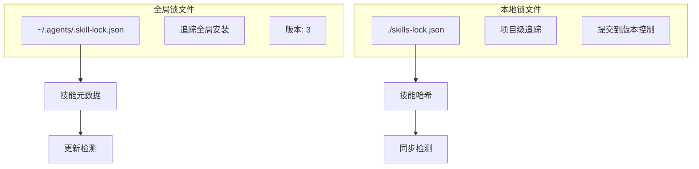
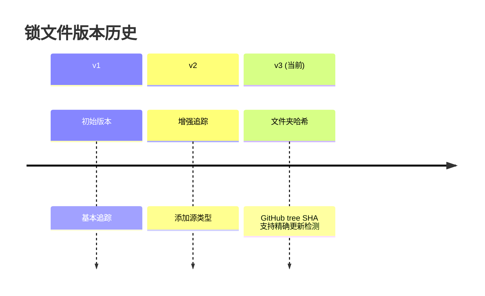
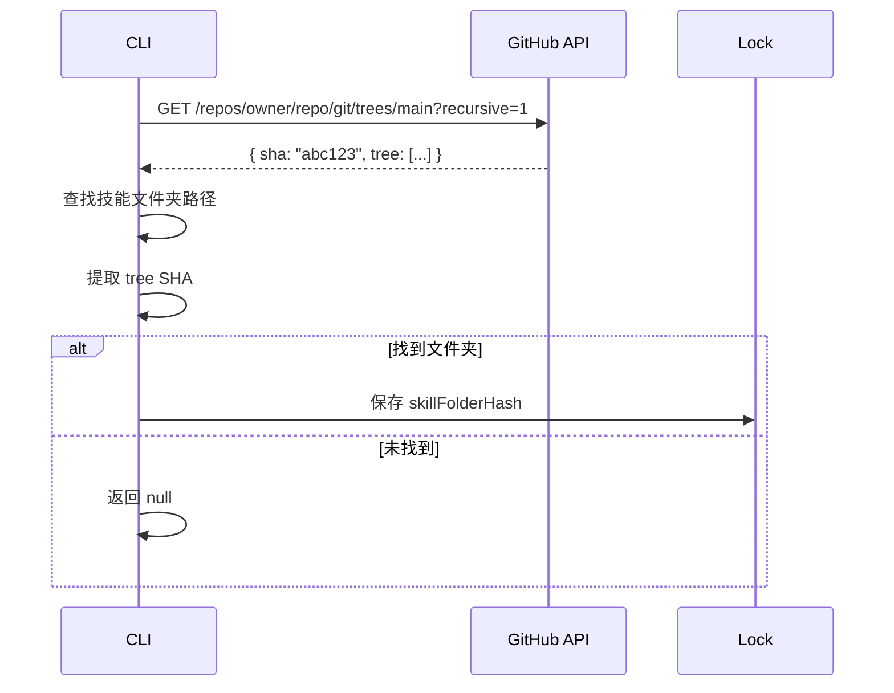
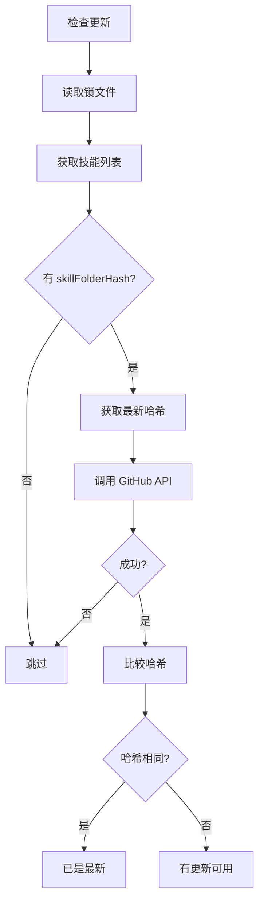
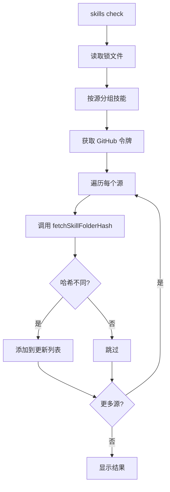
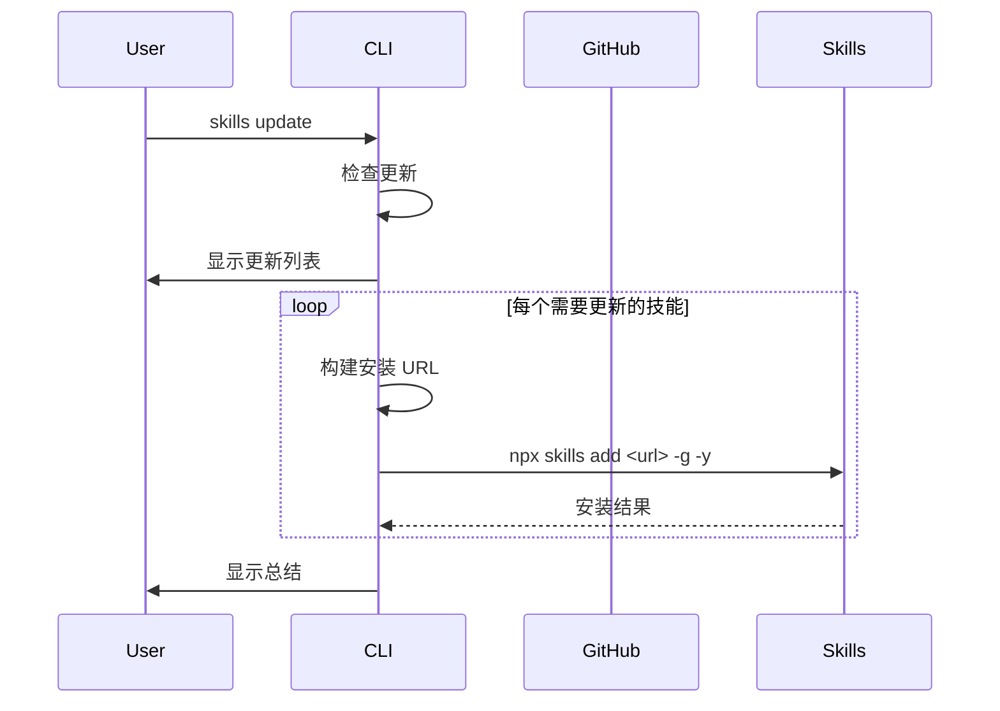

# 锁文件机制

## 1. 锁文件系统架构

### 1.1 双锁文件设计



### 1.2 文件位置

| 锁文件 | 位置 | 用途 |
|--------|------|------|
| 全局锁 | `~/.agents/.skill-lock.json` | 追踪全局安装的技能 |
| 本地锁 | `./skills-lock.json` | 追踪项目级技能（可选提交） |

## 2. 全局锁文件

### 2.1 数据结构

```typescript
interface SkillLockFile {
  version: number;           // 锁文件格式版本
  skills: Record<string, SkillLockEntry>; // 技能条目
  dismissed?: DismissedPrompts;       // 已忽略的提示
  lastSelectedAgents?: string[];       // 上次选择的代理
}

interface SkillLockEntry {
  source: string;           // 规范化源标识 (owner/repo)
  sourceType: string;       // 源类型 (github, mintlify, local)
  sourceUrl: string;        // 原始 URL
  skillPath?: string;       // 子路径 (如适用)
  skillFolderHash: string;  // GitHub tree SHA
  installedAt: string;      // ISO 8601 时间戳
  updatedAt: string;        // ISO 8601 时间戳
  pluginName?: string;      // 所属插件名
}
```

### 2.2 版本历史



### 2.3 读写操作

```typescript
// 读取锁文件
export async function readSkillLock(): Promise<SkillLockFile> {
  const lockPath = getSkillLockPath();

  try {
    const content = await readFile(lockPath, 'utf-8');
    const parsed = JSON.parse(content) as SkillLockFile;

    // 验证版本
    if (typeof parsed.version !== 'number' || !parsed.skills) {
      return createEmptyLockFile();
    }

    // 旧版本兼容性处理
    if (parsed.version < CURRENT_VERSION) {
      return createEmptyLockFile(); // 清空重新填充
    }

    return parsed;
  } catch {
    return createEmptyLockFile();
  }
}

// 写入锁文件
export async function writeSkillLock(lock: SkillLockFile): Promise<void> {
  const lockPath = getSkillLockPath();

  // 确保目录存在
  await mkdir(dirname(lockPath), { recursive: true });

  // 格式化写入
  const content = JSON.stringify(lock, null, 2);
  await writeFile(lockPath, content, 'utf-8');
}
```

## 3. 文件夹哈希系统

### 3.1 GitHub Tree SHA



### 3.2 获取文件夹哈希

```typescript
export async function fetchSkillFolderHash(
  ownerRepo: string,
  skillPath: string,
  token?: string | null
): Promise<string | null> {
  // 标准化路径
  let folderPath = skillPath.replace(/\\/g, '/');

  // 移除 SKILL.md 后缀
  if (folderPath.endsWith('/SKILL.md')) {
    folderPath = folderPath.slice(0, -9);
  } else if (folderPath.endsWith('SKILL.md')) {
    folderPath = folderPath.slice(0, -8);
  }

  // 移除尾部斜杠
  if (folderPath.endsWith('/')) {
    folderPath = folderPath.slice(0, -1);
  }

  // 尝试 main 和 master 分支
  const branches = ['main', 'master'];

  for (const branch of branches) {
    try {
      const url = `https://api.github.com/repos/${ownerRepo}/git/trees/${branch}?recursive=1`;
      const headers: Record<string, string> = {
        Accept: 'application/vnd.github.v3+json',
        'User-Agent': 'skills-cli',
      };
      if (token) {
        headers['Authorization'] = `Bearer ${token}`;
      }

      const response = await fetch(url, { headers });

      if (!response.ok) continue;

      const data = await response.json();

      // 根级技能
      if (!folderPath) {
        return data.sha;
      }

      // 查找文件夹
      const folderEntry = data.tree.find(
        entry => entry.type === 'tree' && entry.path === folderPath
      );

      if (folderEntry) {
        return folderEntry.sha;
      }
    } catch {
      continue;
    }
  }

  return null;
}
```

### 3.3 哈希比较流程



## 4. 锁文件操作

### 4.1 添加技能

```typescript
export async function addSkillToLock(
  skillName: string,
  entry: Omit<SkillLockEntry, 'installedAt' | 'updatedAt'>
): Promise<void> {
  const lock = await readSkillLock();
  const now = new Date().toISOString();

  const existingEntry = lock.skills[skillName];

  lock.skills[skillName] = {
    ...entry,
    installedAt: existingEntry?.installedAt ?? now,
    updatedAt: now,
  };

  await writeSkillLock(lock);
}
```

### 4.2 移除技能

```typescript
export async function removeSkillFromLock(skillName: string): Promise<boolean> {
  const lock = await readSkillLock();

  if (!(skillName in lock.skills)) {
    return false;
  }

  delete lock.skills[skillName];
  await writeSkillLock(lock);
  return true;
}
```

### 4.3 获取技能

```typescript
export async function getSkillFromLock(
  skillName: string
): Promise<SkillLockEntry | null> {
  const lock = await readSkillLock();
  return lock.skills[skillName] ?? null;
}

export async function getAllLockedSkills(): Promise<Record<string, SkillLockEntry>> {
  const lock = await readSkillLock();
  return lock.skills;
}
```

### 4.4 按源分组

```typescript
export async function getSkillsBySource(): Promise<
  Map<string, { skills: string[]; entry: SkillLockEntry }>
> {
  const lock = await readSkillLock();
  const bySource = new Map();

  for (const [skillName, entry] of Object.entries(lock.skills)) {
    const existing = bySource.get(entry.source);
    if (existing) {
      existing.skills.push(skillName);
    } else {
      bySource.set(entry.source, {
        skills: [skillName],
        entry,
      });
    }
  }

  return bySource;
}
```

## 5. GitHub 令牌管理

### 5.1 令牌获取

```typescript
export function getGitHubToken(): string | null {
  // 优先级 1: GITHUB_TOKEN 环境变量
  if (process.env.GITHUB_TOKEN) {
    return process.env.GITHUB_TOKEN;
  }

  // 优先级 2: GH_TOKEN 环境变量
  if (process.env.GH_TOKEN) {
    return process.env.GH_TOKEN;
  }

  // 优先级 3: gh CLI 令牌
  try {
    const token = execSync('gh auth token', {
      encoding: 'utf-8',
      stdio: ['pipe', 'pipe', 'pipe'],
    }).trim();
    if (token) {
      return token;
    }
  } catch {
    // gh 未安装或未认证
  }

  return null;
}
```

### 5.2 速率限制

| 认证状态 | 速率限制 | 推荐 |
|---------|---------|------|
| 已认证 | 5000 次/小时 | 生产环境 |
| 未认证 | 60 次/小时 | 个人使用 |

## 6. 本地锁文件

### 6.1 用途

- 追踪 `node_modules` 中的技能
- 用于 `experimental_sync` 命令
- 可选提交到版本控制

### 6.2 数据结构

```typescript
interface LocalLockFile {
  version: number;
  skills: Record<string, LocalLockEntry>;
}

interface LocalLockEntry {
  source: string;         // 包名
  sourceType: string;     // 'node_modules'
  computedHash: string;   // 本地计算的文件夹哈希
}
```

### 6.3 哈希计算

```typescript
export async function computeSkillFolderHash(skillPath: string): Promise<string> {
  const hash = createHash('sha256');

  // 递归遍历文件夹
  async function hashDirectory(dir: string, base: string) {
    const entries = await readdir(dir, { withFileTypes: true });

    for (const entry of entries) {
      const fullPath = join(dir, entry.name);
      const relativePath = relative(base, fullPath);

      if (entry.isDirectory()) {
        await hashDirectory(fullPath, base);
      } else {
        const content = await readFile(fullPath);
        hash.update(relativePath);
        hash.update(content);
      }
    }
  }

  await hashDirectory(skillPath, skillPath);
  return hash.digest('hex');
}
```

## 7. 更新检测系统

### 7.1 检查命令



### 7.2 更新命令



### 7.3 跳过原因

| 原因 | 说明 | 可解决? |
|------|------|---------|
| 本地路径 | 无法检查版本 | 否 |
| Git URL | 无哈希追踪 | 否 |
| 无哈希值 | 旧格式 | 重新安装 |
| 无路径 | 旧格式 | 重新安装 |

## 8. 提示管理

### 8.1 忽略提示

```typescript
interface DismissedPrompts {
  findSkillsPrompt?: boolean;  // 忽略 find-skills 安装提示
}

// 检查提示是否已忽略
export async function isPromptDismissed(
  promptKey: keyof DismissedPrompts
): Promise<boolean> {
  const lock = await readSkillLock();
  return lock.dismissed?.[promptKey] === true;
}

// 忽略提示
export async function dismissPrompt(
  promptKey: keyof DismissedPrompts
): Promise<void> {
  const lock = await readSkillLock();
  if (!lock.dismissed) {
    lock.dismissed = {};
  }
  lock.dismissed[promptKey] = true;
  await writeSkillLock(lock);
}
```

### 8.2 代理选择记忆

```typescript
// 保存用户选择的代理
export async function saveSelectedAgents(agents: string[]): Promise<void> {
  const lock = await readSkillLock();
  lock.lastSelectedAgents = agents;
  await writeSkillLock(lock);
}

// 获取上次选择的代理
export async function getLastSelectedAgents(): Promise<string[] | undefined> {
  const lock = await readSkillLock();
  return lock.lastSelectedAgents;
}
```

## 9. 错误处理

### 9.1 版本不兼容

```typescript
// 旧版本处理
if (parsed.version < CURRENT_VERSION) {
  // 清空锁文件，要求重新安装
  return createEmptyLockFile();
}
```

### 9.2 损坏文件

```typescript
try {
  const content = await readFile(lockPath, 'utf-8');
  const parsed = JSON.parse(content);
} catch {
  // 文件损坏或不存在
  return createEmptyLockFile();
}
```

### 9.3 并发写入

```typescript
// 简单策略：读取-修改-写入
// 生产环境可能需要文件锁

export async function safeUpdate(
  updater: (lock: SkillLockFile) => SkillLockFile
): Promise<void> {
  const lock = await readSkillLock();
  const updated = updater(lock);
  await writeSkillLock(updated);
}
```

## 10. 性能优化

### 10.1 批量操作

```typescript
// 按源分组，减少 API 调用
const skillsBySource = await getSkillsBySource();

for (const [source, data] of skillsBySource) {
  // 每个源只调用一次 API
  const latestHash = await fetchSkillFolderHash(source, data.entry.skillPath);

  // 更新该源的所有技能
  for (const skillName of data.skills) {
    if (latestHash !== data.entry.skillFolderHash) {
      updates.push({ name: skillName, source });
    }
  }
}
```

### 10.2 增量更新

```typescript
// 只更新变化的条目
const existingEntry = lock.skills[skillName];

lock.skills[skillName] = {
  ...entry,
  installedAt: existingEntry?.installedAt ?? now,  // 保留安装时间
  updatedAt: now,  // 更新修改时间
};
```

---

**下一篇**: [08-远程技能提供者](./08-远程技能提供者.md)
