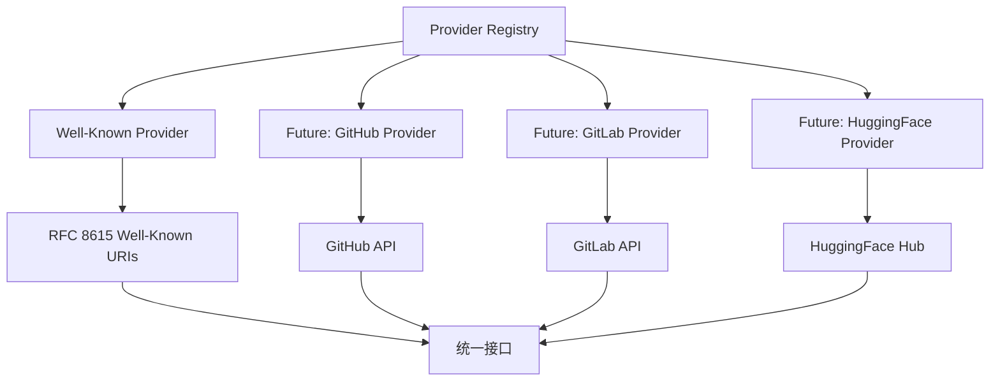
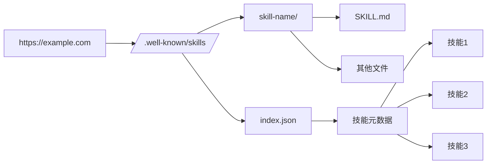
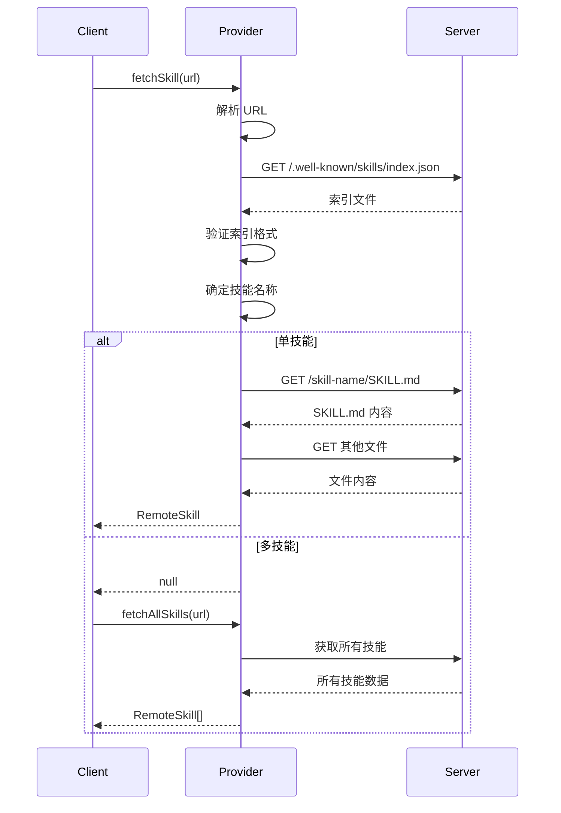
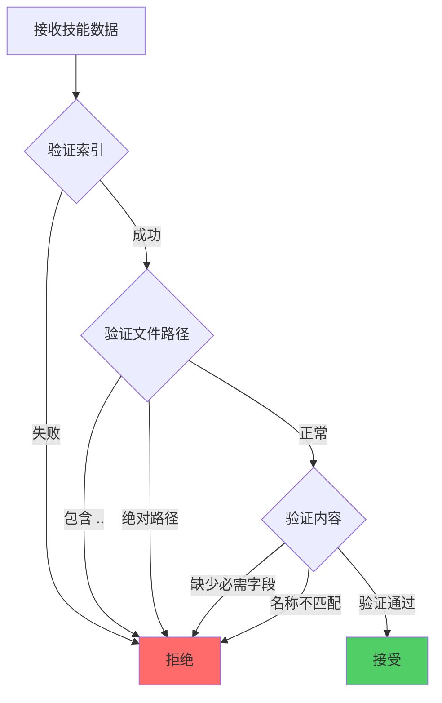

# 远程技能提供者

## 1. 提供者系统架构

### 1.1 提供者注册表



### 1.2 提供者接口

```typescript
interface HostProvider {
  readonly id: string;
  readonly displayName: string;

  // 检查 URL 是否匹配此提供者
  match(url: string): ProviderMatch;

  // 获取单个技能
  fetchSkill(url: string): Promise<RemoteSkill | null>;

  // 获取所有技能
  fetchAllSkills(url: string): Promise<RemoteSkill[]>;

  // 转换为原始 URL
  toRawUrl(url: string): string;

  // 获取源标识符
  getSourceIdentifier(url: string): string;
}

interface ProviderMatch {
  matches: boolean;
  sourceIdentifier?: string;
}
```

### 1.3 注册机制

```typescript
// 提供者注册表
const providers = new Map<string, HostProvider>();

// 注册提供者
export function registerProvider(provider: HostProvider): void {
  providers.set(provider.id, provider);
}

// 查找提供者
export function findProvider(url: string): HostProvider | null {
  for (const provider of providers.values()) {
    const match = provider.match(url);
    if (match.matches) {
      return provider;
    }
  }
  return null;
}

// 获取所有提供者
export function getProviders(): HostProvider[] {
  return Array.from(providers.values());
}
```

## 2. Well-Known 提供者

### 2.1 RFC 8615 规范



### 2.2 索引文件格式

```json
// https://example.com/.well-known/skills/index.json
{
  "skills": [
    {
      "name": "react-best-practices",
      "description": "React 最佳实践指南",
      "files": [
        "SKILL.md",
        "examples/component.jsx",
        "docs/architecture.md"
      ]
    },
    {
      "name": "typescript-patterns",
      "description": "TypeScript 设计模式",
      "files": [
        "SKILL.md",
        "patterns/observer.ts",
        "patterns/factory.ts"
      ]
    }
  ]
}
```

### 2.3 获取流程



### 2.4 匹配逻辑

```typescript
match(url: string): ProviderMatch {
  // 必须是有效的 HTTP(S) URL
  if (!url.startsWith('http://') && !url.startsWith('https://')) {
    return { matches: false };
  }

  try {
    const parsed = new URL(url);

    // 排除已知的 git 托管服务
    const excludedHosts = ['github.com', 'gitlab.com', 'huggingface.co'];
    if (excludedHosts.includes(parsed.hostname)) {
      return { matches: false };
    }

    return {
      matches: true,
      sourceIdentifier: `wellknown/${parsed.hostname}`,
    };
  } catch {
    return { matches: false };
  }
}
```

### 2.5 URL 解析

```typescript
// 支持的 URL 格式
https://example.com                    // 根目录
https://example.com/docs              // 子目录
https://example.com/.well-known/skills // 显式路径
https://example.com/.well-known/skills/skill-name // 特定技能

// 解析逻辑
const pathMatch = parsed.pathname.match(/\/.well-known\/skills\/([^/]+)\/?$/);
if (pathMatch && pathMatch[1] && pathMatch[1] !== 'index.json') {
  skillName = pathMatch[1];
} else if (index.skills.length === 1) {
  skillName = index.skills[0].name;
}
```

## 3. 技能验证

### 3.1 索引验证

```typescript
private isValidSkillEntry(entry: unknown): entry is WellKnownSkillEntry {
  if (!entry || typeof entry !== 'object') return false;

  const e = entry as Record<string, unknown>;

  // 必需字段
  if (typeof e.name !== 'string' || !e.name) return false;
  if (typeof e.description !== 'string' || !e.description) return false;
  if (!Array.isArray(e.files) || e.files.length === 0) return false;

  // 名称格式验证
  const nameRegex = /^[a-z0-9]([a-z0-9-]{0,62}[a-z0-9])?$/;
  if (!nameRegex.test(e.name) && e.name.length > 1) {
    if (e.name.length === 1 && !/^[a-z0-9]$/.test(e.name)) {
      return false;
    }
  }

  // 文件数组验证
  for (const file of e.files) {
    if (typeof file !== 'string') return false;
    // 防止路径遍历
    if (file.startsWith('/') || file.startsWith('\\') || file.includes('..')) {
      return false;
    }
  }

  // 必须包含 SKILL.md
  const hasSkillMd = e.files.some(f =>
    typeof f === 'string' && f.toLowerCase() === 'skill.md'
  );
  if (!hasSkillMd) return false;

  return true;
}
```

### 3.2 内容验证

```typescript
// 验证 SKILL.md 前言
const { data } = matter(content);

if (!data.name || !data.description) {
  return null;
}

// 名称必须与索引匹配
if (data.name !== entry.name) {
  return null;
}
```

### 3.3 安全检查



## 4. 文件获取

### 4.1 并行获取

```typescript
// 并行获取所有文件
const files = new Map<string, string>();
files.set('SKILL.md', content);

// 并行获取其他文件
const otherFiles = entry.files.filter(f => f.toLowerCase() !== 'skill.md');
const filePromises = otherFiles.map(async filePath => {
  try {
    const fileUrl = `${skillBaseUrl}/${filePath}`;
    const fileResponse = await fetch(fileUrl);
    if (fileResponse.ok) {
      const fileContent = await fileResponse.text();
      return { path: filePath, content: fileContent };
    }
  } catch {
    // 忽略单个文件错误
  }
  return null;
});

const fileResults = await Promise.all(filePromises);
for (const result of fileResults) {
  if (result) {
    files.set(result.path, result.content);
  }
}
```

### 4.2 容错策略

```typescript
// 单个文件失败不影响整体
for (const result of fileResults) {
  if (result) {
    files.set(result.path, result.content);
  }
  // 失败的文件被忽略，而不是中断整个过程
}
```

### 4.3 超时处理

```typescript
// 使用 fetch 的 AbortController
const controller = new AbortController();
const timeoutId = setTimeout(() => controller.abort(), 30000);

try {
  const response = await fetch(url, {
    signal: controller.signal,
  });
  clearTimeout(timeoutId);
  // 处理响应
} catch (error) {
  if (error.name === 'AbortError') {
    // 超时处理
  }
}
```

## 5. 源标识符

### 5.1 标识符生成

```typescript
getSourceIdentifier(url: string): string {
  try {
    const parsed = new URL(url);
    // 移除 www. 前缀
    return parsed.hostname.replace(/^www\./, '');
  } catch {
    return 'unknown';
  }
}
```

### 5.2 示例标识符

| URL | 标识符 |
|-----|--------|
| `https://mintlify.com` | `mintlify.com` |
| `https://docs.lovable.dev` | `docs.lovable.dev` |
| `https://www.example.com` | `example.com` |
| `https://mppx-discovery-skills.vercel.app` | `mppx-discovery-skills.vercel.app` |

## 6. 扩展性设计

### 6.1 添加新提供者

```typescript
// 1. 实现 HostProvider 接口
class CustomProvider implements HostProvider {
  readonly id = 'custom-provider';
  readonly displayName = 'Custom Provider';

  match(url: string): ProviderMatch {
    // 匹配逻辑
  }

  async fetchSkill(url: string): Promise<RemoteSkill | null> {
    // 获取逻辑
  }

  // ... 其他方法
}

// 2. 注册提供者
registerProvider(new CustomProvider());
```

### 6.2 提供者优先级

```typescript
// 按注册顺序匹配
export function findProvider(url: string): HostProvider | null {
  for (const provider of providers.values()) {
    const match = provider.match(url);
    if (match.matches) {
      return provider;
    }
  }
  return null;
}

// 先注册的优先级更高
registerProvider(specificProvider);  // 具体提供者优先
registerProvider(genericProvider);   // 通用提供者兜底
```

## 7. 错误处理

### 7.1 网络错误

```typescript
try {
  const response = await fetch(url);
  if (!response.ok) {
    // 静默失败，允许尝试其他提供者
    return null;
  }
} catch {
  // 网络错误，返回 null
  return null;
}
```

### 7.2 格式错误

```typescript
try {
  const index = await response.json();

  // 验证结构
  if (!index.skills || !Array.isArray(index.skills)) {
    continue; // 尝试下一个 URL
  }

  // 验证每个条目
  let allValid = true;
  for (const entry of index.skills) {
    if (!this.isValidSkillEntry(entry)) {
      allValid = false;
      break;
    }
  }

  if (!allValid) {
    continue;
  }

  return { index, resolvedBaseUrl: resolvedBase };
} catch {
  // JSON 解析错误
  return null;
}
```

### 7.3 部分失败

```typescript
// 允许部分文件失败
const fileResults = await Promise.all(filePromises);
for (const result of fileResults) {
  if (result) {
    files.set(result.path, result.content);
  }
  // 失败的文件被忽略
}

// 检查是否至少有 SKILL.md
if (!files.has('SKILL.md')) {
  return null;
}
```

## 8. 性能优化

### 8.1 并行请求

```typescript
// 并行获取所有技能
const skillPromises = index.skills.map(entry =>
  this.fetchSkillByEntry(resolvedBaseUrl, entry)
);
const results = await Promise.all(skillPromises);
return results.filter(s => s !== null);
```

### 8.2 缓存策略

```typescript
// 可以添加缓存层（未来实现）
interface CachedSkill {
  skill: RemoteSkill;
  timestamp: number;
}

const cache = new Map<string, CachedSkill>();

async fetchSkill(url: string): Promise<RemoteSkill | null> {
  const cached = cache.get(url);
  if (cached && Date.now() - cached.timestamp < CACHE_TTL) {
    return cached.skill;
  }

  const skill = await this.fetchSkillImpl(url);
  if (skill) {
    cache.set(url, { skill, timestamp: Date.now() });
  }

  return skill;
}
```

### 8.3 减少请求

```typescript
// 先获取索引，再获取需要的技能
const result = await this.fetchIndex(url);
if (!result) {
  return null;
}

// 只获取需要的技能
if (specificSkill) {
  return this.fetchSkillByEntry(resolvedBaseUrl, specificEntry);
}
```

## 9. 安全考虑

### 9.1 HTTPS 要求

```typescript
if (!url.startsWith('http://') && !url.startsWith('https://')) {
  return { matches: false };
}
```

### 9.2 路径验证

```typescript
// 防止路径遍历
if (file.startsWith('/') || file.startsWith('\\') || file.includes('..')) {
  return false;
}
```

### 9.3 内容大小限制

```typescript
// 未来可以添加
const MAX_SKILL_SIZE = 1024 * 1024; // 1MB

if (content.length > MAX_SKILL_SIZE) {
  throw new Error('Skill content too large');
}
```

## 10. 未来扩展

### 10.1 GitHub 提供者

```typescript
class GitHubProvider implements HostProvider {
  readonly id = 'github';
  readonly displayName = 'GitHub';

  async fetchSkill(url: string): Promise<RemoteSkill | null> {
    // 使用 GitHub API
    const apiUrl = this.buildApiUrl(url);
    const response = await fetch(apiUrl, {
      headers: { Authorization: `Bearer ${token}` },
    });
    // ...
  }
}
```

### 10.2 GitLab 提供者

```typescript
class GitLabProvider implements HostProvider {
  readonly id = 'gitlab';
  readonly displayName = 'GitLab';

  async fetchSkill(url: string): Promise<RemoteSkill | null> {
    // 使用 GitLab API
    // ...
  }
}
```

### 10.3 HuggingFace 提供者

```typescript
class HuggingFaceProvider implements HostProvider {
  readonly id = 'huggingface';
  readonly displayName = 'HuggingFace';

  async fetchSkill(url: string): Promise<RemoteSkill | null> {
    // 使用 HuggingFace Hub API
    // ...
  }
}
```

---

**下一篇**: [09-安全机制](./09-安全机制.md)
