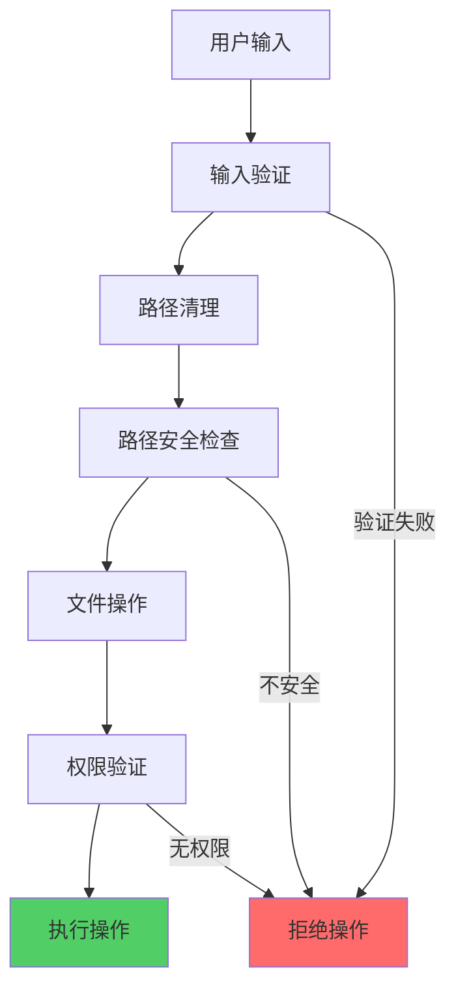
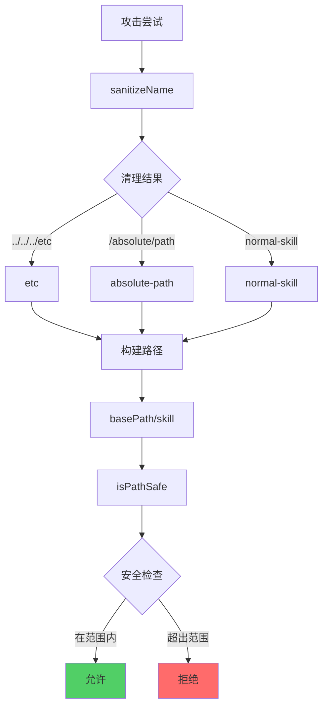

# 安全机制

## 1. 安全架构概览



## 2. 路径遍历防护

### 2.1 名称清理

```typescript
export function sanitizeName(name: string): string {
  const sanitized = name
    .toLowerCase()
    // 替换非法字符为连字符
    .replace(/[^a-z0-9._]+/g, '-')
    // 移除前后的点和连字符
    .replace(/^[.\-]+|[.\-]+$/g, '');

  // 限制长度并返回
  return sanitized.substring(0, 255) || 'unnamed-skill';
}
```

### 2.2 清理示例

| 输入 | 输出 | 原因 |
|------|------|------|
| `My Skill` | `my-skill` | 空格转连字符，小写 |
| `../../../etc/passwd` | `etc-passwd` | 特殊字符转连字符 |
| `skill_Name.v1` | `skill_name.v1` | 保留点和下划线 |
| `` `rm -rf` `` | `rm-rf` | 反引号转连字符 |
| `.hidden` | `hidden` | 移除前导点 |
| `-invalid-` | `invalid` | 移除前导/尾随连字符 |

### 2.3 路径安全验证

```typescript
function isPathSafe(basePath: string, targetPath: string): boolean {
  const normalizedBase = normalize(resolve(basePath));
  const normalizedTarget = normalize(resolve(targetPath));

  // 目标路径必须以基础路径开头
  return normalizedTarget.startsWith(normalizedBase + sep) ||
         normalizedTarget === normalizedBase;
}
```

### 2.4 攻击防护示例



## 3. 文件操作安全

### 3.1 临时目录清理

```typescript
export async function cleanupTempDir(dir: string): Promise<void> {
  // 验证路径在临时目录内
  const normalizedDir = normalize(resolve(dir));
  const normalizedTmpDir = normalize(resolve(tmpdir()));

  if (!normalizedDir.startsWith(normalizedTmpDir + sep) &&
      normalizedDir !== normalizedTmpDir) {
    throw new Error('Attempted to clean up directory outside of temp directory');
  }

  await rm(dir, { recursive: true, force: true });
}
```

### 3.2 文件写入验证

```typescript
// 写入技能文件
async function writeSkillFiles(targetDir: string): Promise<void> {
  for (const [filePath, content] of skill.files) {
    const fullPath = join(targetDir, filePath);

    // 验证文件路径不逃逸目录
    if (!isPathSafe(targetDir, fullPath)) {
      continue; // 跳过不安全的文件
    }

    // 创建父目录
    const parentDir = dirname(fullPath);
    if (parentDir !== targetDir) {
      await mkdir(parentDir, { recursive: true });
    }

    await writeFile(fullPath, content, 'utf-8');
  }
}
```

### 3.3 符号链接安全

```typescript
async function createSymlink(target: string, linkPath: string): Promise<boolean> {
  // 解析真实路径
  const [realTarget, realLinkPath] = await Promise.all([
    realpath(resolve(target)).catch(() => resolve(target)),
    realpath(resolve(linkPath)).catch(() => resolve(linkPath)),
  ]);

  // 检查是否相同
  if (realTarget === realLinkPath) {
    return true; // 已存在
  }

  // 验证链接路径安全
  const linkDir = dirname(linkPath);
  if (!isPathSafe(linkDir, linkPath)) {
    throw new Error('Unsafe symlink path');
  }

  // 创建符号链接
  await symlink(relativePath, linkPath, symlinkType);
  return true;
}
```

## 4. Git 操作安全

### 4.1 克隆超时

```typescript
const CLONE_TIMEOUT_MS = 60000; // 60 秒

export async function cloneRepo(url: string, ref?: string): Promise<string> {
  const tempDir = await mkdtemp(join(tmpdir(), 'skills-'));
  const git = simpleGit({
    timeout: { block: CLONE_TIMEOUT_MS },
    env: { ...process.env, GIT_TERMINAL_PROMPT: '0' }, // 禁用交互式提示
  });

  try {
    await git.clone(url, tempDir, ['--depth', '1']);
    return tempDir;
  } catch (error) {
    // 清理临时目录
    await cleanupTempDir(tempDir).catch(() => {});
    throw new GitCloneError(/* ... */);
  }
}
```

### 4.2 禁用终端提示

```typescript
env: { GIT_TERMINAL_PROMPT: '0' }
```

**防护目标**：
- 防止私钥密码提示
- 防止 SSH 密钥密码提示
- 避免挂起等待用户输入

### 4.3 浅克隆

```bash
git clone --depth 1 <url>
```

**优势**：
- 减少克隆时间
- 节省带宽
- 限制攻击面（不获取完整历史）

## 5. 网络安全

### 5.1 HTTPS 优先

```typescript
// Well-Known 提供者要求 HTTPS
if (!url.startsWith('http://') && !url.startsWith('https://')) {
  return { matches: false };
}
```

### 5.2 GitHub 令牌管理

```typescript
export function getGitHubToken(): string | null {
  // 环境变量（更安全）
  if (process.env.GITHUB_TOKEN) {
    return process.env.GITHUB_TOKEN;
  }
  if (process.env.GH_TOKEN) {
    return process.env.GH_TOKEN;
  }

  // gh CLI（可能缓存凭证）
  try {
    const token = execSync('gh auth token', {
      encoding: 'utf-8',
      stdio: ['pipe', 'pipe', 'pipe'], // 不显示输出
    }).trim();
    return token || null;
  } catch {
    return null;
  }
}
```

### 5.3 私有仓库警告

```typescript
async function isSourcePrivate(source: string): Promise<boolean | null> {
  const ownerRepo = parseOwnerRepo(source);
  if (!ownerRepo) return false;

  return isRepoPrivate(ownerRepo.owner, ownerRepo.repo);
}

// 显示警告
const isPrivate = await isSourcePrivate(source);
if (isPrivate) {
  p.log.warn('This appears to be a private repository.');
  p.log.info('Ensure you have access and credentials are configured.');
}
```

## 6. 权限管理

### 6.1 文件权限

```typescript
// 创建目录时使用默认权限
await mkdir(dir, { recursive: true });

// 写入文件时使用默认权限
await writeFile(path, content, 'utf-8');
```

### 6.2 执行权限

```typescript
// 不设置可执行权限
// 用户可以手动添加需要的话

// 检查时不依赖可执行权限
try {
  await access(path); // 仅检查存在性
  return true;
} catch {
  return false;
}
```

### 6.3 全局安装限制

```typescript
// 某些代理不支持全局安装
if (isGlobal && agent.globalSkillsDir === undefined) {
  return {
    success: false,
    path: '',
    mode: installMode,
    error: `${agent.displayName} does not support global skill installation`,
  };
}
```

## 7. 内容验证

### 7.1 SKILL.md 验证

```typescript
async function parseSkillMd(skillMdPath: string): Promise<Skill | null> {
  try {
    const content = await readFile(skillMdPath, 'utf-8');
    const { data } = matter(content);

    // 必需字段
    if (!data.name || !data.description) {
      return null;
    }

    // 类型检查
    if (typeof data.name !== 'string' || typeof data.description !== 'string') {
      return null;
    }

    // 内部技能检查
    const isInternal = data.metadata?.internal === true;
    if (isInternal && !shouldInstallInternalSkills()) {
      return null;
    }

    return { /* ... */ };
  } catch {
    return null;
  }
}
```

### 7.2 索引文件验证

```typescript
private isValidSkillEntry(entry: unknown): entry is WellKnownSkillEntry {
  if (!entry || typeof entry !== 'object') return false;

  const e = entry as Record<string, unknown>;

  // 必需字段
  if (typeof e.name !== 'string' || !e.name) return false;
  if (typeof e.description !== 'string' || !e.description) return false;
  if (!Array.isArray(e.files) || e.files.length === 0) return false;

  // 名称格式
  const nameRegex = /^[a-z0-9]([a-z0-9-]{0,62}[a-z0-9])?$/;
  if (!nameRegex.test(e.name)) return false;

  // 文件路径安全
  for (const file of e.files) {
    if (typeof file !== 'string') return false;
    if (file.startsWith('/') || file.startsWith('\\') || file.includes('..')) {
      return false;
    }
  }

  return true;
}
```

### 7.3 大小限制

```typescript
// 未来可以实现
const MAX_FILE_SIZE = 1024 * 1024; // 1MB
const MAX_SKILL_SIZE = 5 * 1024 * 1024; // 5MB

async function validateSize(path: string): Promise<boolean> {
  const stats = await stat(path);
  return stats.size <= MAX_FILE_SIZE;
}
```

## 8. 环境隔离

### 8.1 CI 环境检测

```typescript
function isCIEnvironment(): boolean {
  return !!(
    process.env.CI ||
    process.env.CONTINUOUS_INTEGRATION ||
    process.env.GITHUB_ACTIONS ||
    process.env.TRAVIS ||
    process.env.JENKINS_HOME ||
    process.env.GITLAB_CI
  );
}
```

### 8.2 遥测禁用

```typescript
// CI 环境自动禁用遥测
if (isCIEnvironment()) {
  // 跳过遥测收集
  return;
}

// 环境变量覆盖
if (process.env.DISABLE_TELEMETRY || process.env.DO_NOT_TRACK) {
  return;
}
```

### 8.3 临时文件隔离

```typescript
// 每次克隆使用唯一临时目录
const tempDir = await mkdtemp(join(tmpdir(), 'skills-'));

// 确保清理
try {
  // 操作
} finally {
  await cleanupTempDir(tempDir);
}
```

## 9. 错误处理

### 9.1 安全错误消息

```typescript
// 不暴露敏感信息
try {
  await cloneRepo(url);
} catch (error) {
  // 不泄露文件路径
  throw new Error('Failed to clone repository');
}

// 提供有用的指导
throw new GitCloneError(
  `Clone timed out after 60s. This often happens with private repos.\n` +
  `  Ensure you have access and credentials are configured:\n` +
  `  - For SSH: ssh-add -l (to check loaded keys)\n` +
  `  - For HTTPS: gh auth status (if using GitHub CLI)`,
  url,
  true,
  false
);
```

### 9.2 优雅降级

```typescript
// 符号链接失败回退到复制
const symlinkCreated = await createSymlink(canonicalDir, agentDir);

if (!symlinkCreated) {
  // 回退到复制
  await cleanAndCreateDirectory(agentDir);
  await copyDirectory(skill.path, agentDir);

  return {
    success: true,
    path: agentDir,
    mode: 'symlink',
    symlinkFailed: true,
  };
}
```

### 9.3 容错处理

```typescript
// 目录不存在时继续
try {
  const entries = await readdir(dir);
  // 处理条目
} catch {
  return []; // 返回空而不是抛出错误
}
```

## 10. 安全最佳实践

### 10.1 最小权限原则

```typescript
// 只请求必需的权限
// 不使用 sudo 或管理员权限
// 不访问用户敏感目录
```

### 10.2 输入验证

```typescript
// 验证所有用户输入
const sanitized = sanitizeName(userInput);
if (!isPathSafe(base, target)) {
  throw new Error('Unsafe path');
}
```

### 10.3 深度限制

```typescript
// 限制递归深度
const MAX_DEPTH = 5;

async function findSkillDirs(dir: string, depth = 0): Promise<string[]> {
  if (depth > MAX_DEPTH) return []; // 停止递归
  // ...
}
```

### 10.4 超时保护

```typescript
// Git 操作超时
const CLONE_TIMEOUT_MS = 60000;

// 网络请求超时
const controller = new AbortController();
setTimeout(() => controller.abort(), 30000);
```

## 11. 审计和监控

### 11.1 操作日志

```typescript
// 记录关键操作
track({
  event: 'add',
  source: sourceUrl,
  skills: skillNames.join(','),
  agents: agents.join(','),
});
```

### 11.2 错误追踪

```typescript
// 记录错误但不暴露敏感信息
catch (error) {
  track({
    event: 'error',
    type: 'clone_failed',
    message: error.message, // 不包含路径
  });
}
```

### 11.3 使用统计

```typescript
// 匿名统计帮助改进
track({
  event: 'install',
  sourceType: 'github',
  agentCount: agents.length,
  success: 'true',
});
```

---

**下一篇**: [10-遥测系统](./10-遥测系统.md)
