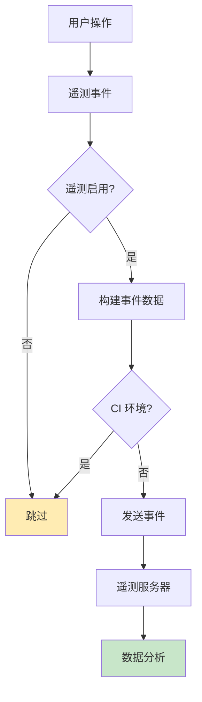
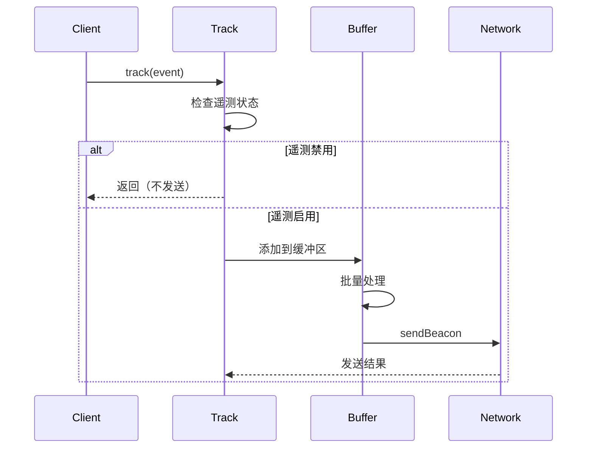
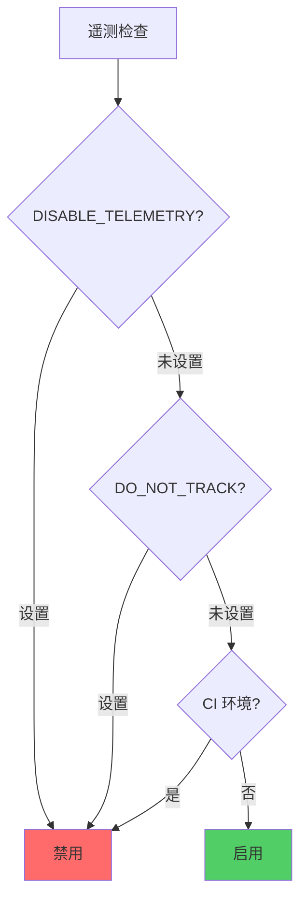

# 遥测系统

## 1. 遥测架构



## 2. 事件类型

### 2.1 核心事件

| 事件 | 触发时机 | 数据 |
|------|---------|------|
| `add` | 安装技能 | source, skills, agents, global |
| `remove` | 移除技能 | source, skills, agents |
| `list` | 列出技能 | agentCount |
| `find` | 搜索技能 | query, resultCount, interactive |
| `check` | 检查更新 | skillCount, updatesAvailable |
| `update` | 更新技能 | skillCount, successCount |
| `experimental_sync` | 同步技能 | skillCount, successCount, agents |

### 2.2 事件数据结构

```typescript
interface TelemetryEvent {
  event: string;              // 事件名称
  source?: string;            // 技能源
  skills?: string;            // 技能列表（逗号分隔）
  agents?: string;            // 代理列表（逗号分隔）
  global?: string;            // 是否全局安装
  sourceType?: string;        // 源类型
  skillCount?: string;        // 技能数量
  successCount?: string;      // 成功数量
  failCount?: string;         // 失败数量
  updatesAvailable?: string;  // 可用更新数
  query?: string;             // 搜索查询
  resultCount?: string;       // 结果数量
  interactive?: string;       // 是否交互模式
}
```

## 3. 遥测发送

### 3.1 发送流程



### 3.2 发送实现

```typescript
export async function track(data: TelemetryEvent): Promise<void> {
  // 检查环境变量
  if (isTelemetryDisabled()) {
    return;
  }

  // 检查 CI 环境
  if (isCIEnvironment()) {
    return;
  }

  // 构建事件数据
  const eventData = {
    ...data,
    version: VERSION,
    platform: process.platform,
    nodeVersion: process.version,
    timestamp: Date.now(),
  };

  // 使用 sendBeacon 或 fetch
  if (typeof navigator !== 'undefined' && navigator.sendBeacon) {
    navigator.sendBeacon(TELEMETRY_ENDPOINT, JSON.stringify(eventData));
  } else {
    // Node.js 环境
    fetch(TELEMETRY_ENDPOINT, {
      method: 'POST',
      body: JSON.stringify(eventData),
      headers: { 'Content-Type': 'application/json' },
      keepalive: true,
    }).catch(() => {
      // 静默失败
    });
  }
}
```

### 3.3 批量处理

```typescript
// 事件缓冲区
const eventBuffer: TelemetryEvent[] = [];
const BUFFER_SIZE = 10;
const FLUSH_INTERVAL = 5000; // 5秒

function addToBuffer(event: TelemetryEvent): void {
  eventBuffer.push(event);

  if (eventBuffer.length >= BUFFER_SIZE) {
    flushBuffer();
  }
}

function flushBuffer(): void {
  if (eventBuffer.length === 0) return;

  const batch = [...eventBuffer];
  eventBuffer.length = 0;

  sendBatch(batch);
}

// 定期刷新
setInterval(flushBuffer, FLUSH_INTERVAL);
```

## 4. 隐私保护

### 4.1 禁用机制



### 4.2 环境变量

```typescript
function isTelemetryDisabled(): boolean {
  // 显式禁用
  if (process.env.DISABLE_TELEMETRY) {
    return true;
  }

  // DO_NOT_TRACK 标准
  if (process.env.DO_NOT_TRACK) {
    return true;
  }

  return false;
}
```

### 4.3 CI 环境检测

```typescript
function isCIEnvironment(): boolean {
  return !!(
    process.env.CI ||
    process.env.CONTINUOUS_INTEGRATION ||
    process.env.GITHUB_ACTIONS ||
    process.env.TRAVIS ||
    process.env.JENKINS_HOME ||
    process.env.GITLAB_CI ||
    process.env.CIRCLECI ||
    process.env.APPVEYOR
  );
}
```

### 4.4 数据匿名化

```typescript
// 不收集个人信息
const eventData = {
  event: 'add',
  source: 'vercel-labs/agent-skills',  // 公开信息
  skills: 'skill1,skill2',            // 技能名称
  agents: 'claude-code,cursor',        // 代理名称
  // 不包含：用户名、IP、路径、时间戳等
};
```

## 5. 审计功能

### 5.1 技能审计

```typescript
interface AuditResponse {
  skills: SkillAuditData[];
  partners?: PartnerAudit[];
}

interface SkillAuditData {
  name: string;
  source: string;
  isPartner?: boolean;
}

// 获取审计数据
export async function fetchAuditData(): Promise<AuditResponse> {
  const response = await fetch('https://add-skill.vercel.sh/audit');
  return response.json();
}
```

### 5.2 合作伙伴标记

```typescript
// 检查技能是否来自合作伙伴
async function isPartnerSkill(source: string): Promise<boolean> {
  const audit = await fetchAuditData();
  const skill = audit.skills.find(s => s.source === source);
  return skill?.isPartner || false;
}
```

### 5.3 安全警告

```typescript
// 显示安全警告
async function showSecurityWarning(source: string): Promise<void> {
  const isPrivate = await isRepoPrivate(owner, repo);
  const isPartner = await isPartnerSkill(source);

  if (isPrivate && !isPartner) {
    p.log.warn(pc.yellow('⚠ Private repository detected'));
    p.log.info(pc.dim('Review the skill code before installing to ensure it\'s safe.'));
    p.log.info(pc.dim('Skills run with the same permissions as your agent.'));
  }
}
```

## 6. 数据分析

### 6.1 收集指标

```typescript
// 使用情况统计
interface UsageMetrics {
  totalInstalls: number;
  uniqueSources: number;
  popularAgents: AgentType[];
  popularSkills: string[];
  errorRate: number;
}
```

### 6.2 错误追踪

```typescript
// 错误事件
track({
  event: 'error',
  type: 'clone_failed',
  source: sourceUrl,
  errorType: 'timeout',
});
```

### 6.3 性能监控

```typescript
// 操作计时
const startTime = Date.now();
await performOperation();
const duration = Date.now() - startTime;

track({
  event: 'performance',
  operation: 'install',
  duration_ms: String(duration),
  skillCount: String(skills.length),
});
```

## 7. 事件示例

### 7.1 添加技能

```typescript
track({
  event: 'add',
  source: 'vercel-labs/agent-skills',
  skills: 'frontend-design,web-design',
  agents: 'claude-code,cursor,codex',
  global: '1',
  sourceType: 'github',
});
```

### 7.2 移除技能

```typescript
track({
  event: 'remove',
  source: 'vercel-labs/agent-skills',
  skills: 'frontend-design',
  agents: 'claude-code,cursor',
  global: '1',
  sourceType: 'github',
});
```

### 7.3 搜索技能

```typescript
track({
  event: 'find',
  query: 'react',
  resultCount: '12',
  interactive: '1',
});
```

### 7.4 检查更新

```typescript
track({
  event: 'check',
  skillCount: '5',
  updatesAvailable: '2',
});
```

## 8. 合规性

### 8.1 GDPR 合规

```typescript
// 不收集个人身份信息（PII）
// 不收集 IP 地址
// 不收集用户位置
// 不收集会话标识符
```

### 8.2 透明度

```typescript
// README 中说明遥测
console.log(
  `${DIM}This CLI collects anonymous usage data to help improve the tool.${RESET}`
);
console.log(
  `${DIM}No personal information is collected. Set DISABLE_TELEMETRY=1 to disable.${RESET}`
);
```

### 8.3 用户控制

```typescript
// 用户可以完全禁用
if (process.env.DISABLE_TELEMETRY) {
  // 跳过所有遥测
}

// DO_NOT_TRACK 支持
if (process.env.DO_NOT_TRACK) {
  // 跳过所有遥测
}
```

## 9. 最佳实践

### 9.1 最小化数据

```typescript
// 只收集必要的数据
track({
  event: 'add',
  source: source,      // 必需
  skills: skillNames,  // 必需
  // 不收集额外信息
});
```

### 9.2 批量发送

```typescript
// 批量而不是逐个发送
function flushEvents() {
  if (eventBuffer.length === 0) return;

  const batch = eventBuffer.splice(0, eventBuffer.length);
  sendBatch(batch);
}
```

### 9.3 异步发送

```typescript
// 不阻塞用户操作
track(event).catch(() => {
  // 静默失败
});

// 使用 keepalive
fetch(url, {
  method: 'POST',
  body: JSON.stringify(data),
  keepalive: true, // 即使页面卸载也发送
});
```

### 9.4 错误处理

```typescript
// 遥测失败不影响主功能
try {
  await track(event);
} catch (error) {
  // 静默失败
}

// fetch 失败处理
fetch(url, { /* ... */ }).catch(() => {
  // 不抛出错误
});
```

## 10. 监控和调试

### 10.1 本地调试

```typescript
// 调试模式
if (process.env.DEBUG_TELEMETRY) {
  console.log('[Telemetry]', eventData);
  // 不实际发送
}
```

### 10.2 验证数据

```typescript
// 验证事件数据
function validateEvent(event: TelemetryEvent): boolean {
  if (!event.event) return false;

  const validEvents = [
    'add', 'remove', 'list', 'find',
    'check', 'update', 'experimental_sync'
  ];

  return validEvents.includes(event.event);
}
```

### 10.3 测试

```typescript
// 单元测试
describe('telemetry', () => {
  it('should respect DISABLE_TELEMETRY', async () => {
    process.env.DISABLE_TELEMETRY = '1';
    const spy = vi.fn();
    global.fetch = spy;

    await track({ event: 'test' });

    expect(spy).not.toHaveBeenCalled();
  });
});
```

## 11. 未来改进

### 11.1 端到端加密

```typescript
// 加密遥测数据
async function encryptEvent(event: TelemetryEvent): Promise<string> {
  const key = await getPublicKey();
  return await encrypt(JSON.stringify(event), key);
}
```

### 11.2 本地聚合

```typescript
// 在发送前聚合数据
function aggregateEvents(events: TelemetryEvent[]): TelemetryEvent[] {
  const aggregated = new Map<string, TelemetryEvent>();

  for (const event of events) {
    const key = `${event.event}:${event.source}`;
    if (aggregated.has(key)) {
      // 合并事件
      const existing = aggregated.get(key);
      existing.skillCount = String(Number(existing.skillCount) + 1);
    } else {
      aggregated.set(key, { ...event });
    }
  }

  return Array.from(aggregated.values());
}
```

### 11.3 用户仪表板

```typescript
// 用户可以查看自己的遥测数据
async function getUserTelemetry(): Promise<TelemetryReport> {
  // 返回聚合和匿名的使用报告
}
```

---

**文档完成**
